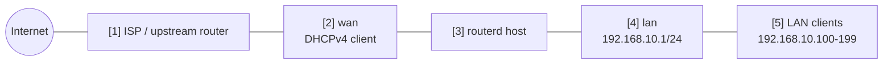

# Basic IPv4 NAT gateway

This is the smallest home-router shape that gives LAN clients IPv4 internet
access through a DHCP-acquired WAN address.

The complete, validated YAML is in `examples/example-basic-ipv4-nat.yaml`.

## Topology



## Diagram map

| No. | Meaning | Main resources |
| --- | --- | --- |
| [1] | Upstream network that gives the router a WAN IPv4 lease. | External to routerd |
| [2] | Physical WAN interface. routerd runs a DHCPv4 client here. | `Interface/wan`, `DHCPv4Lease/wan-dhcpv4` |
| [3] | Linux host applying the routerd config. | `Sysctl/ipv4-forwarding` |
| [4] | LAN gateway address owned by routerd. | `Interface/lan`, `IPv4StaticAddress/lan-base` |
| [5] | DHCPv4 clients using the router as gateway and DNS. | `DHCPv4Server/lan-dhcpv4` |

## What this manages

| Area | routerd resources |
| --- | --- |
| WAN address | `Interface/wan`, `DHCPv4Lease/wan-dhcpv4` |
| LAN address | `Interface/lan`, `IPv4StaticAddress/lan-base` |
| LAN DHCPv4 | `DHCPv4Server/lan-dhcpv4` |
| IPv4 internet access | `NAT44Rule/lan-to-wan` |
| Basic filtering | `FirewallZone/wan`, `FirewallZone/lan`, `FirewallPolicy/home` |

This example leaves DNS resolution simple: DHCPv4 clients receive the router's
LAN address as their DNS server. Add a `DNSResolver` and `DNSZone` once the basic
routing path is working.

## Key config

```yaml
# [2] WAN address is learned from the upstream network.
- apiVersion: net.routerd.net/v1alpha1
  kind: DHCPv4Lease
  metadata:
    name: wan-dhcpv4
  spec:
    interface: wan

# [4] LAN gateway address owned by routerd.
- apiVersion: net.routerd.net/v1alpha1
  kind: IPv4StaticAddress
  metadata:
    name: lan-base
  spec:
    interface: lan
    address: 192.168.10.1/24

# [5] LAN clients receive addresses, gateway, DNS, and search domain.
- apiVersion: net.routerd.net/v1alpha1
  kind: DHCPv4Server
  metadata:
    name: lan-dhcpv4
  spec:
    interface: lan
    addressPool:
      start: 192.168.10.100
      end: 192.168.10.199
      leaseTime: 12h
    gatewayFrom:
      resource: IPv4StaticAddress/lan-base
      field: address
    dnsServerFrom:
      - resource: IPv4StaticAddress/lan-base
        field: address

# [2] -> [5] LAN IPv4 is masqueraded when it exits through the WAN.
- apiVersion: net.routerd.net/v1alpha1
  kind: NAT44Rule
  metadata:
    name: lan-to-wan
  spec:
    type: masquerade
    egressInterface: wan
    sourceRanges:
      - 192.168.10.0/24
```

`NAT44Rule` renders into routerd's nftables NAT table. The firewall resources
put the WAN interface in an `untrust` zone and the LAN interface in a `trust`
zone.

## Apply sequence

```bash
cp examples/example-basic-ipv4-nat.yaml router.yaml
routerd validate --config router.yaml
routerd plan --config router.yaml
routerd apply --config router.yaml --once --dry-run
```

Only apply for real after confirming that management access is not on the LAN
interface being readdressed, or that you have console access.

```bash
routerd apply --config router.yaml --once
```

## Checks

```bash
routerctl status
routerctl describe DHCPv4Lease/wan-dhcpv4
routerctl describe IPv4StaticAddress/lan-base
routerctl describe NAT44Rule/lan-to-wan
nft list table ip routerd_nat
nft list table inet routerd_filter
```

From a LAN client:

```bash
ip route
ping 192.168.10.1
curl https://1.1.1.1/
```

## Common edits

- Change `ens18` and `ens19` to the host's real interface names.
- Change `192.168.10.0/24` when it overlaps with an upstream, VPN, or management network.
- Add a `DNSResolver` before advertising the router as DNS if the host does not already answer DNS on the LAN address.
