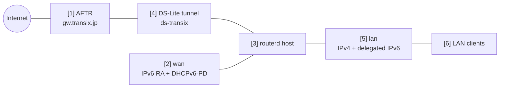

# DS-Lite home gateway

This example models a common IPv6-first access line: the router receives IPv6
through Router Advertisement and DHCPv6-PD, derives a LAN prefix, and sends IPv4
traffic through a DS-Lite tunnel.

The complete, validated YAML is in `examples/example-dslite-home.yaml`.

## Topology



## Diagram map

| No. | Meaning | Main resources |
| --- | --- | --- |
| [1] | ISP AFTR endpoint used by the DS-Lite tunnel. | `DSLiteTunnel/transix` |
| [2] | WAN interface receiving IPv6 RA and DHCPv6-PD. | `IPv6RAAddress/wan-ra`, `DHCPv6PrefixDelegation/wan-pd` |
| [3] | routerd host that creates the tunnel and LAN services. | `Sysctl/ipv4-forwarding`, `Sysctl/ipv6-forwarding` |
| [4] | DS-Lite `ip6tnl` device used for IPv4 egress. | `DSLiteTunnel/transix`, `NAT44Rule/lan-to-dslite` |
| [5] | LAN interface with IPv4 plus a delegated IPv6 address. | `IPv4StaticAddress/lan-ipv4`, `IPv6DelegatedAddress/lan-ipv6` |
| [6] | LAN clients receiving DHCPv4, RA, RDNSS, and DNSSL. | `DHCPv4Server/lan-dhcpv4`, `IPv6RouterAdvertisement/lan-ra` |

## What this manages

| Area | routerd resources |
| --- | --- |
| WAN IPv6 | `IPv6RAAddress/wan-ra` |
| Prefix delegation | `DHCPv6PrefixDelegation/wan-pd`, `IPv6DelegatedAddress/lan-ipv6` |
| DS-Lite | `DSLiteTunnel/transix` |
| LAN IPv4 and DHCPv4 | `IPv4StaticAddress/lan-ipv4`, `DHCPv4Server/lan-dhcpv4` |
| LAN IPv6 advertisement | `IPv6RouterAdvertisement/lan-ra` |
| DNS | `DNSZone/home`, `DNSResolver/lan-resolver` |
| IPv4 egress | `NAT44Rule/lan-to-dslite` |
| MTU/MSS | `PathMTUPolicy/lan-wan-mtu` |

This example uses Transix-like AFTR values as placeholders. Replace the AFTR
FQDN, DNS servers, and DHCPv6 client profile with the values for your access
line.

## Key config

```yaml
# [2] Ask the WAN for delegated IPv6 prefix information.
- apiVersion: net.routerd.net/v1alpha1
  kind: DHCPv6PrefixDelegation
  metadata:
    name: wan-pd
  spec:
    interface: wan
    client: dhcp6c
    profile: ntt-hgw-lan-pd

# [5] Derive a LAN IPv6 address from the delegated prefix.
- apiVersion: net.routerd.net/v1alpha1
  kind: IPv6DelegatedAddress
  metadata:
    name: lan-ipv6
  spec:
    prefixDelegation: wan-pd
    interface: lan
    subnetID: "0"
    addressSuffix: "::1"

# [1] + [4] Build the DS-Lite tunnel toward the ISP AFTR.
- apiVersion: net.routerd.net/v1alpha1
  kind: DSLiteTunnel
  metadata:
    name: transix
  spec:
    interface: wan
    tunnelName: ds-transix
    aftrFQDN: gw.transix.jp
    aftrDNSServers:
      - 2404:1a8:7f01:a::3
      - 2404:1a8:7f01:b::3
    localAddressSource: delegatedAddress
    localDelegatedAddress: lan-ipv6
    localAddressSuffix: "::100"
    defaultRoute: true
    mtu: 1454
```

The DS-Lite tunnel uses a delegated IPv6 address as its local endpoint. If your
access line expects the WAN RA address instead, switch `localAddressSource` to
`interface`.

## LAN services

The example advertises the delegated prefix through RA and gives clients the
router as DNS:

```yaml
# [6] Advertise the delegated LAN prefix and local DNS information.
- apiVersion: net.routerd.net/v1alpha1
  kind: IPv6RouterAdvertisement
  metadata:
    name: lan-ra
  spec:
    interface: lan
    prefixFrom:
      resource: IPv6DelegatedAddress/lan-ipv6
      field: address
    rdnssFrom:
      - resource: IPv6DelegatedAddress/lan-ipv6
        field: address
    dnsslFrom:
      - resource: DNSZone/home
        field: zone
    oFlag: true
    mtu: 1454
```

The `DNSResolver` includes a conditional forwarder for the AFTR name. This is
important when the AFTR record is only meaningful through the access-network
resolver.

## Apply sequence

```bash
cp examples/example-dslite-home.yaml router.yaml
routerd validate --config router.yaml
routerd plan --config router.yaml
routerd apply --config router.yaml --once --dry-run
```

Check the plan for:

- the correct WAN and LAN interface names,
- no accidental removal of management connectivity,
- the intended AFTR FQDN and resolver addresses,
- NAT using the DS-Lite tunnel, not the physical WAN interface.

Then apply:

```bash
routerd apply --config router.yaml --once
```

## Checks

```bash
routerctl status
routerctl describe DHCPv6PrefixDelegation/wan-pd
routerctl describe IPv6DelegatedAddress/lan-ipv6
routerctl describe DSLiteTunnel/transix
routerctl describe NAT44Rule/lan-to-dslite
ip -6 tunnel show
ip route show default
```

From a LAN client:

```bash
ip -6 addr
ip route
curl https://1.1.1.1/
dig router.home.example
```

## Common edits

- Change `client` and `profile` for the DHCPv6-PD client used by your platform.
- Replace `gw.transix.jp` and the AFTR resolver addresses for non-Transix deployments.
- Use `localAddressSource: interface` when the DS-Lite tunnel must originate from the WAN RA address.
- Keep `PathMTUPolicy` when the access network requires a smaller MTU; DS-Lite commonly needs MSS clamping.
