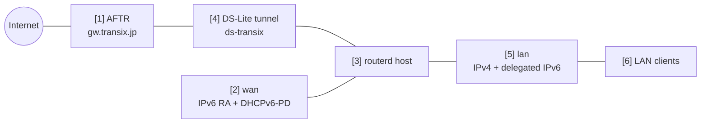

# DS-Lite ホームルーター

IPv6 を主回線として使う回線の例です。ルーターは Router Advertisement と DHCPv6-PD で
IPv6 を受け取り、LAN prefix を派生させ、IPv4 のトラフィックは DS-Lite tunnel に通します。

完全な検証済み YAML は `examples/example-dslite-home.yaml` にあります。

## 構成図



## 図の対応表

| 番号 | 意味 | 主なリソース |
| --- | --- | --- |
| [1] | DS-Lite tunnel の接続先になる ISP 側 AFTR。 | `DSLiteTunnel/transix` |
| [2] | IPv6 RA と DHCPv6-PD を受ける WAN インターフェース。 | `DHCPv6PrefixDelegation/wan-pd` |
| [3] | tunnel と LAN サービスを作り、必要な sysctl を導出する routerd ホスト。 | Derived host runtime |
| [4] | IPv4 egress に使う DS-Lite `ip6tnl` デバイス。 | `DSLiteTunnel/transix`, trust/untrust ゾーンからの NAT44 自動導出 |
| [5] | IPv4 アドレスと委任された IPv6 アドレスを持つ LAN インターフェース。 | `IPv4StaticAddress/lan-ipv4`, `IPv6DelegatedAddress/lan-ipv6` |
| [6] | DHCPv4、RA、RDNSS、DNSSL を受ける LAN クライアント。 | `DHCPv4Server/lan-dhcpv4`, `IPv6RouterAdvertisement/lan-ra` |

## この例で管理するもの

| 領域 | routerd リソース |
| --- | --- |
| WAN IPv6 | `DHCPv6PrefixDelegation/wan-pd` |
| プレフィックス委任（PD） | `DHCPv6PrefixDelegation/wan-pd`, `IPv6DelegatedAddress/lan-ipv6` |
| DS-Lite | `DSLiteTunnel/transix` |
| LAN IPv4 と DHCPv4 | `IPv4StaticAddress/lan-ipv4`, `DHCPv4Server/lan-dhcpv4` |
| LAN IPv6 の広告 | `IPv6RouterAdvertisement/lan-ra` |
| DNS | `DNSZone/home`, `DNSResolver/lan-resolver` |
| IPv4 egress | trust/untrust ゾーンから自動導出される NAT44 |
| MTU/MSS | `DSLiteTunnel/transix` とファイアウォールゾーンから自動導出 |

この例では Transix に近い AFTR 値をプレースホルダーとして使っています。実回線に合わせて、
AFTR FQDN、DNS サーバー、DHCPv6 クライアントの profile を置き換えてください。

## 設定の要点

```yaml
# [2] WAN から IPv6 prefix delegation を取得する。
- apiVersion: net.routerd.net/v1alpha1
  kind: DHCPv6PrefixDelegation
  metadata:
    name: wan-pd
  spec:
    interface: wan
    client: dhcp6c
    profile: ntt-hgw-lan-pd

# [5] delegated prefix から LAN IPv6 address を派生させる。
- apiVersion: net.routerd.net/v1alpha1
  kind: IPv6DelegatedAddress
  metadata:
    name: lan-ipv6
  spec:
    prefixDelegation: wan-pd
    interface: lan
    subnetID: "0"
    addressSuffix: "::1"

# [1] + [4] ISP AFTR に向けた DS-Lite tunnel を作る。
- apiVersion: net.routerd.net/v1alpha1
  kind: DSLiteTunnel
  metadata:
    name: transix
  spec:
    interface: wan
    tunnelName: ds-transix
    aftrFQDN: gw.transix.jp
    aftrDNSServers:
      - 2404:1a8:7f01:a::3
      - 2404:1a8:7f01:b::3
    localAddressSource: delegatedAddress
    localDelegatedAddress: lan-ipv6
    localAddressSuffix: "::100"
    defaultRoute: true
    mtu: 1454
```

この DS-Lite tunnel は、委任された IPv6 アドレスを local endpoint として使います。
回線側が WAN RA アドレスを endpoint として期待する場合は、`localAddressSource` を
`interface` に変えてください。

## LAN 側サービス

この例では、委任された prefix を RA で広告し、クライアントにはルーターを DNS として配ります。

```yaml
# [6] delegated LAN prefix と local DNS 情報を RA で広告する。
- apiVersion: net.routerd.net/v1alpha1
  kind: IPv6RouterAdvertisement
  metadata:
    name: lan-ra
  spec:
    interface: lan
    prefixFrom:
      resource: IPv6DelegatedAddress/lan-ipv6
      field: address
    rdnssFrom:
      - resource: IPv6DelegatedAddress/lan-ipv6
        field: address
    dnsslFrom:
      - resource: DNSZone/home
        field: zone
    oFlag: true
    mtu: 1454
```

`DNSResolver` には、AFTR 名向けの条件付きフォワーダーを入れています。AFTR のレコードが
回線側のリゾルバでだけ意味を持つ構成では、この指定が重要です。

## 適用手順

```bash
cp examples/example-dslite-home.yaml router.yaml
routerd validate --config router.yaml
routerd plan --config router.yaml
routerd apply --config router.yaml --once --dry-run
```

plan では次を確認します。

- WAN / LAN のインターフェース名が正しい。
- 管理アクセスを誤って消さない。
- AFTR FQDN とリゾルバのアドレスが意図した値になっている。
- NAT の出口が物理 WAN ではなく DS-Lite tunnel になっている。

問題なければ適用します。

```bash
routerd apply --config router.yaml --once
```

## 確認

```bash
routerctl status
routerctl describe DHCPv6PrefixDelegation/wan-pd
routerctl describe IPv6DelegatedAddress/lan-ipv6
routerctl describe DSLiteTunnel/transix
routerctl describe FirewallZone/wan
ip -6 tunnel show
ip route show default
```

LAN クライアント側では次を確認します。

```bash
ip -6 addr
ip route
curl https://1.1.1.1/
dig router.home.example
```

## よく変える場所

- プラットフォームに合わせて `client` と `profile` を変更する。
- Transix 以外では `gw.transix.jp` と AFTR リゾルバのアドレスを置き換える。
- DS-Lite tunnel を WAN RA アドレスから張る必要がある場合は `localAddressSource: interface` を使う。
- DS-Lite では MSS clamp が必要になりやすい。routerd は tunnel の MTU と LAN/WAN のファイアウォールゾーンから自動導出する。
