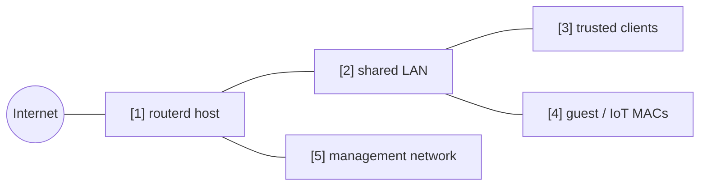

# Guest and IoT client isolation


This example keeps selected MAC addresses on the same LAN but treats them as
guest or IoT clients: internet access is allowed, while trusted LAN and
management access are denied.

The complete, validated YAML is in `examples/guest-mode.yaml`.

## Topology



## Diagram map

| No. | Meaning | Main resources |
| --- | --- | --- |
| [1] | Router applying the client policy. | `FirewallPolicy/default` |
| [2] | Shared layer-2 LAN where trusted and guest clients coexist. | `FirewallZone/lan` |
| [3] | Normal clients not matched by the guest policy. | Default zone behavior |
| [4] | Listed MAC addresses treated as guest or IoT clients. | `ClientPolicy/guest-devices` |
| [5] | Management destinations blocked from guest clients. | `ClientPolicy.spec.isolation.lanMgmt` |

## What this manages

| Area | routerd resources |
| --- | --- |
| LAN addressing | `IPv4StaticAddress/lan-gateway`, `DHCPv4Server/lan-v4` |
| Client classification | `ClientPolicy/guest-devices` |
| Filtering | `FirewallZone/*`, `FirewallPolicy/default` |

## Key config

```yaml
# [4] Listed MAC addresses become isolated guest/IoT clients.
- apiVersion: firewall.routerd.net/v1alpha1
  kind: ClientPolicy
  metadata:
    name: guest-devices
  spec:
    mode: include
    macs:
      - 18:ec:e7:33:12:6c
    # [4] -> [1] Internet is allowed, but LAN and management access are denied.
    isolation:
      lanInternet: allow
      lanLAN: deny
      lanMgmt: deny
      mDNSBroadcast: deny
```

## Checks

```bash
routerctl validate --config examples/guest-mode.yaml
routerctl apply --config examples/guest-mode.yaml --dry-run
routerctl describe ClientPolicy/guest-devices
nft list table inet routerd_filter
```

From a guest client, verify internet access and confirm that trusted LAN and
management addresses are blocked.

## Common edits

- Use `mode: include` when only listed MAC addresses are isolated.
- Use `mode: exclude` for a guest-first network where only listed devices are trusted.
- Pair this with DHCP reservations so client names in the Web Console stay readable.
