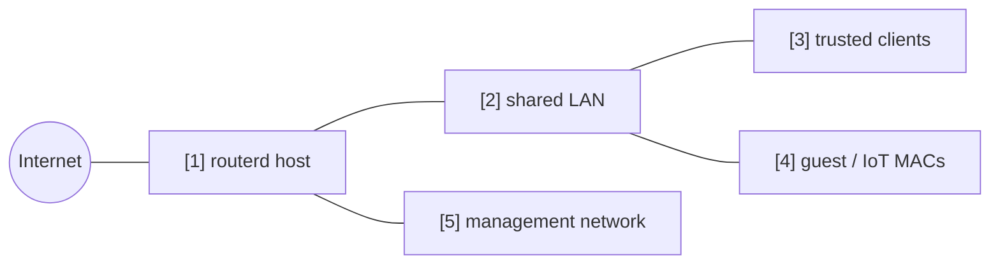

# Guest and IoT client isolation


This example shows how a router can classify selected MAC addresses as guest or
IoT clients and apply a `ClientPolicy` to traffic that reaches the router.

The complete, validated YAML is in `examples/guest-mode.yaml`.

:::danger This is not complete guest-network isolation
This policy only controls traffic that passes through the router. Devices on
the same switch, VLAN, or Wi-Fi SSID can send layer-2 traffic directly to each
other without visiting the router. A MAC address is also not a strong identity;
it can be copied.

For a real guest network, use a separate VLAN, SSID, or physical port and turn
on the access point or switch's client-isolation feature. Treat this example as
an additional router policy, not the security boundary by itself.
:::

## Topology


```mermaid
flowchart LR
  internet((Internet))
  router["[1] routerd host"]
  lan["[2] shared LAN"]
  trusted["[3] trusted clients"]
  guest["[4] guest / IoT MACs"]
  mgmt["[5] management network"]

  internet --- router --- lan
  lan --- trusted
  lan --- guest
  router --- mgmt
```

## Diagram map

| No. | Meaning | Main resources |
| --- | --- | --- |
| [1] | Router applying the client policy. | `FirewallPolicy/default` |
| [2] | Shared layer-2 LAN where trusted and guest clients coexist. | `FirewallZone/lan` |
| [3] | Normal clients not matched by the guest policy. | Default zone behavior |
| [4] | Listed MAC addresses treated as guest or IoT clients. | `ClientPolicy/guest-devices` |
| [5] | Management destinations blocked from guest clients. | `ClientPolicy.spec.isolation.lanMgmt` |

## What this manages

| Area | routerd resources |
| --- | --- |
| LAN addressing | `IPv4StaticAddress/lan-gateway`, `DHCPv4Server/lan-v4` |
| Client classification | `ClientPolicy/guest-devices` |
| Filtering | `FirewallZone/*`, `FirewallPolicy/default` |

## Key config

```yaml
# [4] Listed MAC addresses become isolated guest/IoT clients.
- apiVersion: firewall.routerd.net/v1alpha1
  kind: ClientPolicy
  metadata:
    name: guest-devices
  spec:
    mode: include
    macs:
      - 18:ec:e7:33:12:6c
# [4] Router-routed traffic can allow Internet destinations while denying
# router-routed LAN and management destinations.
    isolation:
      lanInternet: allow
      lanLAN: deny
      lanMgmt: deny
      mDNSBroadcast: deny
```

## Checks

```bash
routerd validate --config examples/guest-mode.yaml

workdir=$(mktemp -d)
routerd apply --config examples/guest-mode.yaml --once --dry-run \
  --state-file "$workdir/state.db" \
  --ledger-file "$workdir/ledger.db" \
  --status-file "$workdir/status.json"
rm -rf "$workdir"
```

On an isolated test network, verify the intended routed traffic policy. Do not
claim that this proves separation from a device on the same L2 segment.

## Common edits

- Use `mode: include` when only listed MAC addresses are isolated.
- Use `mode: exclude` for a guest-first network where only listed devices are trusted.
- Pair this with DHCP reservations so client names in the Web Console stay readable.
- Add `DNSResolver` or `NTPServer` before advertising the router as those
  services. The example advertises external DNS and does not advertise local NTP.
