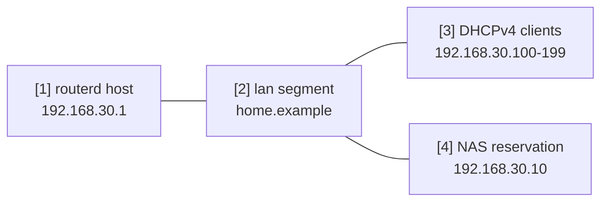

# LAN DHCP and local DNS

This example turns one LAN interface into a small home or lab service segment:
routerd owns the LAN address, serves DHCPv4, answers a local DNS zone, and
derives client names from DHCP leases.

The complete, validated YAML is in `examples/example-lan-dns-dhcp.yaml`.

## Topology



## Diagram map

| No. | Meaning | Main resources |
| --- | --- | --- |
| [1] | Router address that also listens for DNS on the LAN. | `IPv4StaticAddress/lan-base`, `DNSResolver/lan-resolver` |
| [2] | Local DNS zone advertised as the DHCP search domain. | `DNSZone/home` |
| [3] | Dynamic clients that receive addresses and DNS settings. | `DHCPv4Server/lan-dhcpv4` |
| [4] | Fixed infrastructure host with a stable lease and name. | `DHCPv4Reservation/nas`, `DNSZone/home` |

## What this manages

| Area | routerd resources |
| --- | --- |
| LAN address | `Interface/lan`, `IPv4StaticAddress/lan-base` |
| Local names | `DNSZone/home` |
| Resolver | `DNSResolver/lan-resolver` |
| DHCPv4 | `DHCPv4Server/lan-dhcpv4`, `DHCPv4Reservation/nas` |

## Key config

```yaml
# [2] Local zone for names such as router.home.example and nas.home.example.
- kind: DNSZone
  metadata:
    name: home
  spec:
    zone: home.example
    records:
      - hostname: router
        ipv4From:
          resource: IPv4StaticAddress/lan-base
          field: address
    dhcpDerived:
      sources:
        - DHCPv4Server/lan-dhcpv4
      ddns: true

# [3] DHCP advertises the router address as gateway and DNS.
- kind: DHCPv4Server
  metadata:
    name: lan-dhcpv4
  spec:
    gatewayFrom:
      resource: IPv4StaticAddress/lan-base
      field: address
    dnsServerFrom:
      - resource: IPv4StaticAddress/lan-base
        field: address
    domainFrom:
      resource: DNSZone/home
      field: zone
```

## Checks

```bash
routerd validate --config examples/example-lan-dns-dhcp.yaml
routerd apply --config examples/example-lan-dns-dhcp.yaml --once --dry-run
routerctl describe DNSZone/home
routerctl describe DHCPv4Server/lan-dhcpv4
dig @192.168.30.1 router.home.example
```

## Common edits

- Change `home.example` to the local search domain you want to advertise.
- Add `DHCPv4Reservation` entries for NAS, printers, and infrastructure hosts.
- Add more `DNSResolver.spec.sources` when some domains need private upstreams.
