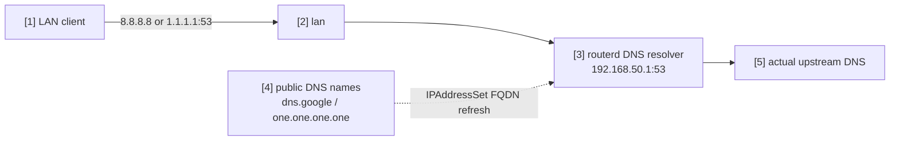

# Redirect public DNS to the local resolver


This example catches LAN clients that send plaintext DNS directly to well-known
public resolver names and redirects only TCP/UDP port 53 to the router's local
resolver. DoH and DoT ports are not touched.

The complete, validated YAML is in `examples/example-local-dns-redirect.yaml`.

## Topology



## Diagram map

| No. | Meaning | Main resources |
| --- | --- | --- |
| [1] | Client that tries to query public DNS directly. | External client |
| [2] | LAN interface where prerouting redirect rules match. | `LocalServiceRedirect/lan-local-services.spec.interface` |
| [3] | Local resolver that receives redirected port 53 traffic. | `DNSResolver/lan-resolver` |
| [4] | Exact FQDNs resolved into reusable nftables sets. | `IPAddressSet/public-dns` |
| [5] | Real upstream resolvers used by the local resolver. | `DNSForwarder`, `DNSUpstream` |

## What this manages

| Area | routerd resources |
| --- | --- |
| Local DNS | `DNSResolver/lan-resolver`, `DNSZone/home` |
| DHCP advertisement | `DHCPv4Server/lan-dhcpv4` |
| FQDN-backed destination set | `IPAddressSet/public-dns` |
| Local redirect | `LocalServiceRedirect/lan-local-services` |

## Key config

```yaml
# [4] Resolve exact public DNS names into an IPAddressSet.
- apiVersion: net.routerd.net/v1alpha1
  kind: IPAddressSet
  metadata:
    name: public-dns
  spec:
    names:
      - dns.google
      - one.one.one.one
    refreshInterval: 10m

# [2] -> [3] Redirect only plaintext DNS port 53 to the local resolver.
# This matches LAN-client prerouting traffic only. Router-origin TCP/443
# HealthCheck probes are not redirected, so they can use the same public target
# address when policy routing selects the path explicitly.
- apiVersion: firewall.routerd.net/v1alpha1
  kind: LocalServiceRedirect
  metadata:
    name: lan-local-services
  spec:
    interface: lan
    rules:
      - name: public-dns
        protocols: [tcp, udp]
        destinationSetRef: IPAddressSet/public-dns
        destinationPort: 53
        redirectPort: 53
```

`IPAddressSet.spec.names` are exact names. `dns.google` does not include
subdomains. Use explicit names for every destination whose resolved addresses
you want to match.

## Checks

```bash
routerctl validate --config examples/example-local-dns-redirect.yaml
routerctl apply --config examples/example-local-dns-redirect.yaml --dry-run
routerctl describe IPAddressSet/public-dns
nft list table ip routerd_nat
```

From a LAN client:

```bash
dig @8.8.8.8 router.home.example
dig @1.1.1.1 router.home.example
```
