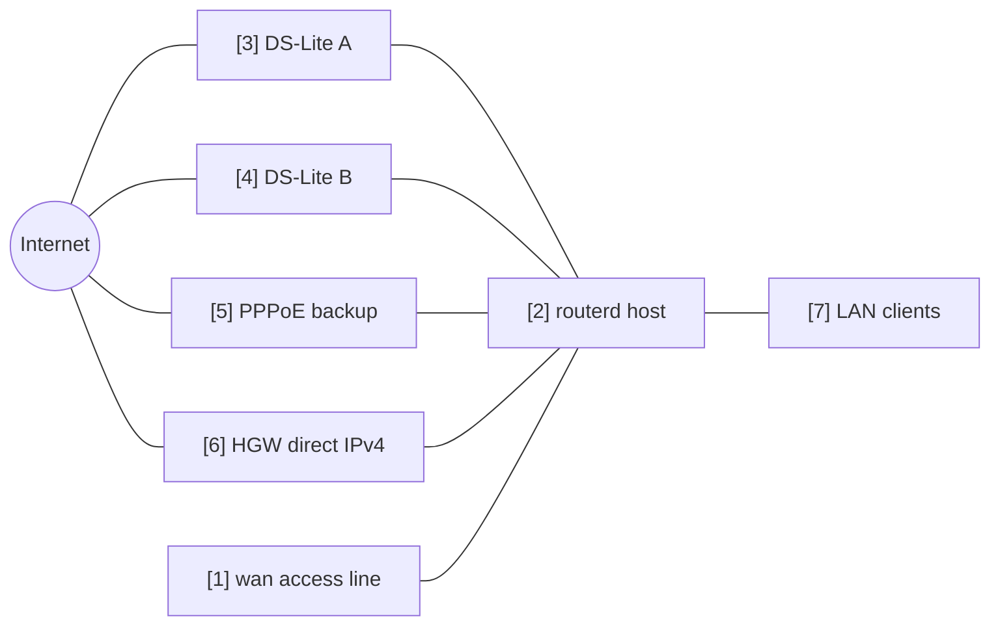

# Multi-WAN IPv4 failover


This example selects one IPv4 default route from several egress paths: multiple
DS-Lite tunnels, PPPoE, and direct upstream-router IPv4.

The complete, validated YAML is in `examples/multi-wan-home.yaml`.

## Topology



## Diagram map

| No. | Meaning | Main resources |
| --- | --- | --- |
| [1] | Physical access line used by all WAN candidates. | `Interface/wan`, `DHCPv4Client/wan-dhcpv4` |
| [2] | Router selecting one default route. | `EgressRoutePolicy/ipv4-default`, `IPv4Route/default` |
| [3] | Primary DS-Lite candidate. | `DSLiteTunnel/ds-lite-a`, `HealthCheck/internet-via-dslite-a` |
| [4] | Additional DS-Lite candidate. | `DSLiteTunnel/ds-lite-b`, `HealthCheck/internet-via-dslite-b` |
| [5] | Lower-priority PPPoE backup. | `PPPoESession/pppoe-flets`, `HealthCheck/internet-via-pppoe` |
| [6] | Direct upstream-router IPv4 fallback. | `DHCPv4Client/wan-dhcpv4`, `HealthCheck/internet-via-hgw-direct` |
| [7] | LAN clients using the selected egress path through NAT. | `NAT44Rule/lan-to-selected-wan` |

## What this manages

| Area | routerd resources |
| --- | --- |
| Egress paths | `DSLiteTunnel/*`, `PPPoESession/pppoe-flets`, `DHCPv4Client/wan-dhcpv4` |
| Link readiness | `HealthCheck/internet-via-*` |
| Selection | `EgressRoutePolicy/ipv4-default` |
| Default route | `IPv4Route/default` |
| NAT | `NAT44Rule/lan-to-selected-wan` |

## Key config

```yaml
# [2] Choose the highest-weight candidate that is currently healthy.
- kind: EgressRoutePolicy
  metadata:
    name: ipv4-default
  spec:
    family: ipv4
    destinationCIDRs:
      - 0.0.0.0/0
    selection: highest-weight-ready
    hysteresis: 30s
    candidates:
      # [3] Primary DS-Lite candidate.
      - name: ds-lite-a
        weight: 120
        healthCheck: internet-via-dslite-a
      # [5] PPPoE backup has lower weight.
      - name: pppoe-flets
        weight: 60
        healthCheck: internet-via-pppoe
      # [6] Direct HGW route is the last fallback in this example.
      - name: hgw-direct
        weight: 40
        healthCheck: internet-via-hgw-direct
```

## Checks

```bash
routerctl validate --config examples/multi-wan-home.yaml
routerctl apply --config examples/multi-wan-home.yaml --dry-run
routerctl describe EgressRoutePolicy/ipv4-default
routerctl describe IPv4Route/default
ip route show default
```

## Operational notes

- Keep health checks conservative. Very short intervals can make a weak link flap.
- Use `hysteresis` so the selected route does not switch on one transient failure.
- Keep RFC1918 destinations excluded from NAT and policy routing unless you really want to NAT private routed networks.
