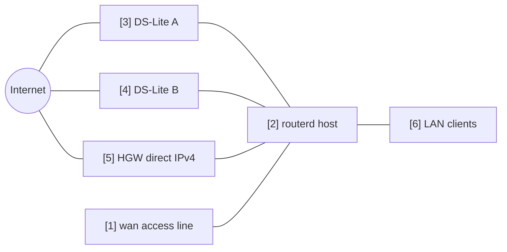

# Multi-WAN IPv4 failover


This example selects one IPv4 default route from two DS-Lite tunnels and a
direct upstream-router IPv4 fallback. It does not configure PPPoE.

The complete, validated YAML is in `examples/multi-wan-home.yaml`.

## Topology


```mermaid
flowchart LR
  internet((Internet))
  wan["[1] wan access line"]
  router["[2] routerd host"]
  dsa["[3] DS-Lite A"]
  dsb["[4] DS-Lite B"]
  hgw["[5] HGW direct IPv4"]
  lan["[6] LAN clients"]

  internet --- dsa --- router
  internet --- dsb --- router
  internet --- hgw --- router
  wan --- router --- lan
```

## Diagram map

| No. | Meaning | Main resources |
| --- | --- | --- |
| [1] | Physical access line used by all WAN candidates. | `Interface/wan`, `DHCPv4Client/wan-dhcpv4` |
| [2] | Router selecting one default route. | `EgressRoutePolicy/ipv4-default` |
| [3] | Primary DS-Lite candidate. | `DSLiteTunnel/ds-lite-a`, `HealthCheck/internet-a` |
| [4] | Additional DS-Lite candidate. | `DSLiteTunnel/ds-lite-b`, `HealthCheck/internet-b` |
| [5] | Direct upstream-router IPv4 fallback. | `DHCPv4Client/wan-dhcpv4` |
| [6] | LAN clients using the selected egress path through NAT. | `NAT44Rule/lan-to-selected-wan` |

## What this manages

| Area | routerd resources |
| --- | --- |
| Egress paths | `DSLiteTunnel/*`, `DHCPv4Client/wan-dhcpv4` |
| Link readiness | `HealthCheck/internet-a`, `HealthCheck/internet-b` |
| Selection | `EgressRoutePolicy/ipv4-default` |
| Default route | Derived by `EgressRoutePolicy/ipv4-default` |
| NAT | `NAT44Rule/lan-to-selected-wan` |

## Key config

```yaml
# [2] Choose the highest-weight candidate that is currently healthy.
- kind: EgressRoutePolicy
  metadata:
    name: ipv4-default
  spec:
    family: ipv4
    destinationCIDRs:
      - 0.0.0.0/0
    selection: highest-weight-ready
    candidates:
      # [3] Primary DS-Lite candidate.
      - name: ds-lite-a
        deviceFrom:
          resource: DSLiteTunnel/ds-lite-a
          field: device
        gatewaySource: none
        weight: 100
        healthCheck: internet-a
      # [4] Second DS-Lite candidate.
      - name: ds-lite-b
        deviceFrom:
          resource: DSLiteTunnel/ds-lite-b
          field: device
        gatewaySource: none
        weight: 80
        healthCheck: internet-b
      # [5] Direct HGW route is the last fallback in this example.
      - name: hgw-direct
        deviceFrom:
          resource: Interface/wan
          field: ifname
        gatewaySource: dhcpv4
        gatewayFrom:
          resource: DHCPv4Client/wan-dhcpv4
          field: gateway
        weight: 40
```

## Checks

```bash
sudo routerd validate --config examples/multi-wan-home.yaml

workdir=$(mktemp -d)
sudo routerd apply --config examples/multi-wan-home.yaml --once --dry-run --skip-service-manager \
  --state-file "$workdir/state.db" \
  --ledger-file "$workdir/ledger.db" \
  --status-file "$workdir/status.json"
rm -rf "$workdir"
```

After the service is running, inspect `sudo routerctl describe
EgressRoutePolicy/ipv4-default` and `ip route show default`. The policy
controller owns the selected route; this example does not declare an
`IPv4Route/default` resource.

## Operational notes

- Keep health checks conservative. Very short intervals can make a weak link flap.
- This exact example has no `hysteresis` value. Add one only after checking the
  current API documentation and observing a real flap you need to dampen.
- Keep RFC1918 destinations excluded from NAT and policy routing unless you really want to NAT private routed networks.
