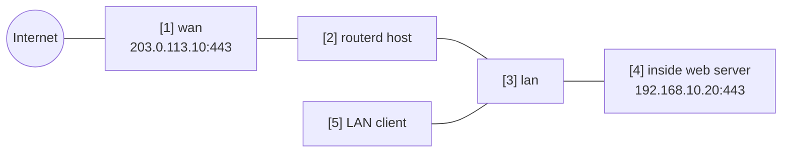

# Port forward to an inside web server


This example publishes one internal HTTPS server through one WAN-side IPv4
address and enables hairpin access so LAN clients can use the same public name.

The complete, validated YAML is in `examples/example-port-forward-web.yaml`.

## Topology



## Diagram map

| No. | Meaning | Main resources |
| --- | --- | --- |
| [1] | Public-side address and port that clients connect to. | `PortForward/web-https.spec.listen` |
| [2] | Router that renders ingress DNAT and hairpin rules. | `PortForward/web-https` |
| [3] | LAN interface where hairpin traffic can arrive. | `PortForward/web-https.spec.hairpin.interfaces` |
| [4] | Internal HTTPS backend. | `PortForward/web-https.spec.target` |
| [5] | LAN client using the public address or public DNS name. | Hairpin path |

## What this manages

| Area | routerd resources |
| --- | --- |
| Ingress DNAT | `PortForward/web-https` |
| Hairpin access | `PortForward.spec.hairpin` |
| Zones and policy | `FirewallZone/wan`, `FirewallZone/lan`, `FirewallPolicy/home` |

## Key config

```yaml
# [1] Public-side listener. Hairpin requires a concrete address here.
- apiVersion: firewall.routerd.net/v1alpha1
  kind: PortForward
  metadata:
    name: web-https
  spec:
    listen:
      interface: wan
      address: 203.0.113.10
      protocol: tcp
      port: 443
    # [4] Internal backend that receives the DNATed connection.
    target:
      address: 192.168.10.20
      port: 443
    # [3] Allow LAN clients to use the same public address.
    hairpin:
      enabled: true
      interfaces:
        - lan
```

Hairpin mode requires a known `listen.address` or `listen.addressFrom`, because
LAN-side clients must match the public destination address before DNAT.

## Checks

```bash
routerctl validate -f examples/example-port-forward-web.yaml --replace
routerctl plan -f examples/example-port-forward-web.yaml --replace
routerctl describe PortForward/web-https
nft list table ip routerd_nat
```

## Common edits

- Replace `203.0.113.10` with the actual WAN-side IPv4 address.
- Add DNS outside routerd so the public name resolves to that WAN address.
- Keep only the ports you truly intend to publish.
