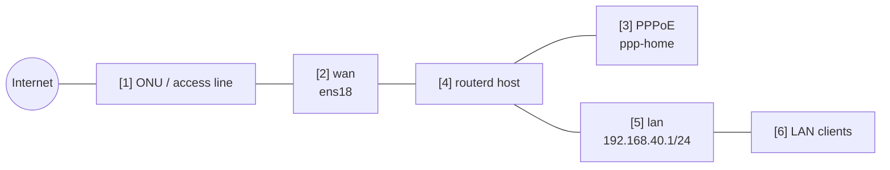

# PPPoE IPv4 NAT ルーター

物理 WAN は Ethernet で、IPv4 internet への出口を PPPoE セッションで作る例です。

完全な YAML は `examples/example-pppoe-ipv4-nat.yaml` にあります。

## 構成図



## 図の対応表

| 番号 | 意味 | 主な resource |
| --- | --- | --- |
| [1] | routerd の管理外にある access line / ONU。 | routerd 管理外 |
| [2] | PPPoE を通す物理 Ethernet インターフェース。 | `Interface/wan` |
| [3] | PPPoE セッションと論理 egress インターフェース。 | `PPPoESession/pppoe-home` |
| [4] | IPv4 forwarding を導出し、nftables NAT を適用するホスト。 | Derived host runtime, `NAT44Rule/lan-to-pppoe` |
| [5] | LAN ゲートウェイと DHCPv4 セグメント。 | `IPv4StaticAddress/lan-base`, `DHCPv4Server/lan-dhcpv4` |
| [6] | NAT 経由で PPPoE を IPv4 internet 経路として使うクライアント。 | `DHCPv4Server/lan-dhcpv4` |

## この例で管理するもの

| 領域 | routerd resource |
| --- | --- |
| PPPoE セッション | `PPPoESession/pppoe-home` |
| LAN アドレス / DHCPv4 | `IPv4StaticAddress/lan-base`, `DHCPv4Server/lan-dhcpv4` |
| IPv4 internet 接続 | `NAT44Rule/lan-to-pppoe` |
| フィルタリング | `FirewallZone/*`, `FirewallPolicy/home` |

## 要点

```yaml
# [3] 物理 WAN 上に作る論理 PPPoE interface。
- kind: PPPoESession
  metadata:
    name: pppoe-home
  spec:
    interface: wan
    ifname: ppp-home
    username: user@example.jp
    passwordFile: /usr/local/etc/routerd/secrets/pppoe-home.password
    mtu: 1454
    mru: 1454
    defaultRoute: true

# [5] -> [3] LAN IPv4 traffic を PPPoE session 側へ masquerade する。
- kind: NAT44Rule
  metadata:
    name: lan-to-pppoe
  spec:
    type: masquerade
    egressInterface: pppoe-home
    sourceRanges:
      - 192.168.40.0/24
```

## 確認

```bash
routerd validate --config examples/example-pppoe-ipv4-nat.yaml
routerd apply --config examples/example-pppoe-ipv4-nat.yaml --once --dry-run
routerctl describe PPPoESession/pppoe-home
ip link show ppp-home
ip route show default
```

## よく変えるところ

- PPPoE のパスワードは YAML に直書きせず、参照先の secret ファイルに置きます。
- `mtu` と `mru` は ISP の案内に合わせます。
- PPPoE をバックアップ経路にする場合は `defaultRoute: false` にします。
