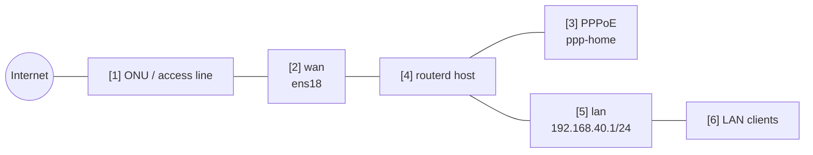

# PPPoE IPv4 NAT gateway

This example is for an access line where the physical WAN is Ethernet but the
IPv4 internet session is PPPoE.

The complete, validated YAML is in `examples/example-pppoe-ipv4-nat.yaml`.

## Topology



## Diagram map

| No. | Meaning | Main resources |
| --- | --- | --- |
| [1] | Access line or ONU outside routerd management. | External to routerd |
| [2] | Physical Ethernet interface that carries PPPoE. | `Interface/wan` |
| [3] | PPPoE session and logical egress interface. | `PPPoEInterface/pppoe-home` |
| [4] | Host enabling IPv4 forwarding and applying nftables NAT. | `Sysctl/ipv4-forwarding`, `NAT44Rule/lan-to-pppoe` |
| [5] | LAN gateway and DHCPv4 segment. | `IPv4StaticAddress/lan-base`, `DHCPv4Server/lan-dhcpv4` |
| [6] | Clients using PPPoE as their IPv4 internet path through NAT. | `DHCPv4Server/lan-dhcpv4` |

## What this manages

| Area | routerd resources |
| --- | --- |
| PPPoE session | `PPPoEInterface/pppoe-home` |
| LAN address and DHCPv4 | `IPv4StaticAddress/lan-base`, `DHCPv4Server/lan-dhcpv4` |
| IPv4 internet access | `NAT44Rule/lan-to-pppoe` |
| Filtering | `FirewallZone/*`, `FirewallPolicy/home` |

## Key config

```yaml
# [3] Logical PPPoE interface created over the physical WAN.
- kind: PPPoEInterface
  metadata:
    name: pppoe-home
  spec:
    interface: wan
    ifname: ppp-home
    username: user@example.jp
    passwordFile: /usr/local/etc/routerd/secrets/pppoe-home.password
    mtu: 1454
    mru: 1454
    defaultRoute: true

# [5] -> [3] LAN IPv4 is masqueraded toward the PPPoE session.
- kind: NAT44Rule
  metadata:
    name: lan-to-pppoe
  spec:
    type: masquerade
    egressInterface: pppoe-home
    sourceRanges:
      - 192.168.40.0/24
```

## Checks

```bash
routerd validate --config examples/example-pppoe-ipv4-nat.yaml
routerd apply --config examples/example-pppoe-ipv4-nat.yaml --once --dry-run
routerctl describe PPPoEInterface/pppoe-home
ip link show ppp-home
ip route show default
```

## Common edits

- Put the real PPPoE password in the referenced secret file, not in YAML.
- Keep `mtu` and `mru` aligned with the ISP guidance.
- Use `defaultRoute: false` when PPPoE is a backup path selected by route policy.
