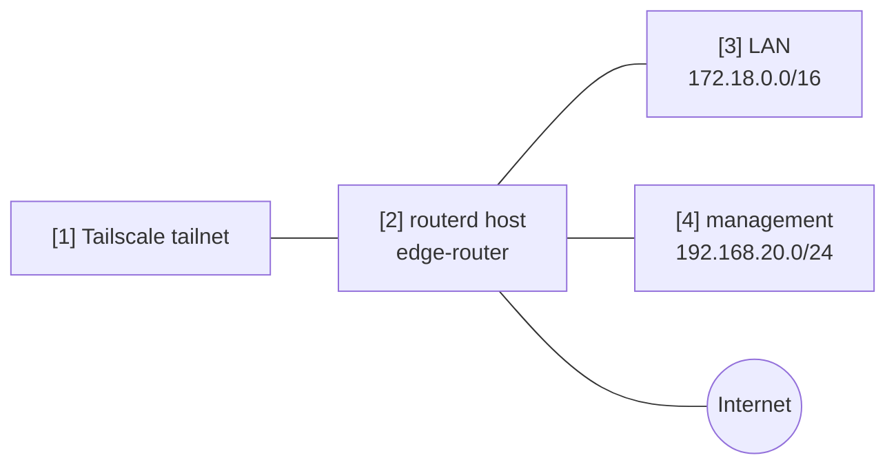

# Tailscale subnet and exit node


This example installs or expects Tailscale and advertises the router as both a
subnet router and an exit node.

The complete, validated YAML is in `examples/tailscale-exit-subnet.yaml`.

## Topology



## Diagram map

| No. | Meaning | Main resources |
| --- | --- | --- |
| [1] | Tailnet that receives route and exit-node advertisements. | External Tailscale control plane |
| [2] | Router registered as a Tailscale node. | `TailscaleNode/home` |
| [3] | LAN prefix advertised to the tailnet. | `advertiseRoutes` |
| [4] | Management prefix advertised when remote management is desired. | `advertiseRoutes` |

## What this manages

| Area | routerd resources |
| --- | --- |
| Runtime package | `Package/tailscale-runtime` |
| Tailnet node | `TailscaleNode/home` |
| Route advertisement | `advertiseRoutes` |
| Exit node | `advertiseExitNode` |

## Key config

```yaml
# [2] Register the router as a named Tailscale node.
- apiVersion: net.routerd.net/v1alpha1
  kind: TailscaleNode
  metadata:
    name: home
  spec:
    hostname: edge-router
    advertiseExitNode: true
    # [3] + [4] Prefixes advertised into the tailnet.
    advertiseRoutes:
      - 172.18.0.0/16
      - 192.168.20.0/24
    acceptDNS: false
    authKeyEnv: TS_AUTHKEY
    authKeyFile: /usr/local/etc/routerd/secrets/tailscale.env
```

## Checks

```bash
routerd validate --config examples/tailscale-exit-subnet.yaml
routerd apply --config examples/tailscale-exit-subnet.yaml --once --dry-run
routerctl describe TailscaleNode/home
tailscale status
```

Approve the advertised routes and exit-node use in the Tailscale admin console
when required by your tailnet policy.
