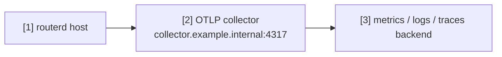

# Telemetry export to an OTLP collector

This example sends routerd telemetry to an OpenTelemetry collector. It is useful
when testing long-running behavior, health checks, DPI, or apply latency.

The complete, validated YAML is in `examples/telemetry-export.yaml`.

## Topology



## Diagram map

| No. | Meaning | Main resources |
| --- | --- | --- |
| [1] | routerd process producing logs, metrics, and traces. | `Telemetry/otlp` |
| [2] | OTLP collector endpoint. | `Telemetry.spec.otlp.endpoint` |
| [3] | Backend selected by the collector configuration. | External to routerd |

## What this manages

| Area | routerd resources |
| --- | --- |
| Telemetry sink | `Telemetry/otlp` |
| Service identity | `serviceNamespace`, `attributes` |
| Signals | `logs`, `metrics`, `traces` |

## Key config

```yaml
# [1] Enable routerd telemetry export.
- apiVersion: observability.routerd.net/v1alpha1
  kind: Telemetry
  metadata:
    name: otlp
  spec:
    # [2] OTLP collector endpoint.
    otlp:
      endpoint: http://collector.example.internal:4317
      insecure: true
    serviceNamespace: routerd
    attributes:
      deployment.environment: lab
      site: example
    signals:
      - logs
      - metrics
      - traces
```

## Checks

```bash
routerd validate --config examples/telemetry-export.yaml
routerctl describe Telemetry/otlp
```

Confirm data arrival from the collector or backend side. Keep the endpoint on a
trusted management or observability network.
