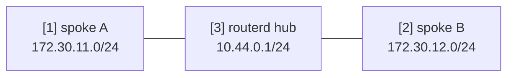

# WireGuard hub and spoke template


This template describes a routed WireGuard hub with two spokes. Treat it as a
starting point: replace keys, endpoint names, and routed prefixes before use.

The complete YAML template is in `examples/wireguard-hub-spoke.yaml`.

## Topology



## Diagram map

| No. | Meaning | Main resources |
| --- | --- | --- |
| [1] | First spoke tunnel address and routed LAN prefix. | `WireGuardPeer/spoke-a` |
| [2] | Second spoke tunnel address and routed LAN prefix. | `WireGuardPeer/spoke-b` |
| [3] | Hub WireGuard interface and address. | `WireGuardInterface/wg-hub`, `IPv4StaticAddress/wg-hub-ipv4` |

## What this manages

| Area | routerd resources |
| --- | --- |
| WireGuard device | `WireGuardInterface/wg-hub` |
| Hub address | `IPv4StaticAddress/wg-hub-ipv4` |
| Peer routes | `WireGuardPeer/spoke-a`, `WireGuardPeer/spoke-b` |

## Key config

```yaml
# [3] Hub WireGuard interface and listen port.
- kind: WireGuardInterface
  metadata:
    name: wg-hub
  spec:
    privateKeyFile: /usr/local/etc/routerd/secrets/wg-hub.key
    listenPort: 51820
    mtu: 1420

# [1] Spoke A tunnel address and routed LAN prefix.
- kind: WireGuardPeer
  metadata:
    name: spoke-a
  spec:
    interface: wg-hub
    publicKey: REPLACE_WITH_SPOKE_A_PUBLIC_KEY
    allowedIPs:
      - 10.44.0.11/32
      - 172.30.11.0/24
```

## Checks

```bash
routerd validate --config examples/wireguard-hub-spoke.yaml
routerd apply --config examples/wireguard-hub-spoke.yaml --once --dry-run
routerctl describe WireGuardInterface/wg-hub
wg show
```

## Common edits

- Keep the private key in a file with restricted permissions.
- Use one `/32` tunnel address per peer and add routed LAN prefixes explicitly.
- Add firewall rules for the UDP listen port where the WAN firewall is managed by routerd.
