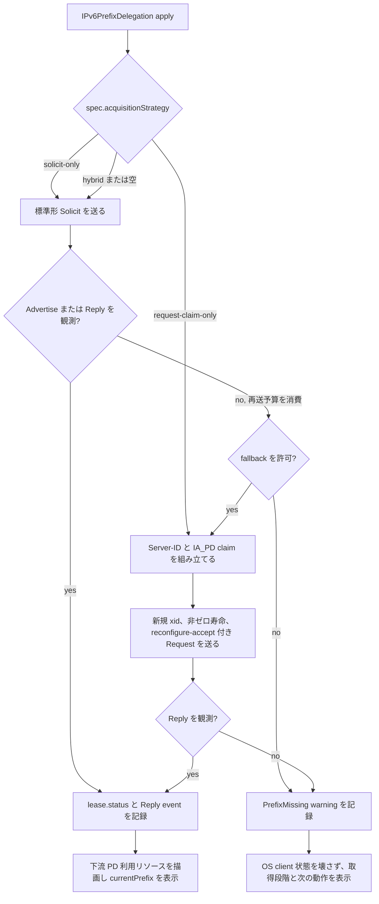
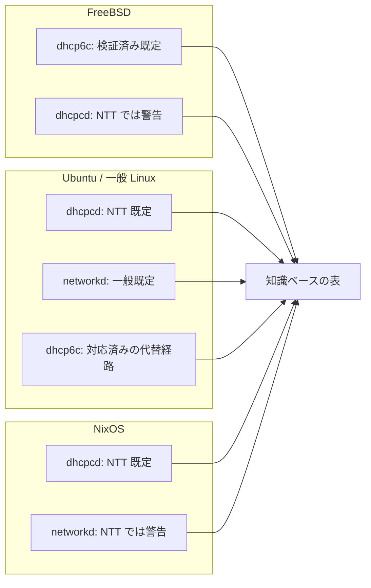

# 設計メモ

この文書は、まだ安定したリソース定義に入れていない設計判断と検証結果を
記録します。公開リポジトリに置くため、検証環境固有のプレフィックス、
MAC アドレス、DUID、宅内アドレスはドキュメント用の値に差し替えています。

## 用語の使い分け

本文では、根拠の強さを次の語で分けます。

| 語 | 意味 |
| --- | --- |
| assert | routerd として採用する設計判断。実装方針を示す。 |
| believe | 間接的な根拠に基づく推測。後で覆る可能性を残す。 |
| observe | ある時点で見えた挙動。再現性や一般性は別に扱う。 |
| measure | tcpdump、ログ、状態表などで数値やフィールドとして確認した値。 |
| cite | RFC、公式仕様、公開文書からの引用または要約。 |

この分類に落とせない文は、未検証事項として扱うか、本文から外します。

## 0. プロジェクトの最終目標

assert: 最終目標は、NTT NGN 回線で稼働している市販ホームルータ（NEC IX シリーズ等）を
routerd で完全に置き換えることである。routerd は市販ルータの補助ではなく代替である必要がある。
具体的には、単一の routerd VM（または物理ホスト）が WAN 側の DHCPv6-PD クライアント、
LAN 側の DHCPv6 サーバ、LAN 側の Router Advertisement、IPv4 経路（DS-Lite または PPPoE）、
および NAT/ファイアウォールを引き受ける。

assert: 参照アーキテクチャは同じ NTT NGN 回線で稼働中の NEC IX2215 構成である。
routerd は LAN 視点で観測可能な同等挙動を提供すること:
同じ /60 取得挙動、同じ /64 ごとの LAN 別配布、同じ RA フラグ意味、同じ
LAN クライアント向け DHCPv6 サーバ応答形。参照との差異は偶発的なドリフトではなく
意図的な設計選択でなければならない。

assert: routerd の構築中は参照ルータと routerd が同じ NGN 回線で並存する。routerd の
lab は参照ルータの脇で Proxmox VE VM として動かす。移行手順は: 参照ルータが LAN を
提供し続けたまま、同じ HGW に対して routerd を並行で訓練する。routerd が運用に耐えると
判断できた時点で参照ルータを撤去し、routerd が LAN を引き受ける。

assert: 5章では、この最終目標を実装ロードマップに落とし込みます。この章の項目は
ラボを整えるための任意作業ではなく、置き換えに必要な要件として扱います。

assert: routerd は IX2215 の機能パリティに縛られません。宣言的モデルが自然に
許す範囲で参照ルータを超えても良く、超えるべき場合があります。MVP 段階で
すでに範囲に入っている具体的な差別化として、複数の DS-Lite トンネルの
同時確立があります。IX2215 の現コンフィグでは DS-Lite トンネルを 1 本しか
張れませんが、routerd のリストは元々マルチインスタンスで、`DSLiteTunnel`
リソースは個別に適用されます。この種の差別化点は、参照アーキテクチャを
追いかけるなかで失われないよう、設計メモに残します。

assert: routerd は WAN 側の DHCPv6-PD で得たリースから LAN ごとのサブプレフィックスを
切り出し、それぞれを下流インタフェースにルーティングする方式で LAN 側 IPv6 セグメントを
提供します。IPv6 ND Proxy は使わず、WAN セグメントを LAN ポートと同じ Linux bridge に
入れる構成も使いません。これらの代替手法は LAN を WAN の /64 に onlink で晒すことになり、
下流のファイアウォールと conntrack の前提を壊し、LAN 別ポリシーを書けなくし、
複数 LAN トポロジを宣言的モデルで素直に表現できなくします。PD 方式なら各 LAN は
独自の /64 を持つルーティングセグメントになるので、ファイアウォールゾーン、conntrack、
LAN 別の RA/DHCPv6 サーバを独立に書けます。

assert: PD が WAN と LAN を分けるための仕組みとして採用されている以上、
DHCPv6-PD の安定取得とリース維持は routerd にとって譲歩できない要件であり、
ベストエフォートではありません。上流 PD リースを失う可能性のある apply 経路、
レンダラ、OS クライアント選択、復旧手順は本番プロファイルの範囲外とします。
Section 5 の `dhcp6c` 本線化と DHCPv6 取引記録はこの安定性を観測可能・
レビュー可能にするために存在します。

assert: routerd は現時点では、後方互換よりも見通しの良さとシンプルで分かりやすい
ロジックに絞り込んで保守性を保つことを明示的に優先します。現段階の人間ユーザは
開発者兼宅内ネットワーク運用者の 1 名のみで、外部スクリプト、外部 CI、
サードパーティ統合は守るべき対象として存在しません。インタフェース (CLI フラグ、
既定動作、設定の形、state DB の列) を作り直すときは、ユーザ自身の過去スクリプトが
依拠していた古い形を壊しても、将来のメンテナが最短で理解できる形を選びます。
escape-hatch フラグ、deprecation shim、「環境変数で旧 default に戻せる」分岐などは
この段階では持ちません。移行のためのヒントが必要なら changelog のエントリと
短いアップグレードノートに書き、コードのパスには持ち込みません。この方針は
将来、routerd が家庭規模で本番運用に入り、ユーザが増え、breaking change の
影響コストが保守性のメリットを上回り始めた段階で見直します。それまでは、
保守できるコードを保つために breaking change を許容します。

## 1. 検証済み事実

### 1.0 真実の元と操作経路

assert: routerd の真実の元 (source of truth) は、YAML 設定と `routerd apply` が
書き込む状態・所有台帳です。ルーターの挙動を変えるときは、ファイルを変更して
apply することを基本にします。生成済みファイルを手で直したり、apply の外から
デーモンだけを動かしたりすると、意図が git の履歴、差分、apply の結果、
ローカルデータベースに残らず、後から追跡できなくなります。

assert: `routerd apply` は、既定では kubectl に近い追加型の反映です。渡された
YAML に書かれたリソースを追加・更新し、所有関係を記録しますが、その YAML に
書かれていない過去の管理リソースは削除しません。これにより、リソースを複数の
ファイルへ分けても、片方のファイルを反映しただけでもう片方のリソースが消える
事故を避けます。削除は `routerd delete` または `routerctl delete` で明示します。

assert: ホスト上のサービスは、OS のサービス管理機構を通して扱います。systemd の
ホストでは `systemctl`、FreeBSD では `service` / rc.d を使います。通常の制御経路
として、長く動くデーモンへ場当たり的にシグナルを送ることは避けます。短時間の
切り分けで直接シグナルを使った場合でも、最後の確認は必ず `routerd apply --once`
の経路でやり直します。

assert: レンダラの変更は、本番と同じ apply 経路を通るまでテスト完了とは見なしません。
`routerd render` の出力確認は有用ですが、あくまで事前確認です。所有台帳、
サービス管理機構、依存順序、OS 自身の診断を通すには `routerd apply` が必要です。

### 1.1 RFC と公開仕様から分かること

- cite: RFC 8415 の通常の DHCPv6 取得手順は Solicit、Advertise、
  Request、Reply です。Rapid Commit が使われる場合は短縮されますが、
  routerd の NTT 向け既定では Rapid Commit を前提にしません。
- cite: RFC 8415 では、クライアントは UDP 546、サーバーとリレーは
  UDP 547 を待ち受けます。これは待受ポートの規定であり、受信する
  Advertise/Reply の送信元ポートが常に 547 であることを意味しません。
- cite: RFC 8415 では、IA_PD の中に IA Prefix を入れて希望プレフィックスや
  希望長を示せます。サーバーはそれをヒントとして扱います。
- cite: RFC 8415 では、Renew は元のサーバーへの更新、Rebind は Renew が
  成立しない場合の再束縛、Solicit は新規取得です。Confirm はアドレス確認用で、
  委譲プレフィックスの復旧手段としては扱いません。
- cite: NTT 東日本と NTT 西日本のフレッツ系公開インターフェース資料では、
  端末側 DUID は DUID-LL または DUID-LLT とされ、MAC アドレス由来であることが
  求められています。DUID-EN や UUID 由来 DUID は、この公開資料の端末モデルには
  入っていません。
- cite: 同資料では、DHCPv6 で 128 ビットのアドレスを取得しない構成が
  説明されています。NTT 向けプロファイルの既定で IA_NA を IA_PD と一緒に
  要求する根拠は、現時点ではありません。
- cite: 同資料の DHCPv6 オプション表では Rapid Commit が「この仕様では使わない」
  項目として扱われています。NTT 向け既定では Rapid Commit を送らない方針にします。
- cite: Sorah's Diary の 2017 年の実機報告は、DUID-LL 以外の Solicit が
  黙って無視されたと述べています。ただし、これは公式仕様ではなく経験報告です。
  routerd では、DUID-LL を NTT 向けプロファイルの厳しめの既定値として扱い、
  DHCPv6 全般の規則にはしません。
- cite: NEC IX の公開設定例では、ひかり電話ありの環境で DHCPv6-PD を使い、
  委譲されたプレフィックスを下流へ広告する構成が示されています。
- cite: 商用ルーターや公開されているルーター実装は、DUID、IAID、リース状態、
  委譲プレフィックス、下流広告を運用対象として扱います。routerd もこれらを
  状態として表示できる必要があります。

### 1.2 NTT HGW向けプロファイルの形

measure: NTT HGWの LAN 側でプレフィックス委譲を受ける構成では、
成功したクライアントは DUID-LL、IA_PD、Rapid Commit 無効、`/60`
委譲を使いました。DHCPv6 の Advertise/Reply は UDP 宛先 546 に届くため、
送信元ポート 547 固定を前提にしてはいけません。

measure: HGWを再起動した直後は、LAN 側の DHCPv6-PD サーバーが
応答を始めるまで数分かかる場合がありました。その間、検証ルーターは妥当な
Solicit を送っていても Advertise を受け取りませんでした。サーバーが準備できた後は、
同じ DUID-LL クライアントがすぐ Advertise/Reply を受け取りました。そのため
routerd では「HGWの再起動直後に数十秒返事がない」ことを、クライアントの形が
間違っている証拠ではなく、上流側の準備待ちとして扱います。

observe: 新しく作った検証ルーターが、過去に使っていない MAC アドレス由来の
DUID-LL で IA_PD の Solicit を繰り返しても、HGWの通常稼働中の
短時間観測では Advertise を受け取りませんでした。同じキャプチャでは、動作中
ルーターの Renew と別の検証ルーターの Rebind が見えていたため、観測点の
マルチキャスト透過性だけが原因ではありません。これにより、「古いクライアント
ごとの binding だけが邪魔している」という単純な説明は弱くなります。残る論点は、
再起動直後の取得期間から外れた 新規 Solicit に対するHGW側の
状態または時刻依存の挙動です。

observe: 既に委譲を受けたことがある FreeBSD 検証ルーターで、routerd の生成設定を
`routerd apply --once` で反映した後、rc.d の `service dhcp6c stop/start` だけで
最小形の 新規 Solicit を送り直しました。Solicit は DUID-LL、IA_PD、DNS の
要求だけを含み、過去に成功した時とほぼ同じ形でしたが、HGWの通常稼働中の
短時間観測では Advertise/Reply を受け取りませんでした。この結果は、特定の
systemd-networkd のパケット形だけが原因という説明を弱め、HGW側の
時刻または内部状態に依存する取得期間の仮説を強めます。

observe: HGWの払い出し表を直接取得できる補助ツールで確認したところ、
動作中の商用ルーターはHGW再起動から約 2 時間後にもリース残時間を
回復していました。一方、検証ルーター 3 台は再起動直後に取得したリースの残時間が
減るだけで、同じ時刻帯に更新された形跡がありませんでした。これは、HGWが
通常稼働中の既存 binding の Renew/Request には応答できること、そして検証側の
主要課題が 新規 Solicit の形ではなく、取得済みリースの Renew/Rebind を
維持できていない点にあることを示します。

measure: 同じ時刻帯のパケット取得では、動作中ルーターの Renew は Server ID を含み、
IA_PD に `T1=7200`、`T2=12600`、IA Prefix の preferred lifetime と valid
lifetime に `14400` を入れていました。検証 Linux ルーターの systemd-networkd は
Renew/Rebind を送っていましたが、IA_PD と IA Prefix の寿命はいずれも `0` でした。
この差は、HGWが通常稼働中の Renew を受け付ける一方で、検証側の
Renew/Rebind が成功しない理由を調べるための最優先の観測点です。routerd はこの
種類の差分を `routerctl describe ipv6pd/<name>` で見えるようにする必要があります。

measure: 動作中ルーターの初回 Solicit にはプレフィックスヒントがありませんでした。
そのため routerd は `ntt-ngn-direct-hikari-denwa` と `ntt-hgw-lan-pd` では、
正確なヒントも長さだけのヒントも既定では送りません。正確なヒントが常に悪いとは
扱いませんが、既定の形からは外します。

assert: NTT 向けプロファイルでは DUID-LL を既定の識別子の形にします。
routerd は、運用者が `spec.iaid` を明示した場合を除き、IAID を作らず
出力もしません。systemd-networkd は再設定をまたいで IAID 状態を保持することがあり、
routerd 側で既定値として出しても効果が分かりにくく、複雑さに見合う利点が
ありませんでした。NTT 向けプロファイルでは、OS クライアントの上に追加の
要求オプション調整を重ねず、設定を最小に保ちます。SOL_MAX_RT のような
プロトコル維持用の項目は networkd が送る場合があるため、OS クライアントを
置き換えない限り、routerd が networkd の Solicit をバイト単位で完全制御できるとは
扱いません。

assert: `ntt-ngn-direct-hikari-denwa` と `ntt-hgw-lan-pd` では、正確なヒントも
長さだけのヒントも既定では送りません。`prefixLength` は routerd が期待する形を
表す値として残しますが、systemd-networkd へは `PrefixDelegationHint=` を出力しません。

measure (2026-04-30): NTT HGW (PR-400NE) で、LAN 側の DHCPv6 サーバが
クライアントからの Solicit / Request / Renew / Rebind / Release / Confirm /
Information-Request をすべて silent drop する状態が観測されました。
NDP と RA はその間も正常に流れ続け、HGW のテーブルに残った既存 binding は
リースカウンタが減るだけで refresh されませんでした。HGW を手動で再起動すると
DHCPv6 サーバは即座に回復し、その直後に routerd の能動 Request
(`routerd dhcp6 request`) が成功して lab `router03` の binding を満期近い
lifetime に refresh できました。同種の DHCPv6 サーバ停止は公開報告でも
複数件確認できます (rabbit51 2022 PR-600MI、HackMD 2021 Yamaha RTX1200 +
AsahiNet、azutake 2023 Cisco IOS-XE on FLET'S クロス)。routerd はこれを
「アクティブ・コントローラーで検出と可視化はできるが自動修復はできない、
外部要因の既知故障モード」として扱い、復旧は operator による HGW 再起動だけを
唯一の経路とします。検出閾値、運用手順、公開報告の引用は
`docs/knowledge-base/ntt-ngn-pd-acquisition.md` の K 節を参照してください。

measure (2026-04-30): 同ラボでは、HGW の post-reboot acceptance window
（Renew 以外の DHCPv6 メッセージを受理する窓）が 4 分以内に閉じることが
観測されました。routerd の active Request は 11:16:50 UTC に受理されて
lab `router03` の binding を refresh しましたが、同じ client から 11:20–11:21
UTC に発火した active Renew、Release、続けての Request はいずれも Reply を
受けられませんでした。一貫して受理されたのは自然な T1 境界での maintenance-
path Renew だけです。したがって routerd は `dhcp6 renew` を診断ツールと位置
付け、運用上の lease 更新は OS の DHCPv6 client が T1 タイマーで担当します。
観測された Reply 値 `T1=7200`、`T2=12600`、`pltime=vltime=14400` の下では、
Renew opportunity は 2 時間ごと 1 回となり、T1 境界を 1 回取りこぼしてから
vltime expire までは約 2 時間の grace があります。routerd の検出と operator
通知のサイズはこの 2 時間の予算を基準に決めます。詳細は
`docs/knowledge-base/ntt-ngn-pd-acquisition.md` の H 節、H.1 節、K.4–K.5 節を
参照してください。

### 1.3 OS クライアント実装から分かること

| クライアント | 測定または引用した挙動 | routerd での扱い |
| --- | --- | --- |
| systemd-networkd | cite/measure: `DUIDType=link-layer`、`IAID`、`PrefixDelegationHint`、`WithoutRA` を設定できます。検証した Linux 経路では Renew/Rebind の IA Prefix 寿命が 0 になる場合があります。 | 一般的な Linux DHCPv6-PD では使えますが、NTT HGW向けの推奨経路にはしません。 |
| KAME/WIDE `dhcp6c` | cite/measure: DUID はファイル、IAID と IA_PD は設定で扱います。ヒント付き Solicit や Renew/Rebind で IA Prefix 寿命を出力できます。 | FreeBSD で使い、Linux では移行や比較検証のために明示した場合だけ使います。NTT 向けでは DUID-LL ファイルを routerd 管理対象にします。 |
| `dhcpcd` | cite/measure: IPv4 DHCP、IPv6 RA/SLAAC、IA_NA、IA_PD を 1 つのクライアントで扱えます。Linux、NixOS、FreeBSD で導入できます。Ubuntu の clean re-acquisition 試験では、通常稼働中の HGW から Reply は返りませんでした。 | ラボ評価用のレンダラとサービス経路として残します。Ubuntu、FreeBSD、NixOS で初回取得と T1 Renew が成功するまで、NTT 向け既定値にはしません。 |
| dnsmasq | cite/assert: LAN 側の DNS、DHCPv4、DHCPv6、RA には有用です。WAN 側の PD クライアントの正にはしません。 | LAN サービスに限定して使います。 |

assert: DHCPv6-PD の取得経路は意図的に絞ります。一般的な Linux では
systemd-networkd を使えます。NTT HGW向けでは、Linux と NixOS は
`dhcpcd`、FreeBSD は KAME/WIDE `dhcp6c` を使います。Linux の `dhcp6c` は
明示した場合だけ使う移行・比較検証用の代替経路です。

assert: NTT 系プロファイルでは、実際の MAC アドレスから作った DUID-LL を既定にします。`duidRawData` と `iaid` は、高可用構成の切り替え、ルータ交換、移行のために明示的に使う上書き設定であり、通常の復旧経路では使いません。

assert: FreeBSD では、NTT 系プロファイルの `dhcp6c` を `-n` 付きで起動し、
サービス再起動時に DHCPv6 Release を送らないようにします。これは公開設定項目ではなく
プロファイル内部の挙動です。通常の Renew/Rebind の時刻管理は、引き続き OS 側の
DHCPv6 クライアントに任せます。

assert: apply は、設定や識別子が本当に変わった場合を除き、DHCPv6 クライアントが
プロセス内に持つリース状態を壊してはいけません。FreeBSD の `dhcp6c` は、動作中の
プロセス内に交換状態を持ちます。毎回の apply で再起動してしまうと、有効なリースが
新規 Solicit の繰り返しになり、自然な Renew/Rebind を観測できません。そのため
FreeBSD の rc.conf 差分判定では `sysrc` の出力を OS のサービス管理状態として扱い、
`dhcp6c_flags="-n"` がすでに入っているなら書き直しません。

## 2. ラボ環境特有の問題

### 2.1 仮想環境のマルチキャスト透過性

observe: 検証機は Proxmox 上の仮想マシンでした。Linux bridge の
`multicast_snooping` が有効な状態では、RA や DHCPv6 のマルチキャスト交換が
見えない、または一部だけ見える状態になり得ます。

cite: Proxmox bridge の `multicast_snooping=0` が IPv6 RA/DHCPv6 の検証で
必要になる事例は、公開記事やフォーラムにも報告されています。

assert: routerd の検証で DHCPv6-PD を判断する前に、次を確認します。

- Proxmox bridge が IPv6 マルチキャストを通すこと。
- 経路上の L2 スイッチで MLD/IGMP snooping が検証を妨げていないこと。
- tcpdump は上流側インターフェースで `udp port 546 or udp port 547` と RA を
  別々に取ること。
- 「HGWが返していない」と結論する前に、同じ区間で動作中ルーターの Solicit や
  Request が見えるか確認すること。

### 2.2 L2 スイッチのマルチキャストスヌーピング

observe: 検証経路上の L2 スイッチで IGMP snooping が有効な場合、IPv6 RA や
DHCPv6 のマルチキャスト交換の一部が届かなくなることがありました。多くの実装で
IGMP snooping の有効/無効は MLD snooping と連動するため、IPv4 マルチキャストの
最適化を意図して入れた設定が IPv6 ND/DHCPv6 の検証を阻害する形で出ます。

assert: routerd の検証では、まず snooping を OFF にしてマルチキャストを flat に
流し、観測経路を素直にします。本番運用で snooping を維持したい場合は、別の
設計選択肢として次があります。

- 経路上に MLD Querier を立てて General Query を送り、各クライアントから
  Listener Report を引き出して snooping テーブルを維持する。
- routerd 配下に NDP/DHCPv6 multicast を完全に通す範囲だけ snooping を切り、
  他の VLAN は維持する分割設計にする。

believe: ラボ規模では snooping OFF が現実的です。フラッディング増は無視できる
範囲で、原因切り分けが速くなります。

observe: 物理 L2 スイッチの設定変更は機種ごとの管理画面・CLI に依存するため、
本文書では機種名や具体的な設定コマンドは扱いません。

## 3. 公開資料

主な参照先:

- [RFC 8415: Dynamic Host Configuration Protocol for IPv6](https://www.rfc-editor.org/rfc/rfc8415.html)
- [RFC 9915: Dynamic Host Configuration Protocol for IPv6](https://datatracker.ietf.org/doc/html/rfc9915)
- [NTT 東日本 技術参考資料](https://www.ntt-east.co.jp/gisanshi/)
- [NTT 東日本 IP 通信網サービスのインタフェース フレッツシリーズ 第三分冊](https://flets.com/pdf/ip-int-3.pdf)
- [NTT 西日本 IP 通信網サービスのインタフェース](https://www.ntt-west.co.jp/info/katsuyo/pdf/23/tenpu16-1.pdf)
- [Yamaha RT シリーズ DHCPv6 機能](https://www.rtpro.yamaha.co.jp/RT/docs/dhcpv6/index.html)
- [Yamaha IPv6 IPoE 機能](https://www.rtpro.yamaha.co.jp/RT/docs/ipoe/index.html)
- [NEC UNIVERGE IX フレッツ 光ネクスト IPv6 IPoE 設定例](https://jpn.nec.com/univerge/ix/Support/ipv6/native/ipv6-internet_dh.html)
- [NEC IX-R/IX-V DHCPv6 機能説明](https://support.necplatforms.co.jp/ix-nrv/manual/fd/02_router/14-1_dhcpv6.html)
- [Sorah's Diary: フレッツ光ネクスト ひかり電話あり環境の DHCPv6-PD 観測](https://diary.sorah.jp/2017/02/19/flets-ngn-hikaridenwa-kill-dhcpv6pd)
- [rixwwd: NTT HGW配下の DHCPv6 パケット観測](https://rixwwd.hatenablog.jp/entry/2023/04/09/211529)
- [SEIL: NGN IPv6 ネイティブ IPoE 接続例](https://www.seil.jp/blog/10.html)
- [systemd.network マニュアル](https://www.freedesktop.org/software/systemd/man/254/systemd.network.html)
- [FreeBSD dhcp6c(8)](https://man.freebsd.org/cgi/man.cgi?manpath=freebsd-release-ports&query=dhcp6c&sektion=8)
- [FreeBSD dhcp6c.conf(5)](https://man.freebsd.org/cgi/man.cgi?query=dhcp6c.conf)
- [pfSense advanced networking documentation](https://docs.netgate.com/pfsense/en/latest/config/advanced-networking.html)
- [OPNsense DHCP documentation](https://docs.opnsense.org/manual/isc.html)
- [MikroTik RouterOS DHCP documentation](https://help.mikrotik.com/docs/display/ROS/DHCP)
- [Cisco IOS XE DHCPv6 Prefix Delegation](https://www.cisco.com/c/en/us/td/docs/ios-xml/ios/ipaddr_dhcp/configuration/xe-16-9/dhcp-xe-16-9-book/ip6-dhcp-prefix-xe.html)
- [Juniper Junos IA_NA and Prefix Delegation](https://www.juniper.net/documentation/us/en/software/junos/subscriber-mgmt-sessions/topics/topic-map/dhcpv6-iana-prefix-delegation-addressing.html)

## 4. 既知の制限と未検証事項

### 4.1 DHCPv6-PD

- believe: DUID-LLT が特定の NTT 経路で黙って無視される可能性はあります。
  ただし NTT 公式資料は DUID-LLT も許しているため、これは公式仕様ではなく
  実装差の可能性として扱います。
- assert: routerd 自前 DHCPv6 クライアントは、OS クライアントで得られる
  安定性と運用性を確認した後の選択肢です。先に DUID、IAID、リース、イベントの
  観測を固めます。

### 4.2 状態と所有台帳

routerd は、ローカル状態と所有台帳を SQLite に保存します。既定の場所は
Linux では `/var/lib/routerd/routerd.db`、FreeBSD では
`/var/db/routerd/routerd.db` です。

| 表 | 役割 |
| --- | --- |
| `generations` | 反映を試みた単位ごとの結果、警告、設定ハッシュを保存します。 |
| `objects` | リソース単位の状態 JSON を保存します。例: `IPv6PrefixDelegation/wan-pd` のリース、DUID、IAID、時刻。 |
| `artifacts` | routerd が管理するホスト側構成物の所有台帳です。 |
| `events` | 反映時の警告やプレフィックス観測を保存します。 |
| `access_logs` | 将来のローカル HTTP API 監査用です。 |

JSON は文字列として保存し、SQLite の JSON1 機能で確認できます。

```sh
sqlite3 /var/lib/routerd/routerd.db \
  "select json_extract(status, '$.lastPrefix') from objects where kind = 'IPv6PrefixDelegation' and name = 'wan-pd';"
```

routerd の実行に `sqlite3` コマンドは不要です。人が状態を調べる時には便利です。
`jq` は、信頼済みローカルプラグインが JSON を扱うために残します。

### 4.3 ホスト情報

routerd は反映処理の開始時に、観測したホスト情報を
`routerd.net/v1alpha1/Inventory/host` として保存します。状態 JSON には
Go の OS 名、`uname` から得たカーネル情報、仮想化の判定、取得できた DMI 情報、
サービス管理方式、`nft`、`pf`、`dnsmasq`、`dhcp6c`、`sysctl` などのコマンドが
使えるかどうかを記録します。

assert: Inventory は観測値であり、望ましい設定を表すリソースではありません。
通常の `spec.resources` には書かず、最初の実装ではレンダラも参照しません。
今ここで保存する理由は、後で物理機か仮想機か、systemd か rc.d か、ブリッジの
マルチキャスト設定のようなホスト前提を、レンダラごとの推測ではなく観測事実として
扱えるようにするためです。

確認には次を使います。

```sh
routerctl describe inventory/host
```

### 4.4 今後の設計作業

- 現在のプロファイル整理後に、Linux の systemd-networkd と FreeBSD の
  `dhcp6c` が自然に行う DHCPv6-PD の Renew/Rebind を観測します。routerd が
  クライアントのタイマーを管理せずに、状態として確実に表示できる範囲を確認します。
- OS クライアントから T1/T2 や寿命を取れる場合は、`IPv6PrefixDelegation` の
  状態表示をさらに強化します。現在値、最後に見えた値、観測した DUID/IAID、
  期待する DUID/IAID、最後に観測した時刻、警告は混ぜずに表示します。
- `IPv6PrefixDelegation` の観測根拠を見直します。LAN 側に過去の委譲アドレスが
  残っているだけでは、上流の DHCPv6-PD リースが現在も有効とは限りません。
  `routerctl describe ipv6pd/<name>` は、派生アドレスの存在、OS クライアントの
  リース状態、最後に観測した DHCPv6 Reply、T1/T2 や寿命を分けて表示し、
  根拠が派生アドレスだけの場合は警告します。
- `routerctl describe ipv6pd/<name>` を強化し、運用確認の最初の手段を
  生のシェルコマンドにしないようにします。詳細表示には、生成したクライアント設定の
  要約、OS サービスの状態、そのクライアントに触れた最後の apply 操作、取得できる
  場合は関連する直近ログ、将来 routerd が管理するパケット観測やイベントを持てるなら
  DHCPv6 のメッセージ種別ごとの数を出します。バイト単位の診断では引き続き
  パケット取得が必要ですが、最初の正常性確認は routerctl で答えられるようにします。
- FreeBSD のホスト情報でコマンド検出を直します。`/usr/local/sbin` に入る
  `dhcp6c` や `dnsmasq` は rc.d から使えても、routerd の PATH が狭いと
  見つからないことがあります。Inventory はプラットフォーム別の探索パスを使い、
  見つけたコマンドのパスも表示します。
- 古い委譲プレフィックスを LAN サービスから撤回する設計を仕上げます。反映処理は、
  委譲プレフィックスが変わったあと、routerd が作った LAN 側アドレスと DS-Lite の
  送信元アドレスのうち、管理対象の末尾アドレスを持つ古いものを削除します。
  委譲プレフィックスが消えた時に、LAN 側 RA/DHCPv6 から古い情報をすばやく
  撤回する設計はまだ残っています。
- `Inventory/host` を、仮想ブリッジのマルチキャスト透過性、RA 受信、
  サービス管理方式の違いといったホスト前提の助言や将来の出力に使うかを設計します。
- 残っているサンプルプラグインを `plugins/` 直下に置き続けるか、信頼済み
  ローカルプラグインの実例が増えた段階でテスト用 fixture へ寄せるかを決めます。
- プレフィックス委譲がない場合でも、WAN 側 IPv6 到達性で DS-Lite を使う
  構成は設計候補として残します。ただし LAN 側 IPv6 をブリッジまたは通過させる
  構成は所有境界とファイアウォール設計が変わるため、別途検証します。

## 5. IX2215 置き換えロードマップ

この作業一覧は、0章で定めた参照ルータの挙動と、現在の routerd 実装の差を埋める
ためのものです。

### 5.1 最重要: NTT/HGW のプレフィックス委譲は OS ごとに経路を選ぶ

assert: NTT HGW 向けプロファイルでは、Linux は `dhcpcd`、FreeBSD は
KAME/WIDE `dhcp6c` を既定にします。どちらも、ラボで観測した
systemd-networkd の Renew/Rebind 寿命 `0/0` 問題を避けるための経路です。
Linux の `dhcp6c` は、移行や比較検証のために明示した場合だけ使う
代替経路として残します。

完了条件: FreeBSD の 1 台を `client: dhcp6c` の対照系として残し、もう 1 台を
`client: dhcpcd` の試験系として同じ HGW 状態で測ります。その後、Ubuntu と
NixOS では Linux 経路として `dhcpcd` を測ります。Linux の既定値は `dhcpcd` に
移しましたが、T1 の長時間 Renew 観測は Phase 3 に残します。

measure (2026-04-30): Ubuntu の `dhcpcd` で clean re-acquisition を試したところ、
routerd 管理下で DUID-LL と IA_PD を含む Solicit は繰り返し送られましたが、
短時間の通常稼働中試験では HGW から Advertise/Reply は返りませんでした。
その後のラボ作業で `dhcpcd` を Linux の本線にしましたが、T1 Renew の長時間観測は
引き続き残作業として追います。

長い T1 測定に入る前に、短い寿命を要求する能動 Request を 1 回送ります。
要求値は `T1=300`、`T2=600`、`pltime=600`、`vltime=900` とし、HGW の Reply
がその値を採用するかを見ます。採用されるなら短い周期で比較試験を回します。
HGW が通常値で上書きするなら、観測済みの 2 時間 T1 周期に戻します。

### 5.2 最重要: DHCPv6 アクティブ・コントローラー (旧: DHCPv6 のやり取りを記録する)

assert: LAN 側に委譲アドレスが残っていることだけでは、上流の DHCPv6-PD リースが
生きている証拠にはなりません。routerd には、パケットから得た DHCPv6 の進行状況が
必要であり、OS クライアントの自動タイマだけでは足りない場面では能動的に
ライフサイクルを駆動できる必要があります。

observe (2026-04-30): NTT HGW (PR-400NE) のラボ試験で、新規 Solicit 経路が
不安定になる時間帯でも、観測済みの Server Identifier と IA_PD の claim を持つ
Request は HGW に受理されました。NEC IX2215 の `clear ipv6 dhcp client` も
INIT-REBOOT 風の Request だけを送ってリースを復旧し、Solicit を一切送らずに
binding を取り戻せました。詰まっていたラボルータからも、観測した HGW Server
Identifier と IA_PD prefix claim を含む Request を routerd 制御で送出すると、
HGW が新規 binding を割り当てて応答しました。

measure (2026-04-30): IA_PD prefix を含んでいても T1/T2 が `0/0` で、
Reconfigure Accept option を含まない能動 Renew は、HGW から応答されませんでした。
routerd の能動制御が送る Request/Renew は、送信ごとに新しい transaction ID を作り、
状態に記録された T1/T2 を使います。状態に無い場合、NTT 系プロファイルでは
`7200/12600` を既定値にします。IA Prefix の寿命も `14400/14400` を既定値として
0 にせず、Request/Renew には Reconfigure Accept を含めます。一方 Release は
逆に IA_PD の寿命を 0 にし、Reconfigure Accept を含めません。

assert: routerd の DHCPv6 ライフサイクル機能は受動的な記録器ではなく、能動的な
コントローラーです。`objects.status._variables` に保持したリース識別情報を
使って、Solicit、Request、Renew、Rebind、Confirm、Information-Request、Release
を任意のタイミングで送出できる必要があります。OS クライアントの自動タイマで
T1/T2 を待つことは引き続き許可されますが、唯一の経路にしてはいけません。
`routerctl describe ipv6pd/<name>` ではこのコントローラーの全状態を見せ、
派生アドレスの有無だけでは判断しません。

assert: アクティブ・コントローラーの永続化は既存の routerd state スキーマを
そのまま使います。新しい SQLite テーブルは作りません。
`IPv6PrefixDelegation/<name>` の `objects.status` JSON が、決まった field 名で
リースと観測を持ちます (例: `lease.serverID`, `lease.prefix`, `lease.iaid`,
`lease.t1`, `lease.t2`, `lease.pltime`, `lease.vltime`, `lease.sourceMAC`,
`lease.sourceLL`, `lease.lastReplyAt`, `wanObserved.hgwLinkLocal`,
`wanObserved.raMFlag`, `wanObserved.raOFlag`, `wanObserved.raPrefix`)。
Solicit/Advertise/Request/Reply/Renew/Rebind/Release の各観測は
既存の `events` テーブルに `reason=SolicitSent` のような安定した
reason 名で 1 行ずつ記録します。

assert: 各 DHCPv6 クライアント用の renderer は、`IPv6PrefixDelegationSpec` と
合わせて、対応するオブジェクトの status を暗黙の入力として受け取ります。
spec に明示的に書かれた値 (`iaid`、`duidRawData`、新規追加の
`serverID`、`priorPrefix` 等) が最優先で、spec が空の field は
`objects.status._variables` の値で埋めます。これは既存の IAID/DUID 上書きの
パターンと同じで、routerd が観測値を自動で記録し、運用者が必要な時だけ
YAML で値を固定できます (ルータ移行、HA 切替、replay 試験など)。

完了条件: routerd がアクティブ・コントローラーを実装し、
`IPv6PrefixDelegation/<name>` status に lease / wanObserved field を記録し、
`events` テーブルに transaction ごとの行を出し、`routerctl describe ipv6pd/<name>`
からそれらが見え、spec の `serverID`、`priorPrefix`、`acquisitionStrategy`
上書きを受け入れること。NTT プロファイルは、OS クライアントの Solicit 経路が
HGW に黙殺される状態でも、観測または固定された `serverID` を使って
Request-with-claim にフォールバックします。

実装メモ (2026-04-30): デーモンは WAN 側の RA を待ち受け、RA の送信元
リンクローカルアドレス、そこから推定したリンクレイヤ DUID 候補、M/O フラグ、
プレフィックス、観測時刻を `lease.wanObserved` に記録します。routerd が管理する
`dhcp6c` と `dhcpcd` は、DHCPv6 リースイベントを制御 API へ送るローカル
フックスクリプトを生成します。デーモン内の軽い監視は `lastReplyAt + T1` と
現在時刻を比べ、想定される更新時刻を過ぎても新しい Reply が無い場合に
`HGWHungSuspected` をイベントとして残します。`routerctl describe ipv6pd/<名前>` は、
下流側に委譲アドレスが残っているかどうかとは別に、リース、WAN 側の観測、
取得段階、次の動作、更新停止の疑いを表示します。

アクティブ・コントローラーの経路は意図的に狭くしています。Linux の
NTT 向け既定が `dhcpcd` になったため、最初の Solicit は routerd ではなく
OS クライアントが担当します。`hybrid` は、OS クライアントの通常取得を観測し、
Advertise/Reply が再送予算内に見えない場合だけ routerd の生
Request-with-claim 補助に進む、という意味です。まず最も自然な DHCPv6 交換を
試し、観測済みの HGW 挙動に必要な場合だけ段階的に強めます。



### 5.3 重要: apply が DHCPv6 クライアントを不用意に壊さないようにする

assert: 生成されたクライアント設定が変わっていない場合、apply は DHCPv6 クライアントを
再起動したり、設定を書き換えたりしてはいけません。OS クライアントの状態は生きている
リースの一部であり、それを失うと HGW が新規 Solicit を受理するかどうかに復旧が
左右されます。

完了条件: apply を2回続けて実行するテストで、変更のない `IPv6PrefixDelegation` が
`dhcp6c` を再起動せず、リース状態を削除せず、同等の設定ファイルを書き直さないことを
確認します。常駐 apply と一回だけの CLI apply は同じ挙動にします。

### 5.4 重要: LAN 側 RA の DNS 配布を明示する

assert: LAN クライアントは一様ではありません。DHCPv6 の DNS オプションを見る
クライアントもあれば、SLAAC のみで RA 内の DNS 情報を期待するクライアントもあります。
routerd は dnsmasq の暗黙挙動に任せず、意図を設定で表せるようにします。

完了条件: `IPv6DHCPScope` または関連リソースで、DNS を DHCPv6 オプション、RA の
RDNSS、両方、どちらも使わない、のいずれで配るかを表現できること。生成される
dnsmasq 設定と文書で、Android や SLAAC のみの端末での挙動が分かること。

### 5.5 中位: 必要なら DHCPv6 の状態付きアドレス配布を追加する

believe: 最初のホームルータ置き換えは、状態なし DHCPv6 と RA から始められます。
ただし、参照ルータと同等の挙動を求める中で、状態付き IPv6 アドレス配布を期待する
クライアントが見つかる可能性があります。

完了条件: 必要性が観測できた場合に、routerd が状態付き IPv6 アドレスプール、
リース保存、生成設定を表せること。dnsmasq で足りるか、別サーバが必要かも含めて
文書化します。

### 5.6 中位: 下流ルータへの IA_PD 再委譲を追加する

believe: 初期の置き換えでは単一 LAN への /64 配布で始められます。ただし、完全な
ルータ置き換えでは、下流ルータへさらにプレフィックスを委譲する必要が出るかもしれません。

完了条件: 下流向けプレフィックスプール、加入者の対応関係、委譲寿命を表すリソースを
用意します。上流から受け取ったプレフィックスの所有と、下流へ配るプレフィックスの
所有を明確に分けます。

### 5.7 中位: NixOS の DHCPv6-PD クライアント経路を仕上げる

assert: この項目は Section 5.8 の方針で完了済みです。
`IPv6PrefixDelegation.spec.client` を省略した NixOS では、Linux の
NTT/HGW 向け既定経路として `dhcpcd` を使います。以下の記述は、
systemd-networkd と WIDE `dhcp6c` を NixOS の既定にしなかった理由を
残すための履歴です。

assert: NixOS は移植性を見るうえで有用な対象ですが、Ubuntu と FreeBSD による
置き換え経路を止める理由にはしません。nixpkgs に `wide-dhcpv6` が無いため、
routerd には再現可能な導入方法か、対応済みの別クライアントが必要です。

完了条件: 完了済み。router02 は、systemd-networkd の PD 経路を使わず、
文書化された `dhcpcd` 経路で NTT/HGW 向けプロファイルを扱えます。

### 5.8 重要: WAN 側クライアントを複数方式で扱う

assert: routerd は複数の DHCPv6-PD クライアント生成経路を残します。ただし、
運用上の既定値は確定済みです。NTT ホームゲートウェイ向けプロファイルでは
Linux と NixOS は `dhcpcd`、FreeBSD は KAME/WIDE `dhcp6c` を使います。
NTT 以外の一般的な Linux では systemd-networkd を使います。Linux の
`dhcp6c` は移行や比較検証のために明示した場合だけ使う代替経路として残します。運用者は
`spec.client` を明示でき、ラボでは YAML を書き換えず apply 時の
上書きフラグを使えます。

`IPv6PrefixDelegation.spec.client` が空の場合、apply は次の既定値を選びます。

| ホスト種別 | プロファイル | 既定クライアント |
| --- | --- | --- |
| FreeBSD | 任意 | `dhcp6c` |
| Linux | `default` | `networkd` |
| Linux | `ntt-*` | `dhcpcd` |
| NixOS | `ntt-*` | `dhcpcd` |

実装の成熟度は知識ベースで管理します。



assert: 既知の悪い組み合わせは、検証エラーではなく警告にする。ある
ネットワークでは不適切でも、別の環境や切り分け試験では役に立つ場合が
あるためである。routerd は `KnownNGCombination` イベントを記録し、生成処理は
続行する。現在の表では、FreeBSD の `dhcpcd` と NTT プロファイルの組み合わせ、
および Linux の `networkd` と NTT プロファイルの組み合わせを警告対象にする。
組み合わせ表は `docs/knowledge-base/dhcpv6-pd-clients.md` に置き、詳細な
試験記録は `docs/knowledge-base/ntt-ngn-pd-acquisition.md` に残す。

完了条件: apply 時の既定値解決が実装されている。apply でクライアントと
プロファイルを上書きできる。既知の悪い組み合わせは警告とイベントとして
表示される。検証では構文、列挙値、必須項目だけを拒否する。OS、クライアント、
プロファイルの対応状況は知識ベースの表で維持する。

### 5.12 中: ブリッジと VXLAN による L2 セグメント

assert: 複数ホストにまたがる LAN セグメントは、場当たり的なシェルスクリプトではなく、
routerd のリソースとして扱う。最初の土台は `Bridge` リソースである。ループを避けるため
STP と RSTP は既定で有効にし、マルチキャストスヌーピングは既定で無効にする。仮想化された
検証環境では、IPv6 近隣探索、ルータ広告、DHCPv6 のマルチキャストを確実に観測できることが
重要だからである。

次の段階では、`VXLANSegment` リソースを `Bridge` へ接続できるようにする。VXLAN ポートには
既定で L2 フィルタを入れ、DHCPv4、DHCPv6、ルータ広告、近隣探索をトンネル越しに流さない。
これにより、同じセグメントに複数の routerd がいても、意図しない DHCP/RA の重複を避けやすく
なる。DHCP と RA のリソースには `role` を追加し、どのルータがサーバとして振る舞い、どの
ルータが L2 の中継だけを行うのかを明示できるようにする。

完了条件: Linux systemd-networkd、FreeBSD、NixOS 向けのブリッジ出力がある。Linux の
RSTP では `mstpd` の依存確認が行われる。VXLAN をブリッジへ接続できる。DHCP/RA の
指定サーバと L2 フィルタの安全策が文書化され、出力にも反映されている。

## 6. 実装フェーズ

assert: Section 5 は置き換え要件を列挙していますが、フェーズには切って
いません。Section 6 では 5.x の項目を、routerd が「動いている IX2215 の隣で
ラボ検証する状態」から「IX2215 を撤去した後の本番運用に入る状態」へ進む順序に
整理します。各フェーズはどの 5.x 項目を進めるか、および何 (コードのみ /
ラボトラフィック / 実機 LAN トラフィック / 本番影響) を触るかを明示します。
これにより、メンテナンス窓や運用者調整が必要なフェーズが一目で分かります。

### 6.1 フェーズ 1: アクティブ・コントローラーの仕上げ

範囲: 5.2 で着手したアクティブ・コントローラーを、運用者の手動コマンド無しで
観測可能・自走可能になるまで仕上げる。

- WAN インタフェースの RA をリッスンして `wanObserved.*` と派生 Server
  Identifier を `IPv6PrefixDelegation/<name>` の status に記録する RA リスナーを実装。
  Linux は raw ICMPv6 リスナー、FreeBSD は DHCPv6 記録器と同じ BPF 経路を使う。
- dhcp6c のフック (または同等のリスナー) を実装し、Reply ごとに `lease.*`
  を更新して `events` テーブルに対応行を出す。
- ハング検知を実装: T1 boundary 経過後、設定可能な猶予秒数を超えて Reply が
  無ければ `hgwHungSuspectedAt` を立て、`routerctl describe ipv6pd/<name>`
  に警告を表示。
- 明示的な回復方針を追加する。既定は手動対応のままで、警告だけを出す。
  運用者が `spec.recovery.mode` に `auto-request` または `auto-rebind` を
  指定した場合だけ、ハング検知後に daemon が Request または Rebind を 1 回送る。
  その後は 5 分待ち、3 回失敗したら、新しい Reply を観測してハング状態が消えるまで
  自動回復を止める。
- `spec.acquisitionStrategy` で宣言されるハイブリッド取得戦略を実装:
  まず canonical な Solicit、設定された再送予算内に Advertise が来なければ
  Request-with-claim にフォールバック。
- 診断用の低レベル手動動詞は残す:
  `routerd dhcp6 solicit|request|renew|rebind|release` は送信した試行を
  `IPv6PrefixDelegation` の状態に記録し、自動経路が完成する前でも
  `routerctl describe` で何を試したか確認できるようにする。
- トランザクション記録器は 2 段階で実装する。まず routerd が内部パケット生成器から
  送った能動制御パケットを記録し、次に受信側リスナーを接続して、外部 DHCPv6
  クライアントと HGW からの Reply も同じ状態形式で記録する。
- 受信側リスナーは受動的でなければならない。リンク層フレームを観測するだけで、
  UDP 546/547 を bind せず、パケット送信、クライアント再起動、リンク状態変更を
  行わない。Linux では AF_PACKET、FreeBSD では `/dev/bpf*` 経由の BPF を使う。
  それ以外の OS では、同等の受動的な捕捉機構を用意してから有効化する。
- ドキュメント: `docs/knowledge-base/ntt-ngn-pd-acquisition.md` の
  Section H/H.1/K に、検知しきい値と運用者向けプレイブックをまとめて
  維持する。

フェーズ 1 はコード、生成設定、`objects.status._variables` のみを触ります。
HGW には触りません: ラボルータはこれまでのプロファイルで動作し続けます。
検証は `go test ./...`、`make check-schema`、`make validate-example`、
`routerctl describe` の新フィールド表示確認で完結します。

assert: フェーズ 1 は 5.1 (dhcp6c 本線化の残り)、5.2 (アクティブ・
コントローラー本体)、5.3 (apply 無動作安全、新リスナーがクライアント
再起動を不要に発生させてはいけない) を進めます。

#### 6.1.x フェーズ 1 サブタスク: WAN クライアント戦略表

assert: Section 5.8 では複数クライアント戦略を採用した。フェーズ 1 では
`dhcp6c`、`dhcpcd`、`networkd` の生成経路を必要な場所で使えるように保ち、
apply 時にホスト種別とプロファイルから既定値を選ぶ。

サブタスクはフェーズ 1 の他の作業と並列に走る:

- `IPv6PrefixDelegationSpec.client` で `networkd`、`dhcp6c`、`dhcpcd` を
  選べる状態を保つ。
- `client` が空のとき、Section 5.8 の OS/プロファイル表で apply 時に補う。
- ラボ検証向けに apply 時上書きフラグを追加し、YAML は書き換えない。
- 既知の悪い組み合わせは検証失敗ではなく、警告とイベントとして扱う。
- 新しいラボ証拠が出たら、知識ベースの対応表を更新する。

assert: Section 5.2 の routerd アクティブ・コントローラーは、どの
クライアントを選んでも残す。正しく動く OS DHCPv6 クライアントは定常運用の
リース維持を担当できる。`pkg/dhcp6control` は起動時取得、復旧、パケット単位の
診断を担当する。

### 6.2 フェーズ 2: 参照ルータと LAN 側パリティ

範囲: 検証期間中に参照ルータと並存させても LAN クライアントが差を観測しない
レベルまで、LAN 側のリソースモデルを IX2215 と揃える。

- 上流 PD リースから複数の下流インタフェースに /64 を切り出して配るしくみを、
  完全に宣言的なリソースで実装。
- アドレスを DHCPv6 で受けたい LAN クライアント向けに、`IPv6DHCPScope.mode`
  に IA_NA stateful の状態付き割り当てを追加。
- routerd の LAN 上にある下流ルータが routerd から自分の /60 や /64 を要求
  できるよう、IA_PD 再委譲を追加 (参照ルータの subscriber モデル相当)。
- SLAAC のみのクライアント (Android, 一部 IoT) が DHCPv6 無しでも DNS を
  受け取れるよう、RA RDNSS と DHCPv6 DNS を一級扱いにする。
- プロファイルが意図的に変えない限り、参照ルータと同じ RA フラグ
  (`O=1, M=0`) を出す。

フェーズ 2 はコード、生成された dnsmasq/radvd 設定、ラボ LAN の実機
クライアントトラフィックに触れます。HGW 再起動や本番切替は不要です。

assert: フェーズ 2 は 5.4 (RA DNS)、5.5 (IA_NA stateful)、5.6 (IA_PD
再委譲) を進めます。LAN 側の正しさが要件であって、5.x が含意する以上の
API 拡張は要件ではありません。

### 6.3 フェーズ 3: ラボ並存の検証

範囲: routerd と参照ルータを HGW に対して長時間並走させ、Renew サイクルを
複数回と少なくとも 1 回の HGW ハング状態を体験させて、フェーズ 1 の検知と
フェーズ 2 の LAN 側パリティを実運用で確かめる。

- routerd 配下のラボルータを 24 〜 48 時間連続稼働。
- 観測された HGW 値で 2 時間ごとに来る T1 boundary が複数回成功し、
  `events` テーブルに記録されること。
- HGW のハング状態を意図的に起こすか自然発生を待ち、ハング検知が
  発火し、運用者通知が surface することを確認。回復経路 (運用者主導の
  HGW 再起動 → routerd の再取得) が、LAN クライアントから IPv6 を
  失わせずにリース予算内で完了すること。
- 結果として得られる `routerctl describe` の出力をリグレッション基準と
  して保管。今後のコード変更でこの出力が後退しないこと。

フェーズ 3 はラボトラフィックに触れ、通常運用を通じて HGW 状態にも触れます。
このフェーズでの予定された HGW 再起動は許容されます。本番 HGW を破壊試験に
再利用することは避けます。

assert: フェーズ 3 は 5.x 項目を直接進めるものではありませんが、フェーズ 1
とフェーズ 2 が「本番に近付ける段階まで仕上がった」と判断する地点です。

### 6.4 フェーズ 4: NixOS と FreeBSD のパリティ

範囲: ラボノードが既に動かしている OS を全てカバーし、本番切替を 1 つの
OS に依存させない。

- IA_PD の寿命を正しく扱える NixOS 向け DHCPv6-PD クライアント (`wide-dhcpv6`
  の derivation か、ドキュメント化された対応クライアント) を提供。
- アクティブ・コントローラーの raw socket 送出経路を FreeBSD に移植
  (BPF、divert、NetGraph ノードのいずれか適切なもの)。Linux の AF_PACKET
  経路はそのまま維持。
- 各サポート OS でフェーズ 1 の検証を再実行。

フェーズ 4 はコードとラボノードに触れます。HGW や LAN への変更は
含みません。

assert: フェーズ 4 は 5.7 (NixOS DHCPv6-PD クライアント) を進め、5.1 の
「Linux と FreeBSD のどちらでも使えるなら使う」約束を仕上げます。

### 6.5 フェーズ 5: 本番切替

範囲: 参照ルータを撤去し、routerd が宅内 LAN を提供する状態にする。

- LAN 側の責務を参照ルータから routerd へ、セグメント単位で順次移管。
  各移管はエンドユーザ機器で動作確認する。
- 参照ルータ無しで HGW の T1/T2/vltime サイクル全体を 1 回以上回し、
  ハング検知と運用者通知が実負荷下で設計通り動くことを確認。
- 上記を満たしたうえで、参照ルータをラックから撤去 (または電源を落として、
  決められたクールダウン期間だけコールドスペアとして保管)。

フェーズ 5 は本番トラフィックと家族の利用に影響します。メンテナンス窓と、
運用者からの明示的な go/no-go 判断が必要です。

assert: フェーズ 5 自身に 5.x の残作業はありません。置き換え要件はこの
時点で全て完了しています。試されるのは設計作業ではなく運用適合性です。

### 6.6 読む順番

believe: 本プロジェクトに参加するエンジニアは、Section 0 (最終目標)、
Section 5 (置き換え要件)、Section 6 (フェーズ)、その後に
`docs/knowledge-base/ntt-ngn-pd-acquisition.md` (要件がそうなっている理由)
の順に読むのが効率的です。Section 1 は assert を支える根拠として残しており、
assert に反論したくなった時に立ち戻る場所です。

その次に `docs/knowledge-base/dhcpv6-pd-clients.md` で現在の
OS/クライアント対応表を読み、`docs/api-v1alpha1.md` で正確なリソース field と
`routerctl describe ipv6pd/<name>` による調査手順を確認します。
