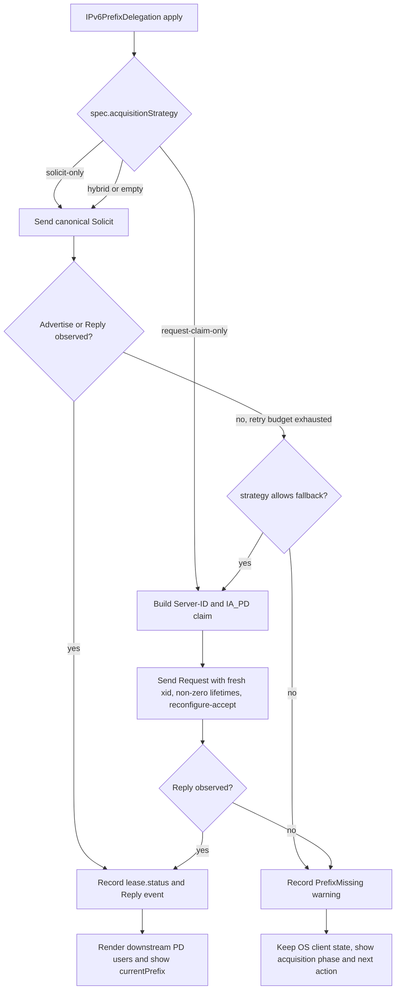
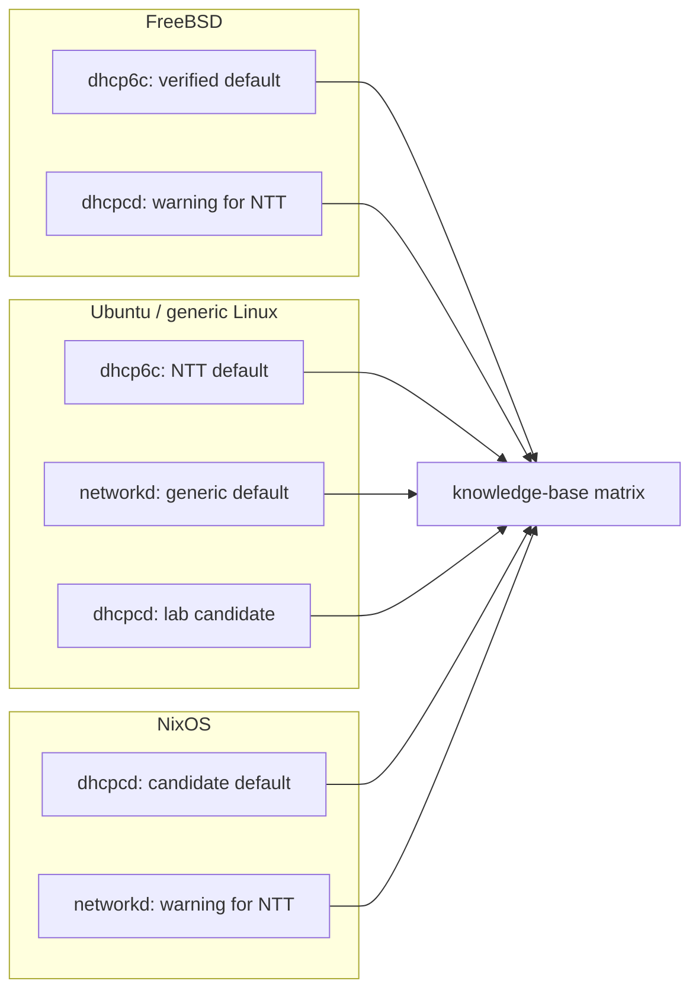

# Design Notes

This document records design decisions and lab findings that are not yet stable
resource definitions. Because this file is public, lab-specific prefixes, MAC
addresses, DUIDs, and private addresses are replaced with documentation values.

## Evidence Language

The document uses the following terms to keep facts separate from assumptions.

| Term | Meaning |
| --- | --- |
| assert | A routerd design decision or implementation direction. |
| believe | An inference based on indirect evidence. It may be revised. |
| observe | Behavior seen at a point in time. Reproducibility is separate. |
| measure | A value confirmed from tcpdump, logs, status tables, or counters. |
| cite | A summary or reference from an RFC, official specification, or public document. |

If a statement cannot fit one of these labels, move it to the open-issues
section or remove it.

## 0. Project End Goal

assert: The end goal is for routerd to replace a commercial home-router
appliance (such as a NEC IX series unit) entirely on a NTT NGN deployment.
routerd must be a complete home-router replacement, not a complement to one.
Operationally this means a single routerd VM (or physical host) takes over the
WAN-side DHCPv6-PD client role, the LAN-side DHCPv6 server role, the LAN-side
Router Advertisement role, IPv4 transport (DS-Lite or PPPoE) and NAT/firewall.

assert: The reference architecture is a working NEC IX2215 deployment on the
same NTT NGN circuit. routerd should provide observably equivalent behavior
from the LAN's point of view: same /60 acquisition behavior, same per-LAN /64
distribution, same RA flag semantics, same DHCPv6 server response shape for
LAN clients. Differences from the reference must be deliberate design choices,
not accidental drift.

assert: While routerd is being built, the reference appliance and routerd
coexist on the same NGN circuit. routerd labs run as Proxmox VE VMs alongside
the reference appliance. The transition path is: reference appliance keeps
serving the LAN; routerd is exercised in parallel against the same HGW;
once routerd is judged ready, the reference appliance is removed and routerd
takes over the LAN.

assert: Section 5 turns this end goal into an implementation roadmap. Items in
that roadmap should be treated as replacement requirements, not optional lab
polish.

assert: routerd is not constrained to strict IX2215 parity. It is allowed and
expected to surpass the reference appliance where the declarative model makes
that natural. The first concrete differentiator already in the MVP scope is
multiple concurrent DS-Lite tunnels: IX2215's current configuration cannot
establish more than one DS-Lite tunnel at a time, while routerd's resource
list is naturally multi-instance and `DSLiteTunnel` resources are applied
per-instance. Differentiators of this kind should be documented in design
notes so they are not lost as the project tracks the reference architecture.

assert: routerd provides LAN-side IPv6 segments by carving subprefixes out of
the WAN-side DHCPv6-PD lease and routing each subprefix to a downstream
interface. routerd does not use IPv6 ND Proxy and does not place the WAN
segment on a Linux bridge with LAN ports. Both alternatives expose the LAN to
the WAN /64 as a single onlink segment, which breaks downstream firewall and
conntrack assumptions, makes per-LAN policy unworkable, and cannot represent
multi-LAN topologies cleanly in a declarative model. The PD-based path keeps
each LAN as a routed segment with its own /64, so firewall zones, conntrack,
and per-segment RA/DHCPv6 servers can be authored independently.

assert: Because PD is the chosen mechanism for separating WAN and LAN
segments, stable DHCPv6-PD acquisition and lease maintenance are
non-negotiable requirements for routerd, not best-effort goals. Any apply
path, renderer, OS-client choice, or recovery procedure that risks losing the
upstream PD lease is out of scope for the production profile. Section 5's
`dhcp6c` primary path and DHCPv6 transaction recorder exist to make that
stability observable and reviewable.

## 1. Verified Facts

### 1.0 Source of Truth and Operation Path

assert: routerd's source of truth is the YAML configuration plus the state and
ownership records written by `routerd apply`. Operators should change router
behavior by editing files and running apply, not by hand-editing generated
files or nudging daemons outside the apply path. This keeps operational intent
reviewable through git history, file diffs, apply output, and the local
database.

assert: Host services remain owned by the operating system's service manager.
routerd should use `systemctl` on systemd hosts and `service` / rc.d on
FreeBSD, instead of sending ad-hoc signals to long-running daemons as the
normal control path. Direct signals are acceptable only as short-lived
debugging probes, and the final verification must be repeated through
`routerd apply --once`.

assert: Renderer changes are not considered tested until the rendered files
have passed through the same apply path that production uses. Checking
`routerd render` output is useful, but it is only a preflight step; it does not
exercise ownership records, service-manager behavior, dependency ordering, or
the host's own diagnostics.

### 1.1 RFCs and Public Specifications

- cite: RFC 8415 uses Solicit, Advertise, Request, and Reply for the normal
  DHCPv6 exchange. Rapid Commit can shorten the exchange, but routerd does not
  require Rapid Commit for the NTT profile.
- cite: RFC 8415 defines UDP 546 for clients and UDP 547 for servers and
  relays. This defines listener ports; it does not mean every Advertise/Reply
  must have source port 547.
- cite: RFC 8415 allows IA_PD to contain an IA Prefix as a prefix or length
  hint. The server treats this as a hint.
- cite: RFC 8415 defines Renew as a request to the original server, Rebind as a
  request to any server after Renew does not complete, and Solicit as a fresh
  acquisition path. Confirm is for address validation and is not a PD recovery
  primitive for routerd.
- cite: NTT East and NTT West public FLET'S interface documents describe
  client DUIDs as DUID-LL or DUID-LLT derived from MAC addresses. DUID-EN and
  UUID-derived DUIDs are outside that documented terminal model.
- cite: The same documents describe cases where DHCPv6 does not provide a
  128-bit address. routerd therefore does not request IA_NA by default in the
  NTT profile.
- cite: Rapid Commit appears in the NTT option tables as unused for the relevant
  specification. The NTT profile keeps Rapid Commit disabled by default.
- cite: Sorah's Diary reported in 2017 that non-DUID-LL Solicit packets were
  silently ignored in one FLET'S observation. That is a field report, not an
  official specification. routerd treats DUID-LL as the strict default for NTT
  profiles, not as a universal DHCPv6 rule.
- cite: NEC IX public examples show DHCPv6-PD use in Hikari Denwa environments
  and downstream advertisement of delegated prefixes.
- cite: Commercial and open router platforms treat DUID, IAID, lease state,
  delegated prefixes, and downstream advertisement as operational state.
  routerd should expose the same class of information.

### 1.2 NTT Home-Gateway Profile Shape

measure: In a NTT home-gateway LAN-side delegation environment, successful
clients used DUID-LL, IA_PD, Rapid Commit disabled, and `/60` delegated
prefixes. DHCPv6 Advertise/Reply packets arrived at UDP destination 546, and
captures must not assume source port 547.

measure: After a home-gateway reboot, the DHCPv6-PD server can take a few
minutes to start answering LAN-side clients. During that interval, lab routers
sent valid Solicit packets without receiving Advertise. Once the server became
ready, the same simple DUID-LL clients received Advertise/Reply quickly. routerd
therefore treats "Solicit observed but no reply for tens of seconds immediately
after HGW reboot" as a readiness observation, not as proof that the client shape
is invalid.

observe: A newly created lab router with a previously unseen MAC-derived
DUID-LL sent repeated IA_PD Solicit packets during normal home-gateway uptime
and received no Advertise within the short observation window. The same capture
also saw a working router's Renew and another lab router's Rebind, so multicast
visibility on the capture point was not the limiting factor. This weakens the
simple "old per-client binding only" explanation; the remaining explanation is
home-gateway state or timing that affects fresh Solicit outside the reboot
acquisition window.

observe: On a FreeBSD lab router that had previously received delegation,
routerd-generated configuration was applied with `routerd apply --once`, then
KAME `dhcp6c` was stopped and started through rc.d. The resulting minimal fresh
Solicit used DUID-LL, IA_PD, and only DNS in the option request, matching the
previously successful shape closely. During normal home-gateway uptime, the
short capture saw no Advertise/Reply. This weakens a systemd-networkd-only
packet-shape explanation and strengthens the hypothesis that fresh acquisition
depends on home-gateway timing or internal state.

observe: A helper that reads the home-gateway delegation table directly showed
that a working commercial router refreshed its lease roughly two hours after
the home-gateway reboot. The three lab routers only counted down from the
leases acquired immediately after reboot and did not show comparable refresh.
This shows that the home gateway can answer existing-binding Renew/Request
during normal uptime. The routerd problem is therefore less about shaping fresh
Solicit packets and more about preserving and observing the acquired lease
state so Renew/Rebind continues.

measure: In a packet capture from the same time window, the working router's
Renew included Server ID, `T1=7200`, `T2=12600`, and IA Prefix preferred and
valid lifetimes of `14400`. Lab Linux routers running systemd-networkd did send
Renew/Rebind packets, but the IA_PD and IA Prefix lifetimes were all `0`. This
difference is the highest-priority observation point for explaining why the
home gateway accepts normal-uptime Renew from the working router while the lab
Renew/Rebind attempts do not refresh the lease. routerd should surface this
class of difference from `routerctl describe ipv6pd/<name>`.

measure: A commercial router's initial Solicit did not include a prefix hint.
routerd therefore omits exact and length-only prefix hints for
`ntt-ngn-direct-hikari-denwa` and `ntt-hgw-lan-pd`. Exact hints are not modeled
as generally harmful, but they are no longer the default shape.

assert: DUID-LL is the default identity shape for NTT profiles. routerd does
not derive or render IAID unless the operator explicitly sets `spec.iaid`.
systemd-networkd can ignore or retain IAID state across reconfiguration, so
defaulting it in routerd added complexity without a clear benefit. routerd keeps
the NTT profile minimal and avoids adding extra option-request tuning on top of
the OS client. systemd-networkd can still emit protocol-maintenance options such
as SOL_MAX_RT, so routerd should not claim byte-for-byte control of networkd
Solicit packets unless it replaces the OS client.

assert: The `ntt-ngn-direct-hikari-denwa` and `ntt-hgw-lan-pd` profiles should
not send exact or length-only prefix hints by default. `prefixLength` remains
part of routerd's expected-shape model, but the systemd-networkd renderer omits
`PrefixDelegationHint=` for these profiles.

measure (2026-04-30): A NTT HGW (PR-400NE) was observed to enter a state where
the LAN-side DHCPv6 server silently dropped Solicit, Request, Renew, Rebind,
Release, Confirm, and Information-Request from clients, while NDP and RA
continued normally. Existing bindings remained in the HGW table but their
lease counters only ticked down. A manual HGW reboot recovered the DHCPv6
server immediately, after which routerd's active Request via
`routerd dhcp6 request` succeeded and refreshed the lab `router03` binding to
near-full lifetime. Public reports (rabbit51 2022 on PR-600MI, HackMD on
Yamaha RTX1200 with AsahiNet 2021, azutake 2023 on Cisco IOS-XE under FLET'S
Cross) describe analogous DHCPv6 server stalls in this hardware family.
routerd treats this as a known external failure mode that the active
controller can detect and surface but cannot fix automatically; operator-
driven HGW reboot is the only recovery. See
`docs/knowledge-base/ntt-ngn-pd-acquisition.md` Section K for the detection
threshold, recovery playbook, and public-report citations.

measure (2026-04-30): The post-reboot HGW acceptance window for non-Renew
DHCPv6 messages was observed to close within four minutes in this lab.
routerd's active Request was accepted at 11:16:50 UTC and refreshed the lab
`router03` binding, but routerd active Renew, Release, and a follow-up
Request from the same client at 11:20–11:21 UTC all received no Reply.
Maintenance-path Renew at the natural T1 boundary remained the only
consistently-honoured operation. routerd therefore treats `dhcp6 renew` as
a diagnostic tool and lets the OS DHCPv6 client drive operational refresh
on its T1 timer. With observed Reply values `T1=7200`, `T2=12600`,
`pltime=vltime=14400`, Renew opportunities are spaced 2 hours apart and a
single missed T1 boundary leaves about 2 hours of grace before vltime
expiry; routerd sizes detection and operator notification against that
2-hour budget. See `docs/knowledge-base/ntt-ngn-pd-acquisition.md`
Sections H, H.1, and K.4–K.5 for details.

### 1.3 OS Client Behavior

| Client | Cited or measured behavior | routerd treatment |
| --- | --- | --- |
| systemd-networkd | cite/measure: Supports `DUIDType=link-layer`, `IAID`, `PrefixDelegationHint`, and `WithoutRA`. Renew/Rebind IA Prefix lifetimes can be zero in the measured Linux path. | Keep it for generic Linux DHCPv6-PD, but do not use it as the preferred NTT home-gateway path. |
| KAME/WIDE `dhcp6c` | cite/measure: Stores DUID in a file and IAID/IA_PD in config. Hint-bearing Solicit and Renew/Rebind can carry IA Prefix lifetimes. | Use it for FreeBSD and as the Linux escape path for NTT home-gateway profiles. routerd manages DUID-LL files for NTT profiles. |
| `dhcpcd` | cite/measure: A single active client for IPv4 DHCP, IPv6 RA/SLAAC, IA_NA, and IA_PD. It is packaged on Linux, NixOS, and FreeBSD. Ubuntu clean re-acquisition did not receive a HGW Reply in the measured steady-state test. | Keep the renderer and service path for lab evaluation. Do not make it the NTT default until Ubuntu, FreeBSD, and NixOS each show successful initial acquisition and T1 Renew. |
| dnsmasq | cite/assert: Useful for LAN DNS, DHCPv4, DHCPv6, and RA. It is not the source of truth for WAN PD acquisition. | Keep it for LAN services only. |

assert: DHCPv6-PD acquisition is intentionally narrow. Generic Linux can use
systemd-networkd. NTT home-gateway profiles should use KAME/WIDE `dhcp6c` on
Linux and FreeBSD because the measured networkd Renew/Rebind shape is not
accepted by the home gateway.

assert: NTT profiles default to real MAC-derived DUID-LL.
`duidRawData` and `iaid` are explicit overrides for HA failover, router
replacement, or migration. They are not the default lab recovery path.

assert: On FreeBSD, NTT profile rendering starts `dhcp6c` with `-n` so service
restart does not send DHCPv6 Release. This is an internal profile behavior, not
a public configuration knob; routerd still delegates normal Renew/Rebind timing
to the OS DHCPv6 client.

assert: Apply must preserve a DHCPv6 client's in-memory lease state unless the
rendered configuration or identity actually changes. FreeBSD `dhcp6c` keeps
the active exchange state in the running process; restarting it on every apply
turns a valid lease into repeated fresh Solicit attempts and prevents natural
Renew/Rebind observation. FreeBSD rc.conf comparison therefore treats `sysrc`
output as service-manager state and must not rewrite `dhcp6c_flags="-n"` when
the value is already present.

## 2. Lab-Specific Issues

### 2.1 Multicast Transparency in Virtual Labs

observe: The lab routers are virtual machines on Proxmox. With Linux bridge
`multicast_snooping` enabled, IPv6 RA and DHCPv6 multicast traffic may be
missing or partially visible.

cite: Public Proxmox reports and lab articles describe IPv6 RA/DHCPv6 issues
that are resolved by disabling bridge multicast snooping.

assert: Before judging DHCPv6-PD behavior in routerd labs, verify:

- Proxmox bridges pass IPv6 multicast.
- L2 switches in the path do not block MLD/IGMP-related multicast traffic.
- Captures include `udp port 546 or udp port 547`, plus separate RA capture.
- A working router's Solicit/Request can be seen on the same segment before
  concluding that the HGW is not replying.

### 2.2 L2 Switch Multicast Snooping

observe: When L2 switches in the path had IGMP snooping enabled, parts of the
IPv6 RA and DHCPv6 multicast exchange were not delivered. Many implementations
tie IGMP snooping and MLD snooping together, so a setting that was meant to
optimize IPv4 multicast can block IPv6 ND/DHCPv6 paths during validation.

assert: For routerd lab validation, disable snooping so that multicast flows
flat. If snooping must remain enabled in production, alternatives are:

- Place an MLD Querier on the segment so that hosts emit Listener Reports and
  the snooping tables stay populated.
- Split the topology so that snooping is disabled only on the routerd-facing
  VLAN, while other VLANs keep it.

believe: At lab scale, disabled snooping is the practical choice. The added
flooding is acceptable and root-cause separation is faster.

observe: Concrete switch configuration depends on each vendor's UI/CLI. Switch
model names and exact commands are intentionally not included in this
document.

## 3. Public References

Primary references:

- [RFC 8415: Dynamic Host Configuration Protocol for IPv6](https://www.rfc-editor.org/rfc/rfc8415.html)
- [RFC 9915: Dynamic Host Configuration Protocol for IPv6](https://datatracker.ietf.org/doc/html/rfc9915)
- [NTT East technical reference](https://www.ntt-east.co.jp/gisanshi/)
- [NTT East FLET'S IP interface, volume 3](https://flets.com/pdf/ip-int-3.pdf)
- [NTT West IP interface document](https://www.ntt-west.co.jp/info/katsuyo/pdf/23/tenpu16-1.pdf)
- [Yamaha RT DHCPv6 documentation](https://www.rtpro.yamaha.co.jp/RT/docs/dhcpv6/index.html)
- [Yamaha IPv6 IPoE documentation](https://www.rtpro.yamaha.co.jp/RT/docs/ipoe/index.html)
- [NEC UNIVERGE IX FLET'S IPv6 IPoE example](https://jpn.nec.com/univerge/ix/Support/ipv6/native/ipv6-internet_dh.html)
- [NEC IX-R/IX-V DHCPv6 documentation](https://support.necplatforms.co.jp/ix-nrv/manual/fd/02_router/14-1_dhcpv6.html)
- [Sorah's Diary DHCPv6-PD observation](https://diary.sorah.jp/2017/02/19/flets-ngn-hikaridenwa-kill-dhcpv6pd)
- [rixwwd DHCPv6 packet observation behind an NTT home gateway](https://rixwwd.hatenablog.jp/entry/2023/04/09/211529)
- [SEIL NGN IPv6 native IPoE example](https://www.seil.jp/blog/10.html)
- [systemd.network manual](https://www.freedesktop.org/software/systemd/man/254/systemd.network.html)
- [FreeBSD dhcp6c(8)](https://man.freebsd.org/cgi/man.cgi?manpath=freebsd-release-ports&query=dhcp6c&sektion=8)
- [FreeBSD dhcp6c.conf(5)](https://man.freebsd.org/cgi/man.cgi?query=dhcp6c.conf)
- [pfSense advanced networking documentation](https://docs.netgate.com/pfsense/en/latest/config/advanced-networking.html)
- [OPNsense DHCP documentation](https://docs.opnsense.org/manual/isc.html)
- [MikroTik RouterOS DHCP documentation](https://help.mikrotik.com/docs/display/ROS/DHCP)
- [Cisco IOS XE DHCPv6 Prefix Delegation](https://www.cisco.com/c/en/us/td/docs/ios-xml/ios/ipaddr_dhcp/configuration/xe-16-9/dhcp-xe-16-9-book/ip6-dhcp-prefix-xe.html)
- [Juniper Junos IA_NA and Prefix Delegation](https://www.juniper.net/documentation/us/en/software/junos/subscriber-mgmt-sessions/topics/topic-map/dhcpv6-iana-prefix-delegation-addressing.html)

## 4. Known Limits and Open Questions

### 4.1 DHCPv6-PD

- believe: Some NTT paths may silently ignore DUID-LLT. NTT public documents
  still allow DUID-LLT, so this remains implementation-specific, not official.
- assert: An in-process routerd DHCPv6 client remains a later option. First,
  stabilize DUID, IAID, lease storage, and events around OS clients.

### 4.2 State and Ownership Storage

routerd stores local state and ownership in SQLite. The default path is
`/var/lib/routerd/routerd.db` on Linux and `/var/db/routerd/routerd.db` on
FreeBSD.

| Table | Role |
| --- | --- |
| `generations` | One row per apply attempt, including result, warnings, and config hash. |
| `objects` | Per-resource status JSON. Example: `IPv6PrefixDelegation/wan-pd` lease, DUID, IAID, and timestamps. |
| `artifacts` | Ownership ledger for host artifacts managed by routerd. |
| `events` | Apply warnings and prefix-observation events. |
| `access_logs` | Reserved for future local HTTP API auditing. |

JSON is stored as text and can be inspected with SQLite JSON1:

```sh
sqlite3 /var/lib/routerd/routerd.db \
  "select json_extract(status, '$.lastPrefix') from objects where kind = 'IPv6PrefixDelegation' and name = 'wan-pd';"
```

The `sqlite3` command is not required to run routerd, but it is useful for
human debugging. `jq` remains because trusted local plugins use JSON through
standard input and output.

### 4.3 Host Inventory

routerd records one observed host object at apply time:
`routerd.net/v1alpha1/Inventory/host`. The status JSON contains the Go OS
name, kernel information from `uname`, virtualization detection, best-effort
DMI values, the detected service manager, and availability of selected host
commands such as `nft`, `pf`, `dnsmasq`, `dhcp6c`, and `sysctl`.

assert: Inventory is an observed object, not a desired resource. It does not
appear in normal authored `spec.resources`, and renderers do not use it in the
first implementation. The reason to record it now is to make later platform
decisions explicit: physical versus virtual hosts, systemd versus rc.d, and
host-level prerequisites such as bridge multicast behavior should be based on
observed facts rather than guessed in each renderer.

Use:

```sh
routerctl describe inventory/host
```

### 4.4 Future Design Work

- Observe natural DHCPv6-PD Renew/Rebind behavior on Linux systemd-networkd
  and FreeBSD `dhcp6c` clients after the current profile cleanup. Record what
  routerd can reliably expose as status without managing the client timers.
- Improve `IPv6PrefixDelegation` status when OS clients expose T1/T2 or
  lifetime data. Current and last prefixes, observed and expected DUID/IAID,
  last observed time, and warnings should remain distinct.
- Rework the evidence behind `IPv6PrefixDelegation` observability. A delegated
  address left on a downstream interface does not prove that the upstream
  DHCPv6-PD lease is still active. `routerctl describe ipv6pd/<name>` should
  distinguish derived address presence, OS client lease state, last observed
  DHCPv6 Reply, T1/T2, and lifetimes. If the only evidence is a derived address,
  it should show a warning instead of a clean health signal.
- Extend `routerctl describe ipv6pd/<name>` so operational checks do not start
  with raw shell commands. The detail view should include the rendered client
  config summary, OS service state, last apply action that touched the client,
  recent relevant service logs when available, and DHCPv6 packet-observation
  counters if routerd grows a managed capture or event source. Packet captures
  may still be needed for byte-level diagnosis, but the first health question
  should be answerable from routerctl.
- Fix host inventory command detection on FreeBSD. Commands installed under
  `/usr/local/sbin` such as `dhcp6c` and `dnsmasq` can be available to rc.d but
  still appear missing if routerd checks with a narrow PATH. Inventory should
  use platform-aware lookup paths and show the resolved command path.
- Finish stale delegated prefix withdrawal from LAN services. Apply removes
  routerd-derived LAN addresses and DS-Lite source addresses that share managed
  suffixes after a PD change. LAN RA/DHCPv6 withdrawal still needs explicit
  design so clients stop using an old prefix quickly when PD disappears.
- Use `Inventory/host` as an input to future platform advice or rendering for
  host prerequisites such as virtual bridge multicast behavior, RA acceptance,
  and service-manager differences.
- Decide whether the remaining example plugin stubs should stay under
  `plugins/` or move fully into test fixtures once the trusted local plugin
  protocol has enough real examples.
- Keep "DS-Lite without delegated LAN IPv6" as a design candidate. It changes
  ownership and firewall boundaries, so it needs separate validation before
  implementation.

## 5. IX2215 Replacement Roadmap

The following work closes the gap between the current routerd implementation
and the reference home-router behavior described in Section 0.

### 5.1 Critical: Use `dhcp6c` for NTT/HGW Prefix Delegation

assert: For NTT HGW profiles, Linux and FreeBSD should use a DHCPv6-PD client
that preserves IA_PD lifetime semantics across Renew and Rebind. The
systemd-networkd PD path is not the default for these profiles because lab
captures showed lifetime `0/0` in Renew/Rebind traffic.

Completion condition: the lab keeps one FreeBSD router on `client: dhcp6c` as
the control path and runs a second FreeBSD router on `client: dhcpcd` as the
test path under the same HGW state. Ubuntu and NixOS are then measured with
`dhcpcd` as follow-up paths. The default only changes after initial acquisition
and T1 Renew both succeed.

measure (2026-04-30): Ubuntu `dhcpcd` clean re-acquisition sent repeated
DUID-LL IA_PD Solicit packets under routerd management but received no
Advertise/Reply from the HGW during the short steady-state test. This keeps
`dhcpcd` in the explicit lab-candidate bucket rather than promoting it to the
NTT default.

Before the long T1 measurement, run one active Request with shortened requested
lifetimes (`T1=300`, `T2=600`, `pltime=600`, `vltime=900`) and inspect the HGW
Reply. If the HGW honours those values, the lab can use a short cycle for
client comparison. If the HGW overrides them with the normal values, fall back
to the observed two-hour T1 cycle.

### 5.2 Critical: DHCPv6 Active Controller (was: Record DHCPv6 Transactions)

assert: A delegated LAN address is not enough evidence that the upstream
DHCPv6-PD lease is alive. routerd needs packet-derived evidence for the
DHCPv6 lifecycle, and it must be able to drive that lifecycle actively when
the OS client's natural timing is not enough.

observe (2026-04-30): Lab tests showed that with one NTT HGW (PR-400NE) the
fresh Solicit path was unreliable while the Request path with a known Server
Identifier and an IA_PD claim was accepted. NEC IX2215's `clear ipv6 dhcp
client` triggered an INIT-REBOOT-style Request and recovered the lease
without sending any Solicit. routerd-driven Requests from lab routers, using
the observed HGW Server Identifier and an IA_PD prefix claim, were
accepted by the HGW and produced new bindings on previously stuck LAN
routers.

measure (2026-04-30): Active Renew packets that carried an IA_PD prefix with
T1/T2 set to `0/0` and no Reconfigure Accept option were silently ignored by
the HGW. Packets used for the controller path must generate a new transaction
ID for every send, carry the server-provided T1/T2 values when known, default
to `7200/12600` for the NTT profile when the state is missing, carry
non-zero IA Prefix lifetimes (`14400/14400` by default), and include
Reconfigure Accept on Request/Renew. Release is the opposite: it sends
zero IA_PD lifetimes and does not include Reconfigure Accept.

assert: routerd's DHCPv6 lifecycle support is not a passive recorder.
It is an active controller. It must be able to send Solicit, Request, Renew,
Rebind, Confirm, Information-Request, and Release on demand, using lease
identity recorded in `objects.status._variables`, instead of only relying on
the OS client's automatic timers. Refresh by waiting for T1/T2 is allowed,
but must not be the only available path. `routerctl describe ipv6pd/<name>`
exposes the full controller state, not just the last delegated address.

assert: The persistence rail for the active controller is the existing routerd
state schema. No new SQLite tables are added. `IPv6PrefixDelegation/<name>`'s
`objects.status` JSON carries the lease and observation under known field
names (for example `lease.serverID`, `lease.prefix`, `lease.iaid`, `lease.t1`,
`lease.t2`, `lease.pltime`, `lease.vltime`, `lease.sourceMAC`,
`lease.sourceLL`, `lease.lastReplyAt`, `wanObserved.hgwLinkLocal`,
`wanObserved.raMFlag`, `wanObserved.raOFlag`, `wanObserved.raPrefix`).
Each Solicit/Advertise/Request/Reply/Renew/Rebind/Release observation is
recorded as one row in the existing `events` table with a stable
`reason` (for example `SolicitSent`, `ReplyRecv`, `RequestSent`,
`RenewSent`, `ReleaseSent`).

assert: The renderer for each DHCPv6 client receives the rendered
`IPv6PrefixDelegationSpec` together with the corresponding object status as an
implicit input. The renderer prefers values written explicitly on the spec
(such as `iaid`, `duidRawData`, and the new override fields like `serverID`
and `priorPrefix`) and falls back to `objects.status._variables` values when
the spec leaves them empty. This mirrors the existing IAID/DUID override
pattern: routerd discovers and records the value automatically; the operator
may pin a value in YAML when manual control is needed (router migration,
HA failover, replay tests).

Completion condition: routerd implements the active controller, records
the lease and `wanObserved` fields under `IPv6PrefixDelegation/<name>` status,
emits per-transaction events in the `events` table, exposes them through
`routerctl describe ipv6pd/<name>`, and accepts spec-level overrides for
`serverID`, `priorPrefix`, and `acquisitionStrategy`. The NTT profile uses
the controller to fall back from Solicit to Request-with-claim when the HGW
silently drops Solicit, using the discovered or pinned `serverID`.

Implementation note (2026-04-30): the daemon now listens for WAN Router
Advertisements and records the RA source link-local address, a derived
link-layer DUID candidate, M/O flags, prefix, and observation time under
`lease.wanObserved`. Managed `dhcp6c` and `dhcpcd` render local hook scripts
that can post DHCPv6 lease events to the control API. A lightweight daemon
monitor compares `lastReplyAt + T1` with the current time and records
`HGWHungSuspected` if the expected renewal point passes without a newer Reply.
`routerctl describe ipv6pd/<name>` shows the lease, WAN observation,
acquisition phase, next action, and hung suspicion separately from the
presence of downstream delegated addresses.

The active-controller path is intentionally narrow. It starts with the least
surprising DHCPv6 exchange, then escalates only when observed HGW behavior
requires it:



### 5.3 High: Make Apply No-Op Safe for DHCPv6 Clients

assert: Apply must not restart or rewrite a DHCPv6 client unless the rendered
client configuration actually changed. The OS client state is part of the live
lease and losing it can make recovery depend on the HGW accepting a fresh
Solicit.

Completion condition: an apply -> apply test proves that unchanged
`IPv6PrefixDelegation` resources do not restart `dhcp6c`, do not remove lease
state, and do not rewrite equivalent config files. The daemon apply loop and
one-shot CLI apply share the same behavior.

### 5.4 High: Make LAN RA DNS Semantics Explicit

assert: LAN clients are not uniform. Some clients consume DHCPv6 DNS options,
while SLAAC-only clients may need DNS information in RA. routerd should expose
this deliberately instead of relying on dnsmasq defaults.

Completion condition: `IPv6DHCPScope` or a related resource can express
whether DNS is advertised through DHCPv6 options, RA RDNSS, both, or neither.
Generated dnsmasq output and documentation make Android/SLAAC-only behavior
clear.

### 5.5 Medium: Add Stateful DHCPv6 Address Assignment If Needed

believe: The current home-router target can start with stateless DHCPv6 and RA,
but IX2215 replacement may eventually need DHCPv6 IA_NA service for clients
that expect stateful IPv6 addressing.

Completion condition: if required by observed clients, routerd gains a
stateful IPv6 address scope mode with documented lease storage, address pool
syntax, and dnsmasq or alternate server rendering.

### 5.6 Medium: Add Downstream IA_PD Subdelegation

believe: The initial replacement can serve a single LAN /64, but full router
replacement may need to delegate prefixes to downstream routers.

Completion condition: routerd has a resource model for downstream prefix pools,
subscriber bindings, and delegated prefix lifetimes. It must clearly separate
upstream PD ownership from downstream PD service ownership.

### 5.7 Medium: Finish the NixOS DHCPv6-PD Client Path

assert: NixOS remains a useful portability target, but it should not block the
critical Ubuntu/FreeBSD replacement path. The lack of `wide-dhcpv6` in nixpkgs
means routerd needs either a derivation or a documented supported client.

Completion condition: router02 can use the NTT/HGW PD profile without
systemd-networkd PD, using a reproducible Nix derivation or a documented
supported alternative that preserves IA_PD lifetimes.

### 5.8 High: Keep a multi-client WAN strategy

assert: routerd will not force a single DHCPv6-PD client across every OS.
Lab evidence shows that client behaviour differs enough between FreeBSD,
Ubuntu, NixOS, and the NTT home-gateway profile that a single "best" daemon
would hide important operational differences. The design is therefore a
multi-client strategy with OS-specific defaults, explicit configuration, and
apply-time overrides for lab work.

Default client resolution happens at apply time when
`IPv6PrefixDelegation.spec.client` is empty:

| Host flavour | Profile | Default client |
| --- | --- | --- |
| FreeBSD | any | `dhcp6c` |
| Linux | `default` | `networkd` |
| Linux | `ntt-*` | `dhcp6c` |
| NixOS | `ntt-*` | `dhcpcd` |

The same policy can be read as a matrix of implementation maturity:



assert: Operators may still set `spec.client` explicitly. Lab runs can also
override every `IPv6PrefixDelegation` resource for a single apply with
`routerd apply --override-client <networkd|dhcp6c|dhcpcd>` and may override
the profile with `--override-profile <name>`. These flags are intentionally
runtime-only; they do not rewrite the YAML file.

assert: Known bad combinations are warnings, not validation errors. Some
combinations are wrong for the NTT profile but still useful for another
network or for a controlled experiment. routerd records a
`KnownNGCombination` event and continues rendering. The current known-bad
table includes FreeBSD `dhcpcd` with an NTT profile and Linux `networkd` with
an NTT profile. The matrix is maintained in
`docs/knowledge-base/dhcpv6-pd-clients.md`, with detailed lab notes in
`docs/knowledge-base/ntt-ngn-pd-acquisition.md`.

Completion condition: apply-time default resolution is implemented; apply
supports client/profile override flags; known-bad combinations are surfaced
as warnings and events; validation rejects only syntax, enum, and required
field errors; and the knowledge-base matrix remains the source of truth for
which OS/client/profile combinations are verified, candidate, or known-bad.

## 6. Implementation Phases

assert: Section 5 catalogues replacement requirements but does not sequence
them. Section 6 sequences the 5.x items into phases that match how routerd
moves from "tested in lab next to a working IX2215" to "in production after
IX2215 has been retired". Each phase lists which 5.x items it advances and
states what the phase touches (code only, lab traffic, real-network traffic,
or production-impact traffic) so it is clear when a phase needs a maintenance
window or operator coordination.

### 6.1 Phase 1: Close out the active controller

Scope: finish the work started under 5.2 so the active controller is observable
and self-driving end-to-end without manual operator commands.

- Implement the RA listener that records `wanObserved.*` and the derived
  Server Identifier into `IPv6PrefixDelegation/<name>` status.
- Implement the dhcp6c hook (or equivalent listener) that records each
  Reply into `lease.*` and emits a corresponding `events` row.
- Implement hung detection: T1 boundary plus configurable grace seconds
  with no Reply triggers `hgwHungSuspectedAt` and a warning surfaced through
  `routerctl describe ipv6pd/<name>`.
- Implement the hybrid acquisition strategy declared in
  `spec.acquisitionStrategy`: Solicit canonical first, fall back to
  Request-with-claim when Solicit produces no Advertise within a
  configured retry budget.
- Keep the low-level manual verbs available for diagnosis:
  `routerd dhcp6 solicit|request|renew|rebind|release` must record the sent
  attempt into `IPv6PrefixDelegation` status so `routerctl describe` can show
  what was tried before the automatic path is complete.
- Implement the transaction recorder in two steps: first record routerd-sent
  active-control packets from the internal packet builder, then attach a
  receive-side listener so external DHCPv6 clients and HGW replies are captured
  through the same status shape.
- The receive-side listener must remain passive. It observes link-layer frames
  and must not bind UDP 546/547, send packets, restart clients, or mutate link
  state. Linux uses AF_PACKET for this reason; non-Linux ports need an
  equivalent passive capture mechanism before enabling the recorder there.
- Documentation: capture the design and operational behavior under
  `docs/knowledge-base/ntt-ngn-pd-acquisition.md` Section H/H.1/K so the
  detection thresholds and operator playbook stay in one place.

Phase 1 touches code, generated config, and `objects.status._variables`.
It does not touch the HGW: lab routers continue to run their existing
profiles. Verification is `go test ./...`, `make check-schema`,
`make validate-example`, and `routerctl describe` showing the new fields.

assert: Phase 1 advances 5.1 (final pieces of the dhcp6c primary path),
5.2 (active controller core), and 5.3 (no-op apply safety, since the new
listeners must not cause unnecessary client restarts).

#### 6.1.x Phase 1 sub-task: WAN client strategy matrix

assert: Section 5.8 settles on a multi-client strategy. Phase 1 therefore
keeps `dhcp6c`, `dhcpcd`, and `networkd` render paths available where they
are useful, but chooses defaults by host flavour and profile at apply time.

The sub-task runs in parallel with the rest of Phase 1:

- Keep renderers for `networkd`, `dhcp6c`, and `dhcpcd` selectable through
  `IPv6PrefixDelegationSpec.client`.
- Resolve an empty client field at apply time using the OS/profile matrix
  in Section 5.8.
- Add apply-time override flags for lab work, without rewriting YAML.
- Keep known-bad OS/client/profile combinations as warnings and events, not
  validation failures.
- Maintain the client matrix in the knowledge base as new lab evidence is
  collected.

assert: The routerd active controller from Section 5.2 stays in place
regardless of client selection. OS DHCPv6 clients can maintain steady-state
leases where they behave correctly; routerd's `pkg/dhcp6control` handles
bootstrap, recovery, and packet-level diagnostics.

### 6.2 Phase 2: LAN-side parity with the reference appliance

Scope: bring the LAN-side resource model up to what IX2215 actually
delivers to the LAN, so routerd can coexist next to the reference appliance
during the validation window without LAN clients observing differences.

- Add per-LAN /64 carve from the upstream PD lease to multiple downstream
  interfaces, fully driven by declarative resources.
- Extend `IPv6DHCPScope.mode` with stateful IA_NA address assignment for
  LAN clients that prefer DHCPv6 for addresses.
- Add IA_PD subdelegation so a downstream router on the routerd LAN can
  request its own /60 or /64 from routerd, mirroring the reference
  appliance's subscriber model.
- Make RA RDNSS and DHCPv6 DNS first-class so SLAAC-only clients (Android,
  some IoT) get DNS without DHCPv6.
- Emit the same RA flag shape as the reference appliance (`O=1, M=0`)
  unless a profile explicitly diverges.

Phase 2 touches code, generated dnsmasq/radvd configuration, and lab LAN
traffic with real client devices. It does not require a HGW reboot or
production cutover.

assert: Phase 2 advances 5.4 (RA DNS), 5.5 (stateful IA_NA), and 5.6
(IA_PD subdelegation). LAN-side correctness is the requirement, not
additional API surface beyond what those items already imply.

### 6.3 Phase 3: Lab coexistence verification

Scope: run routerd and the reference appliance side by side against the
real HGW for an extended window, exercising real Renew cycles and at least
one HGW hung-up event, to confirm Phase 1 detection and Phase 2 LAN-side
parity in operation.

- Lab routers under routerd run continuously for 24 to 48 hours.
- Multiple T1 boundaries (each 2 hours apart with the observed HGW values)
  must pass with successful natural Renew, recorded as `events` rows.
- Trigger or observe at least one HGW hung-up condition; confirm hung
  detection fires and operator notification surfaces. The recovery path
  (operator-driven HGW reboot followed by routerd-driven re-acquisition)
  must close the lease budget without LAN clients losing IPv6.
- Capture the resulting `routerctl describe` output as a regression
  baseline; future code changes must not regress this output.

Phase 3 touches lab traffic and may touch HGW state through normal
operation. A planned HGW reboot during this phase is acceptable. The
production HGW must not be reused for destructive tests in this phase.

assert: Phase 3 advances no new 5.x item directly but is the point at
which Phase 1 and Phase 2 are judged "complete enough to move toward
production".

### 6.4 Phase 4: NixOS and FreeBSD parity

Scope: cover the operating systems that lab nodes already run, so the
production cutover does not depend on a single OS.

- Provide a NixOS-friendly DHCPv6-PD client that preserves IA_PD
  lifetimes; either a packaged `wide-dhcpv6` derivation or a documented
  alternate client.
- Port the active controller's raw socket sender to FreeBSD, using
  whichever interface is appropriate (BPF, divert, or a NetGraph node);
  keep the Linux AF_PACKET path unchanged.
- Run Phase 1 verification on each supported OS.

Phase 4 touches code and lab nodes. No HGW or LAN change is implied.

assert: Phase 4 advances 5.7 (NixOS DHCPv6-PD client) and finishes the
"Linux and FreeBSD where available" promise from 5.1.

### 6.5 Phase 5: Production cutover

Scope: retire the reference appliance and let routerd serve the home LAN.

- Move LAN-side responsibilities from the reference appliance to routerd
  one segment at a time, validating each move with end-user devices.
- Operate through at least one full HGW T1/T2/vltime cycle without the
  reference appliance, confirming hung detection and operator notification
  perform as designed under real load.
- Remove the reference appliance from the rack (or power it off and keep
  it cold-spare for a defined cooldown window) only after the previous
  step succeeds.

Phase 5 affects production traffic and household members. It requires a
maintenance window and explicit go/no-go from the operator.

assert: Phase 5 has no remaining 5.x scope by itself. All replacement
requirements are completed at this point; what is exercised is operational
fitness, not new design work.

### 6.6 Reading order

believe: For an engineer joining this project, the recommended reading
order is Section 0 (end goal), Section 5 (replacement requirements),
Section 6 (phases), then `docs/knowledge-base/ntt-ngn-pd-acquisition.md`
(why those requirements look the way they do). Section 1 captures evidence
that grounds the assertions; revisit it when an assertion needs to be
challenged.

After that, read `docs/knowledge-base/dhcpv6-pd-clients.md` for the current
OS/client matrix and `docs/api-v1alpha1.md` for the exact resource fields and
`routerctl describe ipv6pd/<name>` investigation workflow.
