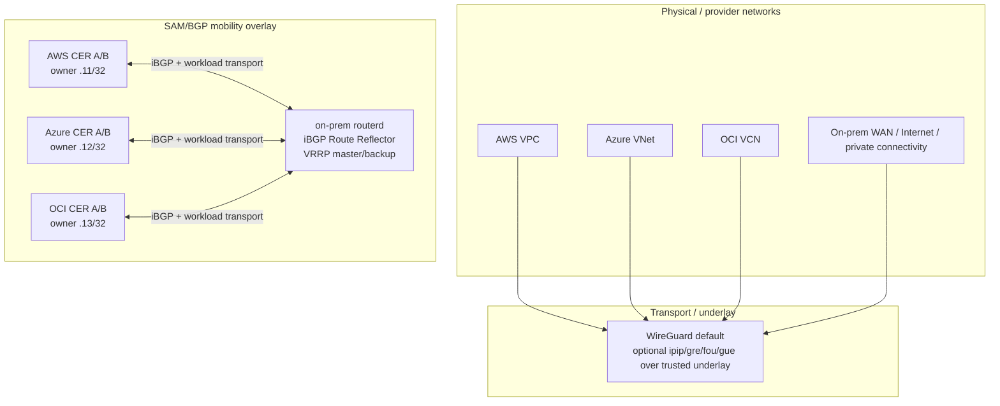
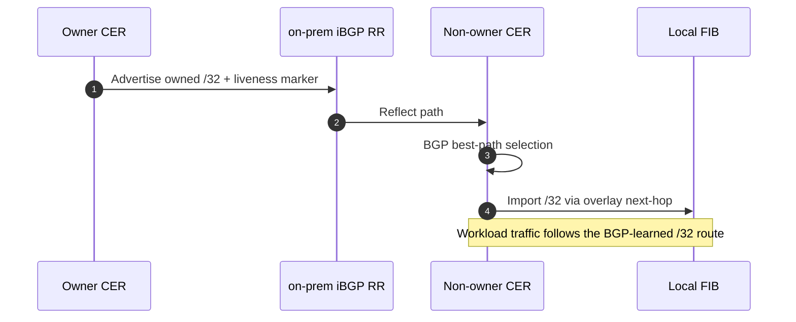
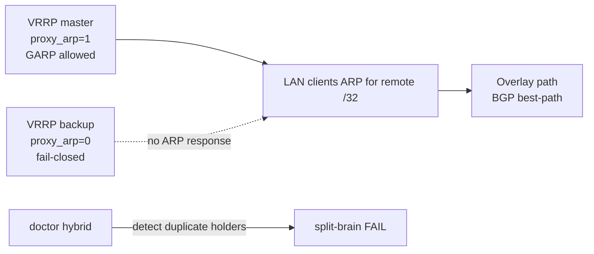

# CloudEdge Selective Address Mobility Phase G — detailed implementation guide


This guide complements the short Phase G overview with the lower-level pieces that
operators usually need when explaining or troubleshooting CloudEdge SAM:

- underlay / transport / overlay terminology;
- WireGuard or `TunnelInterface` encapsulation and the actual inner/outer packet view;
- iBGP peers, Route Reflector behavior, BGP `/32` ownership, and liveness markers;
- RIB-driven traps and provider/on-prem capture realization;
- AWS / Azure / OCI / on-prem implementation differences;
- normal data-plane flow, failover, and endpoint add/remove behavior.

The current Phase G design is **clean Option B**: BGP is the mobility source of
truth. Older mobility-specific `AddressLease`, `ownershipEpoch`, `captureEpoch`,
heartbeat, and route-lowering planner state were removed from the mainline. They
may still appear in historical ADRs or pre-Phase-G discussions, but they are not
the primary explanation path for current CloudEdge SAM.

## 1. Layer vocabulary

CloudEdge documents sometimes use “underlay” as shorthand for the transport below
the SAM/BGP mobility overlay. In operator conversations it is useful to separate
three layers:

| Layer | Meaning | Examples in CloudEdge SAM |
| --- | --- | --- |
| **Physical/provider network** | The network that actually carries outer packets. | AWS VPC, Azure VNet, OCI VCN, on-prem WAN, Internet, DirectConnect, ExpressRoute, FastConnect. |
| **Overlay transport / underlay** | The tunnel or transport used by routerd nodes to carry BGP and workload packets over the physical/provider network. | WireGuard by default; `TunnelInterface` modes `ipip`, `gre`, `fou`, `gue` over trusted underlays. |
| **SAM/BGP mobility overlay** | The logical `/32` reachability plane. | BGP best-path ownership, liveness marker routes, RIB trap, background provider capture. |
| **Workload packet** | The actual client/service traffic inside the transport. | `src=10.77.60.11`, `dst=10.77.60.12`, protocol TCP/UDP/NFS/RPC/etc. |

When we say “WireGuard underlay” in CloudEdge docs, read it as “the default
transport below the SAM/BGP mobility overlay,” not as the physical provider
network itself.

## 2. Overall topology

The validated Phase G demo uses a 4-site topology:

- on-prem acts as the iBGP Route Reflector hub;
- AWS, Azure, and OCI cloud edge routers peer to the on-prem RR over the transport
  network;
- each site has active/standby routers for local failover;
- selected addresses within the logical pool, for example `10.77.60.10/32` through
  `10.77.60.13/32`, are advertised and learned as BGP `/32` paths.



## 3. BGP ownership plane

The owner of a mobile `/32` is the current BGP best path for that prefix.
Operators do not hand-author leases, claims, or per-address provider actions.
routerd projects `MobilityPool` intent into BGP advertisements and observes the
RIB to decide what to realize locally.



Key points:

- owned service/client addresses are plain IPv4 unicast `/32` advertisements;
- marker routes identify node liveness and are separate from the owned `/32`;
- route policy and communities express preference and identity;
- BGP RIB/FIB state is the owner view used by the data plane;
- provider capture actions are fenced by the current BGP mobility path signature.

## 4. Encapsulation: actual packet view

When one site sends traffic to a remote owner `/32`, the client packet is not NATed.
It becomes the **inner packet** carried by the transport.

Example: AWS client `.11` talks to Azure owner `.12`.

```text
Inner workload packet:
  src = 10.77.60.11
  dst = 10.77.60.12
  proto = TCP/22, NFS, RPC, FTP, bulk TCP, etc.

Transport encapsulation:
  WireGuard / GRE / IPIP / FOU / GUE wraps the inner packet.

Outer transport packet:
  src = AWS CER transport/underlay IP
  dst = Azure CER transport/underlay IP
  proto = UDP/51820 for WireGuard, GRE, IPIP, UDP-encap, ...

Provider/physical network:
  AWS VPC / WAN / Azure VNet carries the outer packet.
```

At the receiving CER:

1. The transport packet is decapsulated.
2. The inner packet still has `src=10.77.60.11` and `dst=10.77.60.12`.
3. The destination site delivers it locally through the captured `/32` path.
4. Reply traffic follows the same overlay/BGP decision path in reverse.

## 5. Capture realization by environment

BGP decides reachability. Provider or on-prem capture makes the selected `/32`
physically or locally reachable at the correct edge.

| Environment | Capture method | Control/API | Failover movement | Notes |
| --- | --- | --- | --- | --- |
| AWS | ENI secondary private IP | `assign-private-ip-addresses` with allow-reassignment behavior | Standby seizes the secondary IP when active marker/path disappears. | Keep ENI permissions and source/dest check behavior consistent. |
| Azure | NIC secondary IP via ipConfig | delete old holder ipConfig, create new holder ipConfig | Two-step remove/add; retry must handle partial failure. | There is a short window where no NIC owns the IP. Make executor idempotent. |
| OCI | VNIC secondary private IP | `assign-private-ip --unassign-if-already-assigned` | Standby reassigns the private IP to its VNIC. | Validate VNIC/private-IP state, forwarding, and local firewall. |
| On-prem | proxy ARP + GARP | OS networking gated by VRRP/CARP-like mastership, or `capture.activeWhen.type: single-router` for one-site/one-router/one-owner labs | HA pairs use the VRRP master gate; a single-router site can choose always-active capture without VRRP. | Prevent duplicate ARP response; split-brain doctor must fail loudly. |

Provider secondary IP reconciliation is a background fabric-ingress realization. It
is important for cloud-native entry paths, but it must not become the source of
truth for overlay reachability.

## 6. Normal communication sequence

```mermaid
sequenceDiagram
  autonumber
  participant C as Source client
  participant S as Source CER
  participant T as Transport underlay
  participant D as Destination CER
  participant W as Destination workload

  C->>S: Send packet to remote /32 using existing default gateway
  S->>S: FIB matches BGP-learned /32 best path
  S->>T: Encapsulate inner packet into transport packet
  T->>D: Carry outer packet over VPC/VNet/VCN/WAN
  D->>D: Decapsulate and trap/capture if needed
  D->>W: Deliver to destination /32 locally
  W-->>C: Reply follows best-path route; no NAT translation
```

Invariants to prove in packet captures:

- client default gateway did not change;
- server sees the original source `/32`;
- no NAT translation signature appears;
- only selected `/32` destinations are absorbed by CloudEdge SAM;
- bulk/protocol tests do not blackhole due to MTU/PMTU.

## 7. Cloud failover sequence

```mermaid
sequenceDiagram
  autonumber
  participant A as Active CER
  participant RR as iBGP RR
  participant B as Standby CER
  participant P as Provider API
  participant F as Fabric / LAN ingress

  A->>RR: Advertise owner /32 + liveness marker
  A--xRR: Failure: path / marker withdraws
  RR-->>B: RIB changes: active marker gone, standby path preferred
  B->>B: Liveness-driven seize decision
  B->>P: Provider capture realization
  P->>F: secondary IP / ipConfig / VNIC now points at B
  B->>RR: Advertise owner /32 + marker
  Note over B,F: Traffic restored through B; old path actions are fenced
```

Provider-specific behavior:

- AWS: reassign secondary private IP to standby ENI.
- Azure: remove old ipConfig, create new ipConfig on standby NIC.
- OCI: reassign private IP to standby VNIC with `--unassign-if-already-assigned`.
- On-prem: VRRP master transition enables proxy ARP/GARP on the new master only.

## 8. On-prem LAN capture and split-brain safety

BGP can decide the remote overlay path, but it does not by itself protect local L2
ARP authority. On-prem capture therefore remains gated locally.



Rules:

- only master answers proxy ARP for captured `/32` addresses;
- backup stays fail-closed even if it has the same declarative intent;
- GARP is emitted on master transition to refresh LAN caches;
- in a one-site/one-router/one-owner deployment, `capture.activeWhen.type: single-router` is an explicit always-active proxy-ARP capture mode with no VRRP gate;
- duplicate proxy ARP holders are a hard diagnostic failure.

## 9. Endpoint add/remove and route propagation

The important message propagation is BGP advertise/withdraw, not mobility-specific
lease/heartbeat propagation.

### New or restored `/32`

1. Local owner becomes eligible and advertises the owned `/32` and marker.
2. The RR reflects the route to cloud/on-prem peers.
3. Peers import the best path into their local FIB.
4. RIB trap triggers provider/on-prem capture reconciliation if needed.
5. Data plane starts forwarding to the new owner path.

### Removed or moved `/32`

1. Old owner withdraws the `/32` or marker disappears.
2. BGP best path changes or disappears.
3. Stale provider actions are skipped by path-signature fencing.
4. New holder advertises and realizes capture.
5. All peers converge to the new FIB route or release state.

## 10. PMTU and protocol transparency

Encapsulation adds overhead. CloudEdge therefore treats PMTU/MSS as a data-plane
invariant, not a nice-to-have diagnostic.

- `EstimateMTU` follows WireGuard or `TunnelInterface` overhead.
- `routerd_mss` clamps TCP MSS to avoid blackholes.
- IPv4 force-fragment is available for trusted paths where DF blackhole mitigation
  is more important than preserving DF semantics.
- Protocol transparency acceptance should include more than ping: FTP active/passive,
  NFS, RPC/rpcbind, large TCP bulk, and DF/no-DF PMTU probes.

## 11. Operational checklist

When explaining or debugging CloudEdge SAM, walk this list:

1. Which `/32` is the BGP best path owner right now?
2. Which transport carries the iBGP session and workload packets?
3. Can we observe inner and outer packets separately?
4. Did the non-owner CER import the `/32` best path into the FIB?
5. Did provider/on-prem capture run under the right authority?
6. Are stale provider actions fenced by the current BGP path signature?
7. Is on-prem backup fail-closed and split-brain doctor clean?
8. Do packet captures prove source preservation and no NAT?
9. Do MSS/PMTU probes and bulk protocols pass?

## 12. Short explanation for humans

CloudEdge SAM is BGP best-path driven `/32` mobility. routerd connects sites with a
transport underlay such as WireGuard, learns and advertises selected `/32` owners
through iBGP, traps RIB changes, realizes ingress through provider secondary IP or
on-prem proxy ARP/GARP, and carries workload packets without NAT so source IP and
client default gateway behavior stay unchanged.
