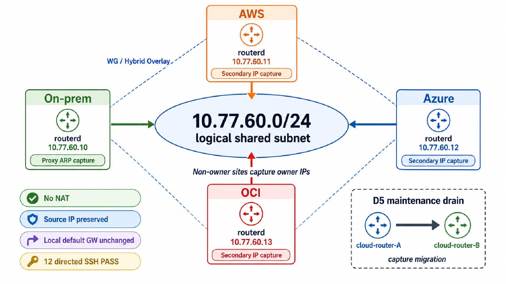

# CloudEdge Mobility Demo

> Experimental (CloudEdge). A lab demo of **Selective Address Mobility (SAM)**:
> on-prem, AWS, Azure, and OCI share one logical `/24`, and each site can serve an
> address that is *owned* by another site — without NAT and without changing the
> client's default gateway. The runnable package is
> [`examples/cloudedge-mobility-demo/`](https://github.com/imksoo/routerd/tree/main/examples/cloudedge-mobility-demo).



## What this demo shows

- **One logical `/24` shared across four sites** — on-prem / AWS / Azure / OCI all
  treat `10.77.60.0/24` as a single logical address space.
- **Non-owner sites capture the owner's address** — each owner address is made
  reachable *at every other site* (cloud: provider **secondary IP**; on-prem:
  **proxy ARP**), arbitrated to a single owner.
- **12 directed SSH flows pass** across the four demo clients.
- **NAT-less, source-preserved, gateway-unchanged** — connectivity keeps the real
  source IP, performs no NAT, and does not touch the client's default gateway.
- **Cloud maintenance capture migration (D5)** — a captured address moves from one
  cloud router to a standby in the same provider with traffic recovering through
  the new holder.

## Address design

All four sites share one logical subnet; each site owns exactly one `/32` within it.

| Site | routerd node | Owner address | Capture mechanism |
| --- | --- | --- | --- |
| On-prem | `onprem-router` | `10.77.60.10/32` | Proxy ARP on the LAN |
| AWS | `aws-router-a` | `10.77.60.11/32` | ENI secondary IP |
| Azure | `azure-router` | `10.77.60.12/32` | NIC secondary ipConfig |
| OCI | `oci-router` | `10.77.60.13/32` | VNIC secondary private IP |

Logical subnet: **`10.77.60.0/24`**. The overlay between routers is a *separate*
RFC1918 WireGuard network (kept clear of link-local `169.254/16` and CGNAT
`100.64/10`); see
[Selective Address Mobility](../reference/selective-address-mobility.md) for the
addressing constraints.

## Data plane

- **provider-secondary-ip capture** — on each cloud router, the owner addresses of
  the *other* sites are attached as secondary IPs on its ENI / NIC / VNIC, so the
  cloud fabric delivers them to that router.
- **proxy-ARP capture** — on-prem, the router answers ARP for the other sites'
  owner addresses on the LAN.
- **/32 delivery route** — each captured address is delivered over the overlay via
  a `/32` route to the owning site's router.
- **WireGuard / Hybrid overlay** — routers interconnect over WireGuard (the Hybrid
  overlay), independent of the shared `/24`.

Because delivery is routed (not NAT'd), the **source IP is preserved** and the
client's **default gateway is unchanged**.

## Control plane

The operator declares only intent; everything else is derived.

- **MobilityPool** — the single operator-authored intent (members, capture mode,
  delivery, placement, maintenance drain).
- **BGP /32 mobility paths** — each owner advertises its owned host route; other
  sites learn the current best path over the overlay.
- **Provider trap actions** — cloud routers eventually assign/unassign remote
  owned /32s as secondary IPs for local trapping; these actions are no longer on
  the critical forwarding path.
- **Event Federation** — `routerd.client.ipv4.observed` facts propagate between
  sites (`EventGroup` / `EventPeer` / `EventSubscription`, see
  [Event Federation](../reference/event-federation.md)).
- **Provider action executor** — performs the gated cloud mutation (assign /
  unassign secondary IP, forwarding) under `ProviderActionPolicy`, using the
  instance's own cloud-native identity (see
  [ADR 0007](../adr/0007-provider-action-execution.md)).
- **pathSig fencing** — provider actions are fenced against the current BGP
  desired path signature and holder, so stale actions cannot mutate a route that
  has reconverged elsewhere.

## How to run it

Use the package under `examples/cloudedge-mobility-demo/`. It assumes the lab
instances, NICs/VNICs, identity permissions, SSH, WireGuard keys, and provider
CLIs are already prepared — the scripts do **not** provision cloud resources.

```sh
cd examples/cloudedge-mobility-demo
cp env.example env
$EDITOR env            # fill every placeholder; keep secrets out of git

./run-demo.sh          # render + deploy, emit events, run D3, then D5 migration
./collect-evidence.sh  # gather provider state, journals, and connectivity
./reset-lab.sh         # best-effort teardown; stops compute to avoid idle cost
```

Run `reset-lab.sh` after every run, even on failure.

## Verified results

- **D1** location auto-reflection: an owner address appearing on-prem is recognized
  by each cloud router.
- **D2** cloud→on-prem capture (proxy ARP).
- **D3** four-site **12 directed ping + SSH PASS** — source preserved, no NAT,
  default gateway unchanged.
- **D4** on-prem HA / VRRP capture failover.
- **D5** cloud maintenance / **capture migration PASS** — drain `aws-router-a`, the
  captured address moves to `aws-router-b`, traffic recovers via B; the stale
  pathSig action is fenced (`skipped: stale mobility desired path`). See
  [the D5 evidence](../releases/evidence/cloudedge-mobility-d5-aws-maintenance-20260531.md).

## Caveats

- This is a **lab demo**, not a production turnkey.
- It is **not** full L2 extension / EVPN — there is no broadcast/multicast bridging.
- It is **selective `/32` address mobility**: chosen addresses are made mobile across
  sites, not the whole subnet.
- The scripts assume pre-provisioned instances and use placeholder, non-secret
  logical addresses; never commit real account/subscription/OCID/ENI/VNIC IDs or
  private keys.
