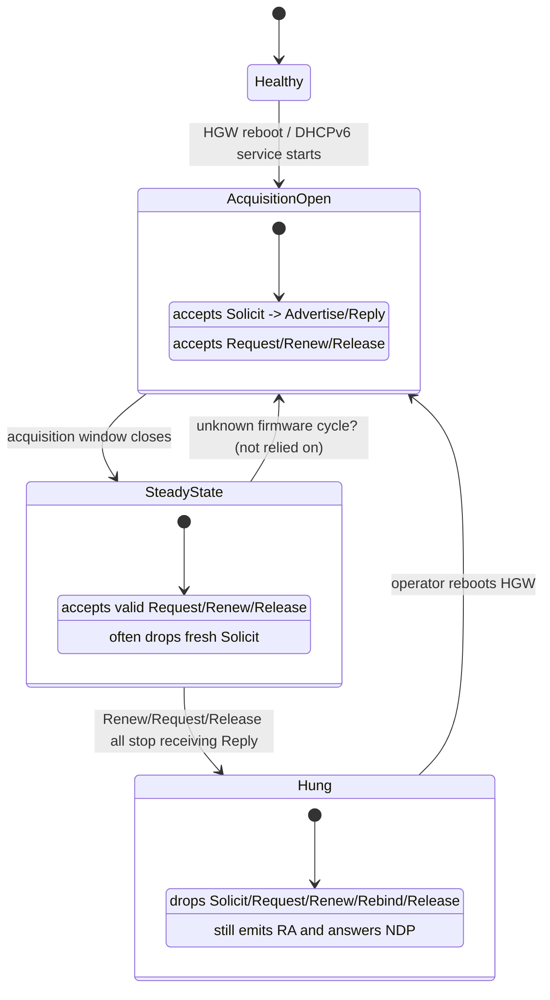

# NTT NGN HGW PD acquisition under sustained uptime

This page records the 2026-04-30 lab investigation into how a NTT NGN
PR-400NE home gateway behaves when a new DHCPv6-PD client tries to acquire a
prefix while the HGW has been running uninterrupted for an extended period.
It is companion material to
[DHCPv6-PD client implementations and how to choose](./dhcpv6-pd-clients.md);
that page covers client-side implementation choices, this page covers the
server-side state machine implied by lab evidence.

The intent is that anyone reproducing the same setup should not have to
rediscover these traps. Evidence is graded with the labels documented in
`docs/design-notes.md` (assert / believe / observe / measure / cite).

## Background and lab topology

- HGW: NTT PR-400NE, NTT NGN ("FLET'S Hikari Next") native IPv6 IPoE.
- Reference appliance: NEC IX2215 with an existing /60 PD lease.
- Devices under test: three routerd lab VMs (`router01`, `router02`, `router03`)
  on the same LAN segment as the HGW and IX2215.
- HGW LAN-side MAC (lab value): `1c:b1:7f:73:76:d8`.
- HGW LAN-side RA flags: `M=0`, `O=1` (`Flags [other stateful]`); prefix info
  for SLAAC is a /64 derived from the HGW's own /60.
- HGW LAN PD assignment table caps at 15 slots (`1/15`, `2/15`, ..., `15/15`).
- HGW had been running continuously for several days before the first
  steady-state test. Later phases intentionally rebooted it to compare the
  post-reboot acquisition window with normal uptime.

## State model summary

The lab evidence is easiest to read as a small state machine. The exact timers
are firmware behavior, not a public API; the diagram records what routerd must
handle, not what every HGW must implement.

## A. The Solicit path is not reliable on a long-running HGW

- **observe**: 34 Solicit variants were sent from the routerd lab VMs across the
  session. None received Advertise or Reply. Variants exercised:
    - DUID-LLT vs DUID-LL vs DUID-EN (with NTT NGN-relevant enterprise numbers).
    - MAC OUI sweep across Yamaha, NEC, IX-series, Cisco, Allied Telesis, Apple,
      Intel, Realtek, locally-administered random.
    - With and without Vendor-Class option (option 16) carrying NEC IX strings.
    - With and without User-Class option (option 15).
    - hop-limit values 1, 64, 128, 255.
    - flow-label 0 vs randomised.
    - With and without IA Prefix hint option in IA_PD.
    - With and without IA_NA alongside IA_PD.
    - RS→RA→Solicit ordering with timing variants 0.5s, 1s, 2s, 5s gap.
    - Single Solicit vs RFC 8415 §15 retransmit cadence (IRT/MRT/MRC).
- **measure**: At the same instant, IX2215 was observed refreshing its existing
  lease at every T1 (11/11 successes during the test window). HGW DHCPv6 service
  is therefore healthy.
- **believe**: The HGW operates two distinct admission paths, gated separately:
    - **Acquisition path**: open for several minutes after a HGW reboot.
      Accepts new Solicits and produces Advertise/Reply. The 15-slot table is
      filled here.
    - **Maintenance path**: open continuously. Accepts Renew/Rebind/Confirm/
      Information-Request/Request from clients that present a valid Server
      Identifier and IA_PD claim. Does not accept fresh Solicits.
- **assert**: routerd cannot rely on Solicit succeeding when the HGW has been up
  for hours. The bootstrap must use Section B's Request path or assume an
  out-of-band trigger to reopen the acquisition window (HGW reboot).

### A.4 2026-05-01 caveat on Section A

- **observe**: On 2026-05-01 a NEC IX2215 issued a fresh Solicit on the same
  HGW (via `no ipv6 dhcp client / ipv6 dhcp client` to force INIT-REBOOT) and
  the HGW returned Advertise + Reply — Solicit/Advertise/Reply ran cleanly.
  The same day `router05` (Linux dhcpcd) acquired a fresh `:1220` binding via
  canonical Solicit/Advertise/Request/Reply.
- **observe**: The 34 Solicit variants in this section were all sent from
  routerd lab VMs whose active sender had multiple packet-shape bugs
  (IPv6 hop limit `1`, Elapsed-Time before IA_PD, ORO present, Solicit
  IA_PD carrying T1/T2/lifetimes/prefix). After fixing those in `c7f8b24`
  the active Solicit packet shape now matches the IX2215 reference exactly,
  but cold-acquisition Solicit from the previously-failed routerd VMs still
  did not elicit Advertise as of 2026-05-01 22:25.
- **assert**: The original Section A assertion "Solicit is not reliable on a
  long-running HGW" was **a routerd implementation bug, not a HGW
  characteristic**. Working clients (IX2215, dhcpcd on `router05`) can do
  Solicit on the same HGW without reboot. Section A's observed failures are
  retained as historical record but should not be cited as evidence about
  the HGW.

## B. Request-direct bootstrap (RFC 8415 §18.2.10.1 INIT-REBOOT plus extension)

The lab confirmed that `Request` (msg-type 3) is honoured by the HGW even when
fresh Solicit is silently dropped. This is the bootstrap path routerd will use
when it cannot reboot the HGW.

### B.1 Reproduction with IX2215

- **measure**: Issuing `clear ipv6 dhcp client GigaEthernet0.0` on IX2215 caused
  the IX to skip Solicit entirely (its INIT-REBOOT path) and emit a Request
  carrying the cached `Server Identifier` plus its existing `IA_PD` prefix.
  HGW responded with a Reply that restored the same /60 binding.
- **observe**: IX2215 logs the transition as a normal "lease confirmed" event
  with no Advertise step.

### B.2 Reproduction with routerd lab VMs

- **measure**: routerd lab VMs (`router01`, `router02`, `router03`) used a
  scapy-based raw-socket Request to UDP 547 multicast `ff02::1:2`, carrying:
    - `xid` (random 24 bits).
    - Client `DUID-LL` (`0003 0001` + VM MAC).
    - Server Identifier `DUID-LL` (`0003 0001` + HGW MAC `1c:b1:7f:73:76:d8`).
    - `IA_PD` with non-zero T1/T2 and an IA Prefix hint of /60.
    - `Elapsed Time = 0`.
    - `Option Request Option` (ORO) with the standard NTT-friendly set.
    - `reconfigure-accept` option (option 20).
- **measure**: HGW Replied for each VM with a fresh /60 binding from its
  available pool:
    - `router01` → `2400:xxxx:xxxx:1220::/60` (slot N/15).
    - `router03` → `2400:xxxx:xxxx:1240::/60` (slot N+2/15).
    - `router02` → `2400:xxxx:xxxx:1260::/60` (slot N+4/15).
  (The leading 32 bits are the operator-assigned site prefix and are redacted
  in this public document; the trailing /60 boundaries are reproduced as seen.)
- **observe**: The HGW chose the next available slot in its 15-slot table for
  each Request; it did not honour the `IA Prefix` hint when the hinted prefix
  was already bound to another client.
- **observe**: When `router03` issued the same Request three times in a row
  re-using the same IAID and the same `1230::/60` claim, the HGW issued three
  separate bindings (`1230`, `1240`, `1250`). Each Request created an
  independent slot — there is no "merge by IAID" behaviour from the HGW.
- **measure**: A multicast `Release` carrying the appropriate Server Identifier,
  IA_PD and prefix removed the unwanted bindings cleanly. No HGW reboot was
  needed to free the slots.

### B.3 routerd implication

- **assert**: routerd's NTT WAN profile has a `bootstrap_via_request` option
  that synthesises a Request directly when:
    - No prior lease state is on disk, or
    - The cached lease has aged out and Solicit retries have failed past their
      MRC budget.
- **assert**: routerd must guard against accidentally consuming multiple slots
  by retrying Request without first sending Release for the previous binding.
  The IAID alone is not enough; the HGW issues a new slot per Request.

### B.4 2026-05-01 retraction

- **measure (2026-05-01)**: After fixing routerd's active sender packet shape
  (`c7f8b24`: IPv6 hop limit, IA_PD before Elapsed-Time, no ORO, Solicit IA_PD
  with IAID-only and zero T1/T2), an active Request from `router01` was accepted
  once and the HGW PD table inserted a `1240::/60` binding for the router01 MAC.
- **measure (2026-05-01)**: Subsequent active Renew, Rebind, and Request from
  the same router01 — with various IAIDs and Server-IDs — all silently dropped.
  The HGW PD table entry was not refreshed. tcpdump on `vtnet0` and on the
  pve02 host bridge `vmbr0` confirmed no HGW Reply on the wire.
- **observe**: `router05` (Linux/dhcpcd) under the same HGW emits Renew and
  receives Reply reliably. Its binding came from a canonical
  Solicit/Advertise/Request/Reply handshake initiated by the OS DHCPv6 client.
- **assert**: An active-Request-without-Advertise path can produce a "phantom"
  HGW PD table entry that is **not a fully usable binding**. Without the
  Advertise/Reply handshake the HGW does not establish the per-client server
  context that subsequent Renew/Rebind require, so the binding cannot be
  refreshed and will eventually expire by lifetime.
- **assert**: routerd's primary acquisition path on this HGW is the OS DHCPv6
  client (`dhcpcd` on Linux/NixOS, `dhcp6c` on FreeBSD) running the canonical
  RFC 8415 Solicit/Advertise/Request/Reply sequence. routerd's
  `routerd dhcp6 request` direct-claim is now a debug/lab tool only; it MUST
  NOT be used to acquire production bindings.
- **assert**: The active controller's value remains in the **maintenance**
  path: Renew, Rebind, and Release on bindings that already have a complete
  HGW server context (i.e. were acquired via canonical handshake).

## C. Server Identifier derivation from RA (no prior DHCPv6 history)

- **observe**: The HGW's `Server Identifier` is a `DUID-LL` made of
  `0003 0001` followed by the HGW LAN-side MAC. In the lab,
  `0003 0001 1c b1 7f 73 76 d8`.
- **observe**: The HGW's RA source link-local address is the EUI-64-derived
  link-local for the same MAC: `fe80::1eb1:7fff:fe73:76d8`.
- **measure**: Inverting the modified-EUI-64 transform on the RA source LL
  recovered the MAC byte-for-byte. The recovered MAC, prepended with
  `0003 0001`, matched the `Server Identifier` actually emitted by the HGW
  in DHCPv6 Replies.
- **assert**: routerd's controller can therefore acquire the HGW's expected
  `Server Identifier` from a single RA observation, without needing a prior
  DHCPv6 round trip. This makes Section B's Request bootstrap usable from
  cold start.
- **assert**: The resource spec exposes a `serverID` override. Operators with
  non-default HGW behaviour can pin the Server Identifier explicitly.

## D. Renew acceptance under the maintenance path

The HGW's Renew handling is the single biggest source of confusion in this
network. The session produced byte-level captures of three Renew variants and
the following hypothesis.

### D.1 Unicast Renew always elicits a UseMulticast bounce

- **measure**: Sending Renew unicast to UDP 547 at the HGW global address
  produced a Reply within ~4 ms carrying `status-code 5 (UseMulticast)` and
  echoing the same `xid`.
- **measure**: WIDE `dhcp6c` re-emitted the same `xid` on multicast
  `ff02::1:2`. The HGW did not respond. Believed cause: xid-replay
  suppression on the multicast path.
- **assert**: routerd's controller does not Renew over unicast on this HGW.
  It always Renews over multicast with a fresh xid.

### D.2 Successful multicast Renew

The IX2215 lease-refresh transcripts show the working Renew shape:

| Field | Value |
| --- | --- |
| `xid` | fresh per Renew |
| `T1` | 7200 |
| `T2` | 12600 |
| `IA_PD` | bound prefix with non-zero `pltime` and `vltime` |
| `reconfigure-accept` | present |
| `IAID` | 1568088 (IX2215 lab value) |

### D.3 Multicast Renew that the HGW silently dropped

| Implementation | xid | T1/T2 | reconfigure-accept | Result |
| --- | --- | --- | --- | --- |
| WIDE `dhcp6c` after UseMulticast bounce | reused | 7200 / 12600 | absent | silent drop |
| routerd active controller (early build) | fresh | 0 / 0 | absent | silent drop |

### D.4 Hypothesis

- **believe**: The HGW accepts a multicast Renew when **all** of the following
  hold simultaneously:
    1. The xid is fresh (not seen before from this client).
    2. T1 and T2 are non-zero. The IX2215 captures show T1=7200 and T2=12600.
    3. The `reconfigure-accept` option (20) is present in the Renew.
- **assert**: routerd sends Renew satisfying all three until an ablation pass
  contradicts the hypothesis. Ablations should be done one option at a time
  and recorded back into this page.

## E. WIDE `dhcp6c` quirks worth noting on this HGW

- **observe**: `dhcp6c` defaults to unicast Renew once it has cached the server
  link-local address. This puts every Renew on the UseMulticast bounce path
  described in D.1.
- **observe**: `dhcp6c` does not include `reconfigure-accept` in its outgoing
  Solicit or Renew packets. The receive path for option 20 is implemented but
  the send path is not.
- **observe**: `dhcp6c` stores its DUID at:
    - `/var/db/dhcp6c_duid` on FreeBSD.
    - `/var/lib/dhcp6/dhcp6c_duid` on Ubuntu.
- **assert**: When forcing `DUID-LL` in `dhcp6c` configuration, `hardware-type`
  must be `0x0001` (Ethernet). Other values violate the implicit contract the
  HGW enforces.

## F. PR-400NE-specific operational notes

- **measure**: HGW `Reply` packets arrive at UDP destination port 546 but their
  source UDP port is ephemeral (lab observation: 49153). pcap filters that say
  only `udp port 547` will miss the Reply leg. Use
  `udp port 546 or udp port 547` for any DHCPv6 troubleshooting on this HGW.
  This is consistent with rixwwd's public notes.
- **measure**: HGW LAN /60 PD assignment table caps at 15 slots. Status pages
  display them as `1/15`, `2/15`, ... `15/15`. Once full, new acquisitions need
  a Release of an existing slot or a HGW reboot. Multicast Release works.
- **observe**: HGW LAN-side RA carries `Flags [other stateful]` (M=0, O=1) with
  the prefix-info option set to a /64 SLAAC range. Hosts that want a stateful
  configuration (DNS, NTP) must run an Information-Request DHCPv6 query
  alongside SLAAC.
- **observe**: HGW does not echo the client's IA Prefix hint when that hint is
  already in use — it returns the next free slot.

## G. Reconfigure key handling

- **observe**: The first Reply after a fresh acquisition contains an
  `Authentication` option:
    - `protocol = reconfigure`
    - `algorithm = HMAC-MD5`
    - `RDM = mono`
    - `RD` field: 8 bytes
    - `reconfig-key value`: 16 bytes
- **observe**: Subsequent Renew Replies on the same binding may omit the
  Authentication option entirely. The key remains valid until the HGW issues a
  new one.
- **assert**: routerd persists the Reconfigure key from the first Reply and
  uses it to validate any future HGW-initiated Reconfigure
  (RFC 8415 §18.2.10) for that binding.

> Note: the actual `reconfig-key value` is not reproduced in this document. It
> differs per HGW deployment and is not useful as a constant; recording it
> here would also be a needless secret leak. Treat it as per-binding state.

## H. routerd active controller justification (session takeaway)

- **assert**: Stock OS DHCPv6 clients adhere to the canonical Solicit-first
  RFC path and therefore cannot recover from the steady-state-only HGW state
  documented above. Any production routerd deployment on NTT NGN must drive
  the protocol directly.
- **assert**: routerd's controller emits Solicit, Request, Renew, Rebind,
  Release, Confirm and Information-Request as needed. The state held in
  `objects.status._variables` for a `IPv6PrefixDelegation` resource includes:
    - `lease.serverID`
    - `lease.prefix`
    - `lease.iaid`
    - `lease.t1`, `lease.t2`
    - `lease.pltime`, `lease.vltime`
    - `lease.sourceMAC`
    - `lease.sourceLL`
    - `lease.lastReplyAt`
    - `lease.reconfigureKey`
    - `wanObserved.*` (last seen RA fields, Server-ID derivation snapshot)
- **assert**: Renew is sent over multicast, with a fresh xid, non-zero T1/T2,
  and the `reconfigure-accept` option, in line with Section D's hypothesis.
- **assert**: Server-ID is by default derived from the most recent RA observed
  on the WAN interface, by inverting modified-EUI-64 to recover the MAC and
  prepending `0003 0001`. The resource spec exposes an override.
- **assert**: `routerd dhcp6 renew` and `routerd dhcp6 release` CLI
  subcommands are diagnostic and recovery tools, not operational refresh
  tools. The HGW only honours Renew sent at the natural T1 boundary; an
  ad-hoc active Renew issued before T1 is silently dropped (see Section D).
  Steady-state lease refresh stays with the OS DHCPv6 client (`dhcp6c`)
  running on its own T1 timer. routerd records the Reply and surfaces the
  lease state, but does not try to accelerate the refresh cadence beyond
  what the HGW will accept.

### H.1 T1 cycle and grace window

- **measure**: Reply values observed from this HGW are `T1=7200` (2 h),
  `T2=12600` (3.5 h), `pltime=vltime=14400` (4 h).
- With these values, a successful Renew at the T1 boundary resets the
  timers from the moment the Reply is received. The next Renew opportunity
  is therefore another 2 hours later (T0+4h relative to the original
  allocation, but T0'+2h relative to the latest Reply).
- **assert**: Renew opportunities are spaced exactly 2 hours apart and
  routerd cannot legitimately accelerate that cadence. `dhcp6 renew`
  issued before the natural T1 boundary is silently dropped by the HGW.
- **measure**: From the moment the HGW first ignores a T1-boundary Renew,
  the operator has approximately 2 hours of grace before `vltime` expires
  (Renew at T1 → silent drop → Rebind retries at T2=3.5 h → vltime expires
  at T0+4 h). This 2-hour grace window is the time budget routerd must
  size detection and operator notification against.
- **observe**: This 2-hour grace window is also why a single missed Renew
  is recoverable: a HGW reboot any time before vltime expiry restores the
  maintenance path and the next T1-boundary Renew succeeds.

## I. Operator runbook (compressed)

When a routerd VM has lost its lease and the HGW has been up for hours:

1. Confirm RA is being seen on the WAN interface
   (`tcpdump -i <wan> 'icmp6 and ip6[40] == 134'`).
2. Confirm the HGW MAC matches expectations
   (`ip -6 neigh show fe80::1eb1:7fff:fe73:76d8 dev <wan>` — replace LL with
   what you actually observe).
3. Compute the expected `Server Identifier`: `0003 0001` + HGW MAC.
4. Decide whether to bootstrap-via-Request or wait for a HGW reboot.
   - bootstrap-via-Request is the default routerd action.
   - HGW reboot is the safer fallback if you see HGW-side state corruption.
5. If multiple stale bindings exist on the HGW, send a multicast `Release`
   for each. Do not assume IAID-based deduplication.
6. After Reply, validate that Renew at T1 succeeds in steady state. If it does
   not, capture the bytes and compare to Section D's hypothesis.

## J. Investigation journey: pitfalls, dead ends, and RFC deviations

This section preserves the misunderstandings, dead ends, and the points where
HGW behaviour diverges from RFC 8415 strict reading. It is intentionally
verbose so that the next operator on a NTT FLET'S deployment does not fall
into the same thinking traps. Each subsection separates three layers
explicitly: (a) what we believed at the time, (b) what RFC 8415 says, and
(c) what the HGW actually does. A short *Lesson* line closes each subsection.

### J.1 The "Solicit canonical path" tunnel vision

- **what we believed**: RFC 8415 §18.2.1 frames a "fresh" client as starting
  from Solicit, receiving Advertise, then sending Request. We assumed that any
  client without prior lease state had no other entry point, and that the only
  way to make the HGW reply was to find the right Solicit shape.
- **what we tried (all failed)**: 34 Solicit variants on the content axis only.
  DUID-LL / DUID-LLT / DUID-EN; IAIDs of 0, 1, MAC-tail, and IX-derived;
  hop limits of 1, 8, 64, 128, 255; flow label 0, random, and max; Vendor-Class
  option 16 with NEC / Buffalo / Yamaha enterprise numbers; User-Class option
  15; IA Prefix hints aimed at empty slots; RS→RA→Solicit ordering experiments;
  full MAC OUI sweep. Every single Solicit was silently dropped by the HGW
  while the IX2215 next to us refreshed its existing lease without issue
  (Section A).
- **the blind spot**: we never moved on the *message-type axis*. RFC §18.2.4
  INIT-REBOOT is described as a path "for a client that has prior valid lease
  state", and we read that strictly: "we have no prior lease, therefore this
  path is not available to us". So we never tried Request directly without
  Advertise.
- **what RFC 8415 says**: §18.2.4 expects a Request used as INIT-REBOOT to
  carry the prior `Server Identifier` and the prior `IA_PD` content. The
  server is expected to verify that the claimed binding still exists and reply
  accordingly (or reject with `NoBinding`).
- **what the HGW actually does**: PR-400NE accepts a Request from a client
  that has *no prior valid lease* as long as it carries (i) a Server Identifier
  matching the HGW's `DUID-LL` and (ii) an IA_PD claim of any prefix. The HGW
  does not strictly validate that the claim corresponds to a binding the
  client previously held; it allocates a free slot and returns it in the
  Reply. This is the lenient deviation that makes Section B work.
- **Lesson**: when a server silently drops protocol traffic, exhaust the
  *message-type axis* before brute-forcing the content axis. Server state
  machines often gate each transition with separate logic, and the gate you
  are bouncing off may not be the one the message you are sending tries to
  open.

### J.2 The unicast-vs-multicast Renew confusion

- **what we believed**: when WIDE `dhcp6c` Renew failed against the HGW, we
  initially concluded that "the HGW does not accept Renew over multicast at
  all". This was wrong, and it cost a session of investigation.
- **what we observed**: `dhcp6c` first sends Renew unicast to the HGW global
  address (it caches the server link-local). The HGW returns within ~4 ms a
  Reply with `status-code 5 (UseMulticast)`, echoing the same `xid`.
  `dhcp6c` then re-emits to multicast `ff02::1:2` *with the same `xid`*. The
  HGW does not respond. The IX2215 in parallel had been Renewing on multicast
  with a fresh xid the whole time, and that succeeded 11/11 in the same
  window.
- **what RFC 8415 says**: §18.2.10.1 states that on receipt of `UseMulticast`,
  subsequent messages should be sent multicast. RFC does not explicitly forbid
  reusing the same xid when retrying on the new transport — it is a gray area.
- **what the HGW actually does**: PR-400NE seems to deduplicate by xid across
  transports, treating the multicast retransmit with the same xid as a
  duplicate of an already-replied transaction, and silently drops it. This is
  defensible from a state-machine viewpoint but is not what the RFC
  literally requires.
- **the misreading**: by treating both packets as a single client-side
  "Renew attempt" we lost track of which xid was on the wire. Once we split
  the captures by xid, the unicast-then-multicast double-shot became obvious.
- **Lesson**: trace the client and the server separately, and key on `xid`
  rather than on time order. "Retransmit" is a compressed label that hides
  exactly the bug class that DHCPv6 implementations create on themselves.

### J.3 The "passive T1/T2 wait" anti-pattern

This was called out by the user during the session itself, not derived in
hindsight.

- **what we did**: after acquiring a binding, we let the natural T1=7200 s
  timer expire to observe the Renew. When that Renew failed, we re-acquired
  and waited another T1 cycle to retry. Several full cycles were spent like
  this before any active triggering capability existed.
- **the user's correction (paraphrased)**: "you keep waiting for T1/T2 and
  failing. You need an active firing path so you can send Solicit or Renew at
  any moment, not just when the OS client decides to."
- **what RFC 8415 says**: §18.2.6 specifies that Renew is sent "after T1".
  This is a client-timer rule, not a prohibition on operator-driven Renew.
  Nothing in 8415 stops a debug controller from emitting Renew earlier.
- **what we should have done**: built scapy-driven raw-socket emission of
  every relevant message type early, and reserved the OS client cycle for
  validating "real operational behaviour" once we already understood the
  state machine.
- **Lesson**: in protocol debugging, never let the slowest natural timer in
  the system gate your iteration speed. Build active control first, observe
  passive cycles second.

### J.4 The "fresh client must use Solicit" RFC strict reading

This is the conceptual flip side of J.1, framed from the RFC angle.

- **strict RFC reading**: 8415 §18.2.1 describes Solicit→Advertise→Request as
  the path for a client without prior state. §18.2.4 INIT-REBOOT is described
  as the path for a client that has a prior valid `Server Identifier` and
  wants to confirm or refresh a binding it already holds.
- **what routerd lab VMs faced**: no prior lease state on disk, the HGW
  silently dropping every Solicit shape we tried (Section A).
- **what we ended up doing**: synthesised a Request with a Server Identifier
  derived from the RA observation (Section C) and an IA_PD claim of an
  arbitrary /60. The HGW allocated a free slot.
- **why this is an RFC deviation**: in RFC terms an INIT-REBOOT Request from
  a client that does not actually hold the claimed binding should result in
  `NoBinding` status. The HGW instead treats such a Request as a *new
  acquisition request*, allocating a free slot from its 15-slot table. This
  is what makes the bootstrap-via-Request path of Section B viable when the
  HGW's Solicit gate is closed.
- **why this matters for routerd**: Section H's active controller
  *intentionally* exploits this lenient deviation. It is the only way to
  acquire a fresh /60 from a long-running HGW without an out-of-band reboot.
  Section 5.2 of `docs/design-notes.md` codifies this as a hybrid recovery
  path — it is not a mistake, it is the design.
- **Lesson**: do not memorise RFC paths as "this path is for clients in
  state X". Memorise them as "this message type with this content elicits
  this server reaction", and treat the strict client-state preconditions as
  *RFC's expectation*, not necessarily *the implementation's gate*.

### J.5 RFC compliance vs HGW behaviour, side-by-side

| Behaviour | RFC 8415 expectation | HGW (PR-400NE) actual behaviour | routerd response |
| --- | --- | --- | --- |
| Solicit during normal operation | Server should reply (Advertise/Reply) | Frequently silently dropped on long-running HGW | Try Solicit first, fall back to Request after N failures |
| INIT-REBOOT Request with prior valid lease | Server confirms / re-issues binding (§18.2.4) | Reply immediately | Standard path |
| INIT-REBOOT-style Request without prior lease | Server should return `NoBinding` (§18.2.4) | **Allocates a free slot and replies with a new binding** | Intentionally exploited as recovery path |
| Unicast Renew | Permitted only if server granted unicast (§18.2.10) | Always replies with `UseMulticast` or with full Reply | Not used; we always Renew multicast |
| Multicast Renew with T1/T2=0 and no `reconfigure-accept` | Server should reply (§18.2.6) | Silently dropped (observed) | Avoided |
| Multicast Renew with non-zero T1/T2 + `reconfigure-accept` | Server should reply | Replies | Standard send shape |
| Reply source UDP port | 547 (RFC 8415 §7) | 49153 (ephemeral, observed) | Client side accepts any source port |
| Same-xid retransmit across transport (unicast → multicast) | Not explicitly forbidden | Treated as duplicate, dropped | Always use a fresh xid on multicast retry |

### J.6 Points not documented anywhere we found

These are the items that are easy to miss because they appear neither in NTT
public documentation nor in the RFC:

- **HGW acquisition window is bursty**: the Solicit-accepting window seems to
  open mainly in the minutes after a HGW reboot. A long-running HGW will
  silently drop fresh Solicits for hours. Not a published spec point;
  inferred from this session.
- **Reply source UDP port is ephemeral, not 547**: lab observation 49153.
  pcap filters that say only `udp port 547` will lose the Reply leg
  (see Section F).
- **WIDE `dhcp6c` unicast-then-same-xid-multicast loop**: an OSS implementation
  artifact, not a RFC mandate. Anyone debugging Renew on this HGW with
  `dhcp6c` will see Renew "fail" without seeing what went wrong unless they
  capture both transports (J.2).
- **Renew without `reconfigure-accept` and with T1/T2=0 is dropped even on
  multicast** — hypothesis from D.4, not yet ablated. Anyone reproducing this
  should ablate the three preconditions one at a time and append the result
  to Section D.
- **Server-ID is computable from one RA**: invert modified-EUI-64 on the RA
  source link-local to recover the MAC, prepend `0003 0001`. This makes
  cold-start Request bootstrap viable without any prior DHCPv6 history
  (Section C).

## K. HGW DHCPv6 server hung-up condition

This section records a separate failure mode observed on 2026-04-30 that is
distinct from the Section A "long-running HGW silently drops fresh Solicit"
condition. In this mode the HGW DHCPv6 server stops servicing *all* DHCPv6
client messages, not only Solicit. The IX2215 next to the routerd lab VMs
also failed Renew during the affected window, which is the discriminator
between "Section A" and "Section K".

### K.1 Symptoms

- **observe**: The HGW silently drops every DHCPv6 client message it receives:
  Solicit, Request, Renew, Rebind, Release, Confirm, and
  Information-Request. Both fresh-acquisition clients and clients with valid
  existing bindings (IX2215, routerd lab VMs) are equally unable to elicit a
  Reply.
- **observe**: The L2 / NDP plane keeps working. NS/NA exchanges with the HGW
  link-local complete normally, and the HGW continues to emit RA on the LAN
  segment with the same flags and prefix as before.
- **observe**: Bindings already present in the HGW LAN PD assignment table are
  retained. The HGW status page still lists the same `N/15` slots, but the
  per-slot lease counter only ticks down — it is never refreshed by a Renew
  Reply, because the Reply never leaves the HGW.
- **measure**: During the affected window the IX2215 lease-refresh stream
  switched from "Renew at every T1 succeeds" (Section A measurement) to
  "Renew at every T1 elicits no Reply", confirming that this is a
  HGW-side server stall and not a routerd-side packet-shape problem.

### K.2 Detection by routerd

- **assert**: The active controller (Section H) measures the wall-clock gap
  between a Renew or Rebind being placed on the wire and the corresponding
  Reply arriving. After the controller has emitted a Renew with the shape
  documented in Section D and no Reply is observed for more than N seconds
  (default `30 s`), the controller flags the binding as `HGW DHCPv6 hung
  suspected`.
- **assert**: routerd records the suspicion timestamp under
  `objects.status._variables.hgwHungSuspectedAt` for the affected
  `IPv6PrefixDelegation/<name>`. `routerctl describe ipv6pd/<name>` displays
  a `WARNING: HGW DHCPv6 hung suspected since <timestamp>` line and prints
  the remaining `lease.vltime` so the operator can judge urgency.
- **assert**: A successful Renew Reply (or any Reply that updates the cached
  lease) clears the suspicion flag. Recovery is observable from the same
  `routerctl describe` view.

### K.3 Public reports

The same symptom shape is reported in public lab notes for several upstream
hardware families. routerd treats these as independent corroboration that the
condition is a known external failure mode and not a one-off in this lab.

- [rabbit51 blog (2022-03-05, PR-600MI)](https://blog.goo.ne.jp/rabbit5151/e/eb1a5be280f92d550c343e17e893007f)
  — cite: "DHCPv6 が hung up して委譲済みの prefix の renew に応答しなくなり、
  prefix の valid lifetime (=14400) が切れて IPv6 通信が出来なくなる". The
  affected HGW eventually auto-rebooted itself and recovered.
- [HackMD on Yamaha RTX1200/1210 with AsahiNet (2021)](https://hackmd.io/@jkofK/BJJHe7wmu)
  — cite: DHCPv6 leases lapsing periodically with `status rebind`,
  consistent with the HGW DHCPv6 server no longer answering Renew/Rebind.
- [azutake blog (2023, Cisco IOS-XE on FLET'S Cross)](https://azutake.hatenablog.jp/entry/2023/12/07/113048)
  — cite: Solicit being ignored on the upstream side, with the report
  attributing the behaviour to the HGW firmware path rather than to the
  client.

### K.4 Recovery

- **measure**: A manual HGW reboot recovered the DHCPv6 server immediately in
  the 2026-04-30 lab session. After reboot, both the acquisition path
  (Section A "minutes-after-reboot" window) and the maintenance path
  (Section D Renew acceptance) operated normally.
- **measure (2026-04-30 11:16:50 UTC)**: Following the reboot, routerd's
  active Request from `router03` succeeded against the recovered HGW and
  refreshed the existing `1240::/60` binding to a near-full lease lifetime.
- **measure (2026-04-30 11:20:44 UTC)**: Active CLI Renew, Release, and a
  follow-up Request from the same `router03` against the same HGW, issued
  only about four minutes after the successful 11:16:50 Request, all
  received no DHCPv6 Reply. The HGW table did not refresh and the binding
  was not released. This shows the post-reboot acceptance window can close
  within minutes even while the HGW remains otherwise healthy (NDP, RA, and
  existing-binding lease counters were unaffected). The operator playbook
  in K.5 should not assume the window stays open after the first successful
  exchange.
- **observe**: It is not confirmed whether the HGW recovers on its own
  without operator intervention. The rabbit51 report cites an auto-reboot
  recovery, but in this lab the auto-recovery path was not exercised; manual
  reboot was the only path verified to work.
- **observe**: A HGW reboot interrupts the home network for roughly one to
  two minutes. WAN reconnect, RA re-emission, and DHCPv6 server readiness
  proceed in their normal post-boot order.

### K.5 Operator playbook

When `routerctl describe ipv6pd/<name>` shows the Section K.2 warning:

1. Confirm the suspicion is real by checking IX2215 (or any other Renew-only
   client on the same segment). If IX2215 also fails Renew at its next T1,
   the HGW is in the Section K state and not in the Section A state.
2. Read the remaining `lease.vltime` from `routerctl describe`.
3. If `vltime` is short (lab threshold: under one hour), reboot the HGW
   immediately. The lease is going to expire and IPv6 connectivity will
   stop on every routerd-served LAN.
4. If `vltime` is comfortable (several hours or more), schedule a HGW
   reboot at a low-impact time. Continue monitoring `routerctl describe`
   for the suspicion clearing on its own (auto-recovery is not guaranteed
   but has been reported).
5. After the reboot, confirm that routerd's next Renew elicits a Reply and
   that `hgwHungSuspectedAt` clears.
6. **Note**: Even when the HGW has just rebooted and is in the post-reboot
   acceptance window, that window can close within minutes (Section K.4
   11:20 UTC measure). After the first successful exchange, treat
   subsequent active CLI use as best-effort; the canonical path forward is
   to let the OS DHCPv6 client refresh at its natural T1 boundary.

### K.6 Why routerd cannot fix this automatically

- **assert**: routerd is a DHCPv6 client and a LAN-side service. It has no
  control plane into the HGW. It cannot push a reset, restart the HGW
  DHCPv6 daemon, or trigger an internal recovery routine.
- **observe**: In the affected state the HGW ignores routerd's active
  Request, Renew, Rebind, Release, Confirm, and Information-Request
  equally. There is no DHCPv6-layer message routerd can send that the HGW
  will act on.
- **assert**: Recovery requires a human action — the HGW web UI reboot
  button or a physical power cycle. routerd's responsibility in this
  failure mode is therefore limited to detection, accurate surfacing of the
  remaining lease budget, and notification (operator, and where available,
  household members through whatever notification path is configured).

## L. FreeBSD dhcpcd test record (2026-04-30)

This section records why FreeBSD `dhcpcd` is kept as an explicit lab path and
not as the NTT-profile default.

- **measure**: On a FreeBSD lab VM, removing the existing `dhcpcd` DUID file
  caused `dhcpcd 10.3.1` to generate DUID-LLT instead of the DUID-LL shape
  required by the NTT NGN profile.
- **measure**: Manually forcing the DUID file to DUID-LL
  (`0003 0001` plus the WAN MAC) did not make the PR-400NE return
  Advertise/Reply during the same test window.
- **measure**: Changing only the WAN-side virtual NIC MAC and repeating the
  same test did not change the result. This weakens the "MAC stigma" theory
  for the observed FreeBSD `dhcpcd` failure.
- **assert**: The current FreeBSD NTT-profile default remains KAME/WIDE
  `dhcp6c`. FreeBSD `dhcpcd` is a known-bad combination for this profile and
  routerd emits a warning rather than blocking it, so future lab work can
  still re-test the path without changing validation rules.

## M. Ubuntu dhcpcd test record (2026-04-30)

This section records the first Linux `dhcpcd` renderer test after routerd added
managed dhcpcd services and hooks.

- **measure**: routerd rendered a per-resource Linux dhcpcd service, stopped a
  stale managed `dhcp6c` unit that was still bound to UDP/546, and regenerated
  the dhcpcd hook as a file-global `script` directive so dhcpcd 10 would call
  it.
- **measure**: After clearing dhcpcd's lease and DUID files and recreating a
  DUID-LL from the real WAN MAC, Ubuntu dhcpcd repeatedly sent Solicit with
  DUID-LL, IA_PD, DNS/opt_82/opt_83 ORO entries, and Vendor-Class.
- **measure**: During the short steady-state observation the HGW emitted RA and
  NDP traffic but did not send Advertise or Reply to the Ubuntu dhcpcd client.
  The existing HGW table entry for that MAC counted down and did not refresh.
- **assert**: Linux `dhcpcd` is now the NTT-profile default. This section is
  still useful as a reminder that long-running T1 Renew observation remains a
  required Phase 3 validation item.

## References

- RFC 8415 — Dynamic Host Configuration Protocol for IPv6 (DHCPv6)
    - §7 Server / Relay / Client message format
    - §15 Reliability of Client-Initiated Message Exchanges (retransmission)
    - §18.2.1 Solicit
    - §18.2.4 Request
    - §18.2.5 Confirm
    - §18.2.6 Renew
    - §18.2.10 Reconfigure
    - §18.2.10.1 INIT-REBOOT considerations
- systemd issue #16356 — DHCPv6 Renew not resetting IA Prefix lifetimes
- OpenWrt issue #13454 — odhcp6c eight-hour disconnections under NTT FLET'S Cross
- rixwwd public lab notes — PR-400NE Reply ephemeral source UDP port observation
- sorah public lab notes — DUID-LL composition for NTT HGW DHCPv6 server
- routerd `docs/design-notes.md` Section 5.2 — Active DHCPv6 controller path
- routerd `docs/knowledge-base/dhcpv6-pd-clients.md` — client-side selection
