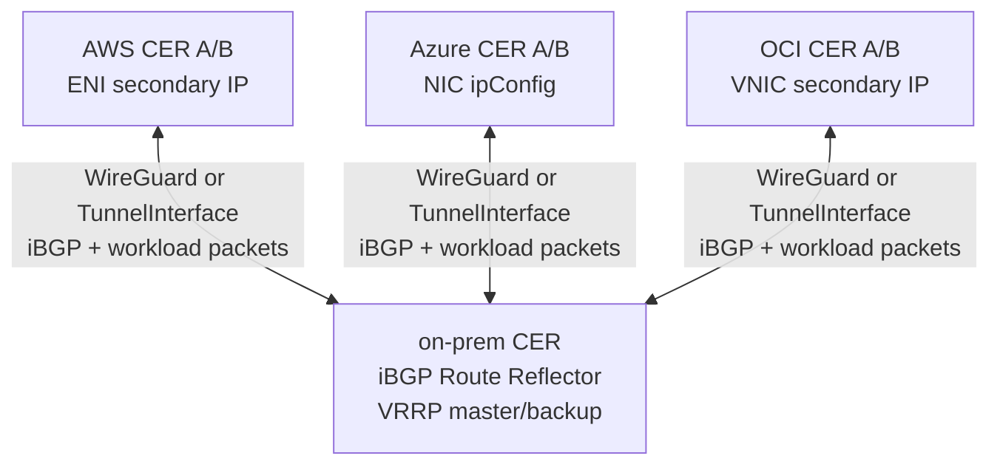
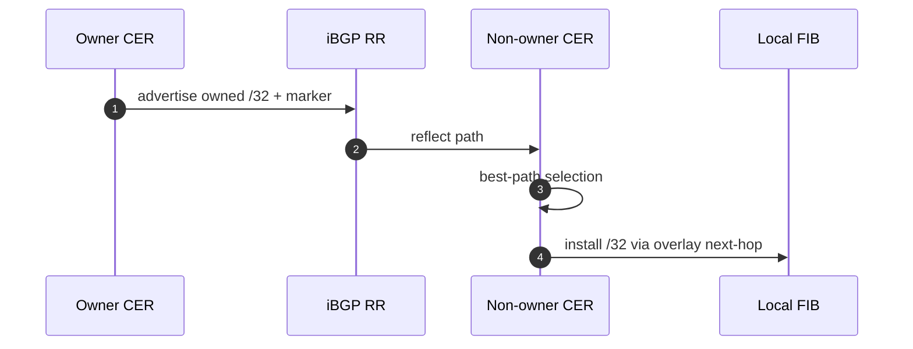
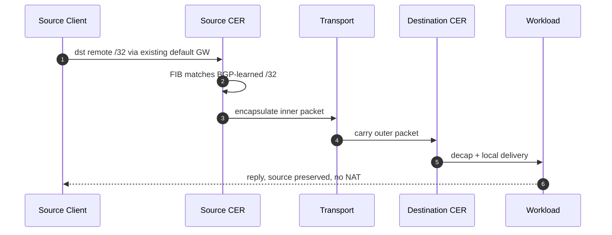
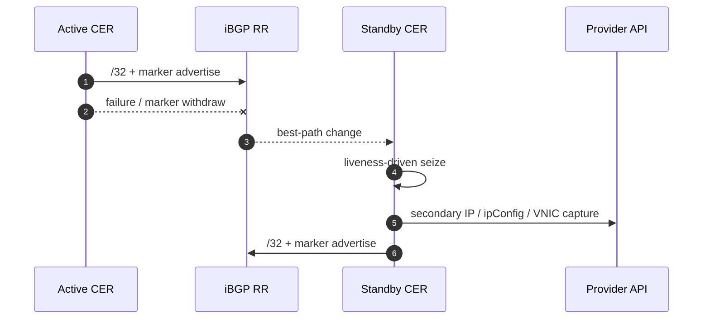
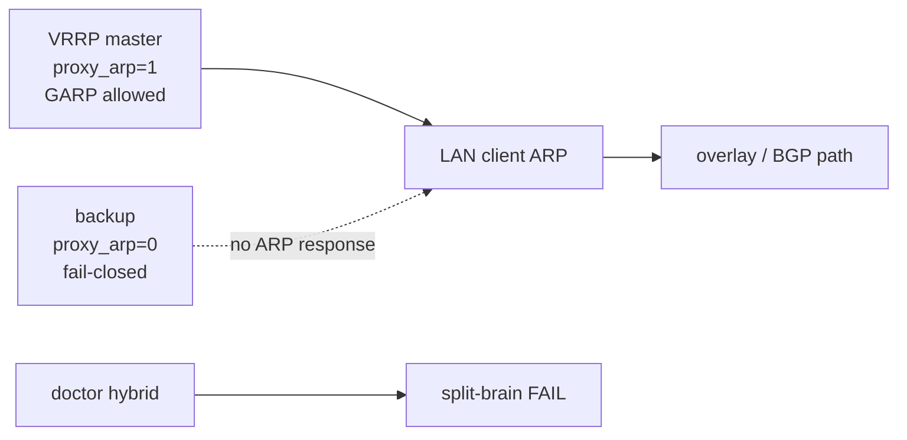

# CloudEdge SAM Phase G Deep Dive
## underlay / transport / overlay / BGP / packet / secondary IP

AWS / Azure / OCI / on-prem をまたぐ BGP best-path driven `/32` mobility

**no NAT / source IP preserved / default gateway unchanged**

---

## 1. レイヤーをそろえる

| レイヤー | 役割 | 例 |
|---|---|---|
| physical/provider network | outer packet を実際に運ぶ | AWS VPC / Azure VNet / OCI VCN / WAN / Internet |
| transport / underlay | SAM/BGP overlay の下で運ぶ | WireGuard / ipip / gre / fou / gue |
| SAM/BGP mobility overlay | `/32` owner と delivery を決める | BGP best-path / marker / RIB trap |
| workload packet | 端末・サービスの実通信 | src/dst は `/32` のまま |

> CloudEdge 文書で “underlay” と呼ぶ場合、SAM overlay から見た下位 transport を指すことがある。

---

## 2. 4-site topology



- logical pool: `10.77.60.0/24`
- selected owners: `.10` on-prem, `.11` AWS, `.12` Azure, `.13` OCI
- full L2 extension ではなく、選択 `/32` を BGP で到達化する

---

## 3. BGP ownership plane

| 要素 | 方式 |
|---|---|
| ownership | BGP best-path |
| liveness | per-node marker route + identity community |
| delivery | BGP-learned `/32` FIB route |
| trap | RIB-driven best-path change |
| provider capture | BGP path view から background reconciliation |

`AddressLease / ownershipEpoch / captureEpoch / heartbeat` は mainline から外れ、
BGP RIB が mobility source of truth になった。

---

## 4. BGP path propagation



見るべきもの:

- GoBGP RIB / Adj-RIB-Out
- route policy / local-pref / community
- marker path の有無
- OS FIB の `/32` route

---

## 5. Encapsulation: inner と outer

```text
inner workload packet:
  src = 10.77.60.11
  dst = 10.77.60.12

transport:
  WireGuard / GRE / IPIP / FOU / GUE

outer packet:
  src = source CER transport IP
  dst = destination CER transport IP
```

ポイント:

- inner src/dst は NAT されない
- outer packet だけが physical/provider network で配送される
- tcpdump では inner/outer の観測点を分ける

---

## 6. capture realization

| 環境 | capture | API / 実装 | failover |
|---|---|---|---|
| AWS | ENI secondary private IP | assign-private-ip-addresses | allow-reassignment |
| Azure | NIC ipConfig secondary IP | delete old ipConfig + create new | 2-step retry |
| OCI | VNIC secondary private IP | assign-private-ip | unassign-if-already-assigned |
| on-prem | proxy ARP / GARP | OS networking + VRRP gate | master only, backup fail-closed |

BGP best-path が owner を決める。secondary IP / ARP は ingress realization。
単一 on-prem ルータ構成では `capture.activeWhen.type: single-router` で VRRP 無しの常時 capture を選べる。

---

## 7. Normal packet flow



---

## 8. Cloud failover sequence



- stale path actions are fenced by current BGP path signature
- overlay reachability can recover before provider fabric catch-up finishes

---

## 9. On-prem VRRP / proxy ARP safety



- BGP does not replace local L2/ARP authority
- only master realizes proxy ARP / GARP
- backup remains fail-closed
- single-router capture is explicit for 1 site / 1 router / 1 owner
- duplicate proxy-ARP holders are diagnostic failures

---

## 10. Endpoint add/remove

### New `/32`
1. owner advertises `/32` + marker
2. RR reflects path
3. non-owner imports FIB route
4. RIB trap triggers capture reconciliation
5. traffic starts flowing

### Removed or moved `/32`
1. old owner withdraws path or marker disappears
2. best path changes
3. stale provider action is skipped
4. new holder advertises and captures
5. peers converge

---

## 11. PMTU and protocol transparency

- encapsulation overhead changes effective MTU
- `routerd_mss` clamps TCP MSS to avoid blackhole
- IPv4 force-fragment exists for trusted paths, default off
- acceptance should include:
  - FTP active/passive
  - NFS
  - RPC / rpcbind
  - 100MB bulk transfer
  - DF / no-DF PMTU probes
  - tcpdump source preservation / no NAT

---

## 12. Explanation checklist

1. Which `/32` is current BGP best-path owner?
2. Which transport carries iBGP and workload packets?
3. Where can we see inner and outer packet headers?
4. Did the local FIB import the remote `/32`?
5. Which provider/on-prem capture mechanism realizes ingress?
6. Are stale actions fenced by path signature?
7. Does packet capture prove no NAT and source preservation?

CloudEdge SAM = **BGP best-path driven `/32` mobility**.
