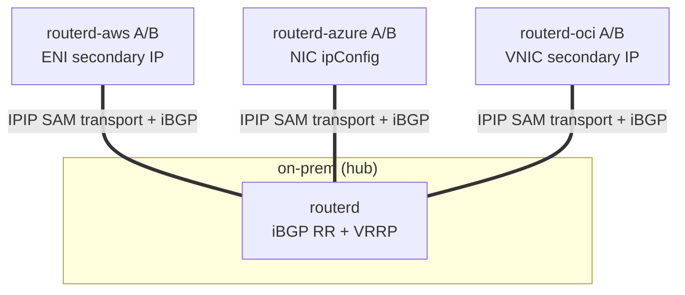
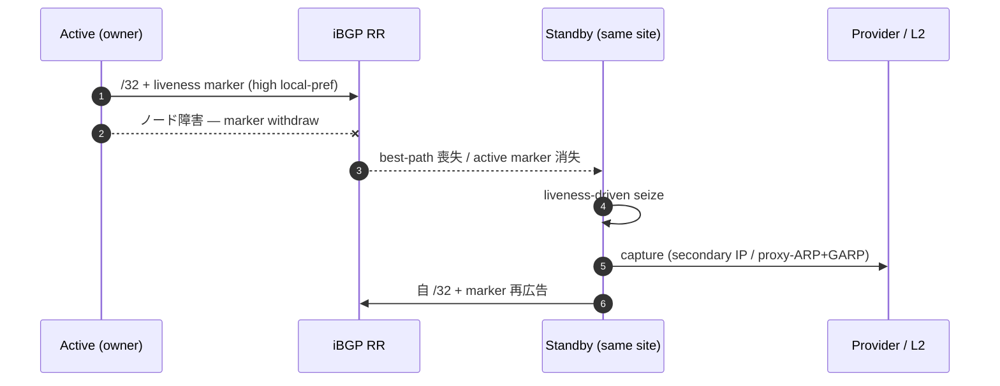
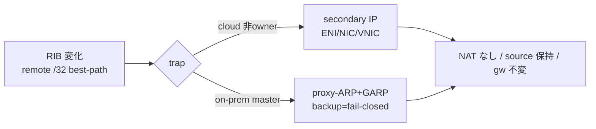

<!--
Marp スライド。レンダリング例:
  npx @marp-team/marp-cli docs/slides/cloudedge-sam-phase-g.md -o cloudedge-sam-phase-g.html
  npx @marp-team/marp-cli docs/slides/cloudedge-sam-phase-g.md --pdf
docusaurus でも通常の Markdown ページとして読める（--- は区切り線として描画）。
-->

# CloudEdge Selective Address Mobility
## Phase G — autonomous BGP `/32` address mobility

AWS / Azure / OCI / on-prem をまたぐ `/32` 可搬性
**NAT なし・source IP 保持・default gateway 不変**

routerd Cloud Edge Router

---

## 課題

- マルチクラウド + オンプレで、同一の `/32`（サービス/クライアントアドレス）を
  サイト間で到達させたい。
- ルーターノード障害時に、**手動操作ゼロ**で同一サイトの standby が引き継ぎ、
  L3 到達性を復旧したい。
- provider 固有の操作（AWS secondary IP / Azure NIC ipConfig / OCI VNIC /
  on-prem VRRP）を**共通フレームワーク**で扱いたい。
- split-brain / flapping を防ぎ、収束時間 **60s 以下** を目指す。

---

## 設計 — clean Option B

| 要素 | 方式 |
|---|---|
| **ownership** | BGP best-path（唯一の真実源） |
| **liveness** | per-node marker（overlay `/32` + identity community） |
| **trap** | RIB-driven（best-path 変化を捕捉） |
| **seize** | liveness-driven（active marker 消失で standby が取得） |

旧来の **AddressLease / ownershipEpoch / heartbeat / ActionPlan を撤去**。
複数の真実源を排し、BGP を唯一の ownership plane に。

➡ ADR 0012 が ADR 0006 を supersede

---

## トポロジ — SAM transport + iBGP hub-spoke

logical `/24` = `10.77.60.0/24` / default delivery は IPIP、暗号化が必要なら endpoint-only WireGuard underlay

---

## 自律フェイルオーバー

手動操作ゼロ・`manualProviderAction=false`

---

## capture の実現

- on-prem: **VRRP-master hard-gate** — backup は fail-closed（`proxy_arp=0`）
- doctor hybrid が split-brain を deterministically FAIL（loop-free by design）
- cloud mutation は**最小権限 identity**で自律実行

---

## データプレーン不変条件

- **NAT なし** — translation signature が出ない
- **source IP 保持** — server から見える source = client の `/32`
- **default gateway 不変** — client の既定経路は不変
- **MTU/PMTU** — overlay 追従 MSS clamp（`routerd_mss`）+ 任意の IPv4
  force-fragment（default off）で DF blackhole 回避

➡ FTP(active/passive) / NFS / RPC / 100MB bulk が fragment なく完走

---

## transport と PMTU

- **SAMTransportProfile**
  - default delivery は IPIP `TunnelInterface`
  - WireGuard は endpoint `/32` 専用 underlay。mobile `/32` は `AllowedIPs` に入れない
- **P2-b — IPv4 force-fragment**（ADR 0013）
  - `OverlayPeer / TunnelInterface.pathMTU.forceFragmentIPv4`、default off
  - 低 PMTU underlay の DF blackhole を緩和（IPv4 限定）

---

## acceptance 結果（実機 evidence）

| 項目 | 結果 |
|---|---|
| overall | **overallPass: true** |
| 4-site matrix | D3 **12/12** |
| AWS / Azure / OCI failover | D5 / D6 56.7s / D7（自律, 60s 以下） |
| on-prem VRRP | D8 recovery **8s**, backup fail-closed, split-brain FAIL |
| L2 loop / STP | recovery 3s, STP blocking, loop-free |
| protocol 透過性 | FTP/NFS/RPC/100MB/PMTU/source 保持/no-NAT 全 PASS |
| 最小権限 | AWS / OCI / Azure scoped identity 実証 |
| unit | go test **2322 pass** |

---

## まとめ

- **BGP best-path が `/32` の owner を決める**
- **RIB の変化を CER が trap する**
- **cloud は secondary IP、on-prem は proxy-ARP/GARP で実現する**
- **データプレーンは NAT せず、source IP と default gateway を維持する**

CloudEdge SAM = *BGP best-path driven `/32` mobility*

ネットワーク屋に通じる単純さと、実機 acceptance で裏打ちされた堅牢性。
