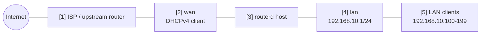

# 基本的な IPv4 NAT ルーター


LAN クライアントが、DHCP で取得した WAN 側 IPv4 アドレスを使ってインターネットに出るための、最小構成に近いホームルーターの例です。

完全な検証済み YAML は `examples/example-basic-ipv4-nat.yaml` にあります。

## 構成図



## 図の対応表

| 番号 | 意味 | 主なリソース |
| --- | --- | --- |
| [1] | WAN 側 IPv4 リースを配る上流ネットワーク。 | routerd 管理外 |
| [2] | 物理 WAN インターフェース。ここで DHCPv4 クライアントを動かす。 | `Interface/wan`, `DHCPv4Client/wan-dhcpv4` |
| [3] | 転送用の sysctl と nftables ルールを自動導出して適用する Linux ホスト。 | Derived host runtime |
| [4] | routerd が持つ LAN ゲートウェイアドレス。 | `Interface/lan`, `IPv4StaticAddress/lan-base` |
| [5] | ルーターをゲートウェイ / DNS として使う LAN クライアント。 | `DHCPv4Server/lan-dhcpv4` |

## この例で管理するもの

| 領域 | routerd リソース |
| --- | --- |
| WAN アドレス | `Interface/wan`, `DHCPv4Client/wan-dhcpv4` |
| LAN アドレス | `Interface/lan`, `IPv4StaticAddress/lan-base` |
| LAN DHCPv4 | `DHCPv4Server/lan-dhcpv4` |
| IPv4 インターネット接続 | `NAT44Rule/lan-to-wan` |
| 基本的なフィルター | `FirewallZone/wan`, `FirewallZone/lan`, `FirewallPolicy/home` |

この例では DNS をできるだけ単純にしています。
DHCPv4 クライアントには、ルーターの LAN アドレスを DNS サーバーとして配ります。
基本的なルーティングが動いたあとで、必要に応じて `DNSResolver` と `DNSZone` を追加してください。

## 設定の要点

```yaml
# [2] WAN アドレスは上流ネットワークから DHCPv4 で取得する。
- apiVersion: net.routerd.net/v1alpha1
  kind: DHCPv4Client
  metadata:
    name: wan-dhcpv4
  spec:
    interface: wan

# [4] routerd が LAN ゲートウェイアドレスを持つ。
- apiVersion: net.routerd.net/v1alpha1
  kind: IPv4StaticAddress
  metadata:
    name: lan-base
  spec:
    interface: lan
    address: 192.168.10.1/24

# [5] LAN クライアントへアドレス、ゲートウェイ、DNS、検索ドメインを配る。
- apiVersion: net.routerd.net/v1alpha1
  kind: DHCPv4Server
  metadata:
    name: lan-dhcpv4
  spec:
    interface: lan
    addressPool:
      start: 192.168.10.100
      end: 192.168.10.199
      leaseTime: 12h
    gatewayFrom:
      resource: IPv4StaticAddress/lan-base
      field: address
    dnsServerFrom:
      - resource: IPv4StaticAddress/lan-base
        field: address

# [2] -> [5] LAN の IPv4 トラフィックは WAN に出るときマスカレードする。
- apiVersion: net.routerd.net/v1alpha1
  kind: NAT44Rule
  metadata:
    name: lan-to-wan
  spec:
    type: masquerade
    egressInterface: wan
    sourceRanges:
      - 192.168.10.0/24
```

`NAT44Rule` は routerd の nftables NAT テーブルに反映されます。
ファイアウォールのリソースでは、WAN インターフェースを `untrust` ゾーン、LAN インターフェースを `trust` ゾーンに入れます。

## 適用手順

```bash
cp examples/example-basic-ipv4-nat.yaml router.yaml
routerctl validate -f router.yaml --replace
routerctl plan -f router.yaml --replace
```

管理アクセスが、アドレスを変更しようとしている LAN インターフェースに依存していないこと、あるいはコンソールアクセスがあることを確認してから適用します。

```bash
routerctl apply -f router.yaml --replace
```

## 確認

```bash
routerctl status
routerctl describe DHCPv4Client/wan-dhcpv4
routerctl describe IPv4StaticAddress/lan-base
routerctl describe NAT44Rule/lan-to-wan
nft list table ip routerd_nat
nft list table inet routerd_filter
```

LAN クライアント側では次を確認します。

```bash
ip route
ping 192.168.10.1
curl https://1.1.1.1/
```

## よく変える場所

- `ens18` と `ens19` を実際のインターフェース名に変更する。
- 上流ネットワーク、VPN、管理ネットワークと重なる場合は `192.168.10.0/24` を変更する。
- ルーターを DNS サーバーとして配る前に、必要なら `DNSResolver` を追加する。
