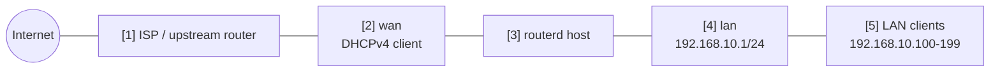

# 基本的な IPv4 NAT ルーター

LAN client が、DHCP で取得した WAN 側 IPv4 address を使って internet に出るための、
最小構成に近い home router 例です。

完全な検証済み YAML は `examples/example-basic-ipv4-nat.yaml` にあります。

## 構成図



## 図の対応表

| 番号 | 意味 | 主な resource |
| --- | --- | --- |
| [1] | WAN 側 IPv4 lease を配る上流 network。 | routerd 管理外 |
| [2] | 物理 WAN interface。ここで DHCPv4 client を動かす。 | `Interface/wan`, `DHCPv4Lease/wan-dhcpv4` |
| [3] | routerd config を適用する Linux host。 | `Sysctl/ipv4-forwarding` |
| [4] | routerd が持つ LAN gateway address。 | `Interface/lan`, `IPv4StaticAddress/lan-base` |
| [5] | router を gateway / DNS として使う LAN client。 | `DHCPv4Server/lan-dhcpv4` |

## この例で管理するもの

| 領域 | routerd resource |
| --- | --- |
| WAN address | `Interface/wan`, `DHCPv4Lease/wan-dhcpv4` |
| LAN address | `Interface/lan`, `IPv4StaticAddress/lan-base` |
| LAN DHCPv4 | `DHCPv4Server/lan-dhcpv4` |
| IPv4 internet access | `NAT44Rule/lan-to-wan` |
| 基本的な filter | `FirewallZone/wan`, `FirewallZone/lan`, `FirewallPolicy/home` |

この例では DNS は単純にしています。DHCPv4 client には router の LAN address を
DNS server として配ります。基本的な routing が動いたあとで、必要に応じて
`DNSResolver` と `DNSZone` を追加してください。

## 設定の要点

```yaml
# [2] WAN address は上流 network から DHCPv4 で取得する。
- apiVersion: net.routerd.net/v1alpha1
  kind: DHCPv4Lease
  metadata:
    name: wan-dhcpv4
  spec:
    interface: wan

# [4] routerd が LAN gateway address を持つ。
- apiVersion: net.routerd.net/v1alpha1
  kind: IPv4StaticAddress
  metadata:
    name: lan-base
  spec:
    interface: lan
    address: 192.168.10.1/24

# [5] LAN client へ address、gateway、DNS、search domain を配る。
- apiVersion: net.routerd.net/v1alpha1
  kind: DHCPv4Server
  metadata:
    name: lan-dhcpv4
  spec:
    interface: lan
    addressPool:
      start: 192.168.10.100
      end: 192.168.10.199
      leaseTime: 12h
    gatewayFrom:
      resource: IPv4StaticAddress/lan-base
      field: address
    dnsServerFrom:
      - resource: IPv4StaticAddress/lan-base
        field: address

# [2] -> [5] LAN IPv4 traffic は WAN に出るとき masquerade する。
- apiVersion: net.routerd.net/v1alpha1
  kind: NAT44Rule
  metadata:
    name: lan-to-wan
  spec:
    type: masquerade
    egressInterface: wan
    sourceRanges:
      - 192.168.10.0/24
```

`NAT44Rule` は routerd の nftables NAT table に反映されます。Firewall resource では、
WAN interface を `untrust` zone、LAN interface を `trust` zone に入れます。

## 適用手順

```bash
cp examples/example-basic-ipv4-nat.yaml router.yaml
routerd validate --config router.yaml
routerd plan --config router.yaml
routerd apply --config router.yaml --once --dry-run
```

管理 access が、address を変更しようとしている LAN interface に依存していないこと、
または console access があることを確認してから実適用します。

```bash
routerd apply --config router.yaml --once
```

## 確認

```bash
routerctl status
routerctl describe DHCPv4Lease/wan-dhcpv4
routerctl describe IPv4StaticAddress/lan-base
routerctl describe NAT44Rule/lan-to-wan
nft list table ip routerd_nat
nft list table inet routerd_filter
```

LAN client 側では次を確認します。

```bash
ip route
ping 192.168.10.1
curl https://1.1.1.1/
```

## よく変える場所

- `ens18` と `ens19` を実際の interface 名に変更する。
- upstream、VPN、管理 network と重なる場合は `192.168.10.0/24` を変更する。
- router を DNS server として配る前に、必要なら `DNSResolver` を追加する。
