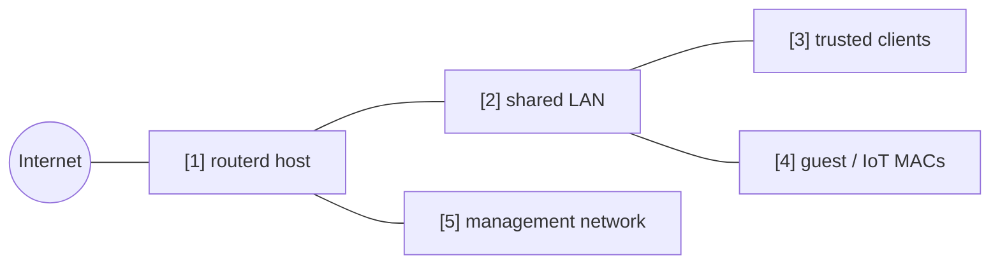

# Guest / IoT client の分離

同じ LAN に接続されている特定の MAC address を guest / IoT client として扱い、
internet は許可しつつ、trusted LAN や管理網への到達を止める例です。

完全な YAML は `examples/guest-mode.yaml` にあります。

## 構成図



## 図の対応表

| 番号 | 意味 | 主な resource |
| --- | --- | --- |
| [1] | client policy を適用する router。 | `FirewallPolicy/default` |
| [2] | trusted client と guest client が同居する shared LAN。 | `FirewallZone/lan` |
| [3] | guest policy に一致しない通常 client。 | default zone behavior |
| [4] | guest / IoT として扱う MAC address。 | `ClientPolicy/guest-devices` |
| [5] | guest client から到達させない管理宛先。 | `ClientPolicy.spec.isolation.lanMgmt` |

## 要点

```yaml
# [4] listed MAC address を isolated guest / IoT client として扱う。
- apiVersion: firewall.routerd.net/v1alpha1
  kind: ClientPolicy
  metadata:
    name: guest-devices
  spec:
    mode: include
    macs:
      - 18:ec:e7:33:12:6c
    # [4] -> [1] internet は許可し、LAN と管理網は拒否する。
    isolation:
      lanInternet: allow
      lanLAN: deny
      lanMgmt: deny
      mDNSBroadcast: deny
```

## 確認

```bash
routerd validate --config examples/guest-mode.yaml
routerd apply --config examples/guest-mode.yaml --once --dry-run
routerctl describe ClientPolicy/guest-devices
nft list table inet routerd_filter
```

guest client から internet へ出られること、trusted LAN と管理網へ届かないことを確認します。

## よく変えるところ

- listed MAC address だけを分離するなら `mode: include`。
- 原則 guest にして、listed device だけ trusted にするなら `mode: exclude`。
- Web Console で分かりやすくするため、DHCP reservation と組み合わせる。
