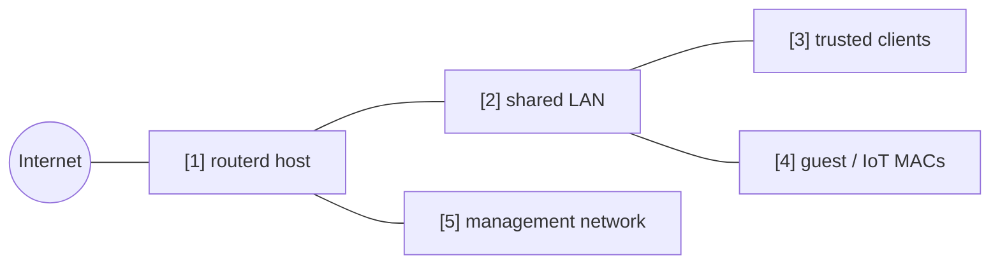

# ゲスト / IoT 端末の分離


同じ LAN につながった特定の MAC アドレスをゲスト / IoT 端末として扱い、
インターネットは許可しつつ、信頼済み LAN や管理網への到達を止める例です。

完全な YAML は `examples/guest-mode.yaml` にあります。

## 構成図



## 図の対応表

| 番号 | 意味 | 主なリソース |
| --- | --- | --- |
| [1] | 端末ポリシーを適用するルーター。 | `FirewallPolicy/default` |
| [2] | 信頼済み端末とゲスト端末が同居する共有 LAN。 | `FirewallZone/lan` |
| [3] | ゲストポリシーに一致しない通常の端末。 | default zone behavior |
| [4] | ゲスト / IoT として扱う MAC アドレス。 | `ClientPolicy/guest-devices` |
| [5] | ゲスト端末から到達させない管理宛先。 | `ClientPolicy.spec.isolation.lanMgmt` |

## 要点

```yaml
# [4] listed MAC address を isolated guest / IoT client として扱う。
- apiVersion: firewall.routerd.net/v1alpha1
  kind: ClientPolicy
  metadata:
    name: guest-devices
  spec:
    mode: include
    macs:
      - 18:ec:e7:33:12:6c
    # [4] -> [1] internet は許可し、LAN と管理網は拒否する。
    isolation:
      lanInternet: allow
      lanLAN: deny
      lanMgmt: deny
      mDNSBroadcast: deny
```

## 確認

```bash
routerctl validate --config examples/guest-mode.yaml
routerctl apply --config examples/guest-mode.yaml --dry-run
routerctl describe ClientPolicy/guest-devices
nft list table inet routerd_filter
```

ゲスト端末からインターネットへ出られること、信頼済み LAN と管理網へ届かないことを確認します。

## よく変えるところ

- 列挙した MAC アドレスだけを分離するなら `mode: include`。
- 原則ゲスト扱いにして、列挙した端末だけ信頼済みにするなら `mode: exclude`。
- Web 管理画面で分かりやすくするため、DHCP の予約と組み合わせる。
