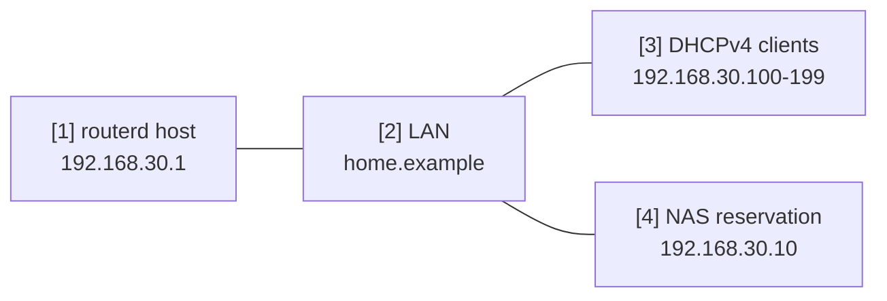

# LAN DHCP とローカル DNS


1 つの LAN インターフェースを、小さな家庭内 LAN や検証用 LAN のサービスセグメントとして使う例です。
routerd が LAN アドレス、DHCPv4、ローカル DNS ゾーン、DHCP リース由来の名前を管理します。

完全な YAML は `examples/example-lan-dns-dhcp.yaml` にあります。

## 構成図



## 図の対応表

| 番号 | 意味 | 主なリソース |
| --- | --- | --- |
| [1] | LAN の DNS 待ち受けも兼ねるルーターのアドレス。 | `IPv4StaticAddress/lan-base`, `DNSResolver/lan-resolver` |
| [2] | DHCP の search domain として配るローカル DNS ゾーン。 | `DNSZone/home` |
| [3] | アドレスと DNS 設定を受け取る動的なクライアント。 | `DHCPv4Server/lan-dhcpv4` |
| [4] | 固定リースと名前を持つ基盤ホスト。 | `DHCPv4Reservation/nas`, `DNSZone/home` |

## この例で管理するもの

| 領域 | routerd リソース |
| --- | --- |
| LAN アドレス | `Interface/lan`, `IPv4StaticAddress/lan-base` |
| ローカルの名前 | `DNSZone/home` |
| リゾルバ | `DNSResolver/lan-resolver` |
| DHCPv4 | `DHCPv4Server/lan-dhcpv4`, `DHCPv4Reservation/nas` |

## 要点

```yaml
# [2] router.home.example や nas.home.example の local zone。
- kind: DNSZone
  metadata:
    name: home
  spec:
    zone: home.example
    dhcpDerived:
      sources:
        - DHCPv4Server/lan-dhcpv4
      ddns: true

# [3] DHCP で router address を gateway / DNS として配る。
- kind: DHCPv4Server
  metadata:
    name: lan-dhcpv4
  spec:
    gatewayFrom:
      resource: IPv4StaticAddress/lan-base
      field: address
    dnsServerFrom:
      - resource: IPv4StaticAddress/lan-base
        field: address
    domainFrom:
      resource: DNSZone/home
      field: zone
```

## 確認

```bash
routerctl validate --config examples/example-lan-dns-dhcp.yaml
routerctl apply --config examples/example-lan-dns-dhcp.yaml --dry-run
routerctl describe DNSZone/home
routerctl describe DHCPv4Server/lan-dhcpv4
dig @192.168.30.1 router.home.example
```

## よく変えるところ

- `home.example` を自分の search domain に変える。
- NAS、プリンター、基盤機器は `DHCPv4Reservation` に足す。
- 一部のドメインだけプライベートな上流へ送りたい場合は `DNSForwarder` と `DNSUpstream` を追加する。
