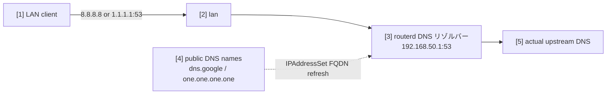

# パブリック DNS をローカルリゾルバへリダイレクト


LAN クライアントが有名なパブリックリゾルバーへ平文 DNS を直接送ろうとしたときに、TCP/UDP の port 53 だけをルーターのローカルリゾルバーへリダイレクトする例です。
DoH や DoT の port には手を加えません。

完全な YAML は `examples/example-local-dns-redirect.yaml` にあります。

## 構成図



## 図の対応表

| 番号 | 意味 | 主なリソース |
| --- | --- | --- |
| [1] | パブリック DNS へ直接問い合わせようとするクライアント。 | external client |
| [2] | prerouting のリダイレクトルールが一致する LAN インターフェース。 | `LocalServiceRedirect/lan-local-services.spec.interface` |
| [3] | リダイレクトされた port 53 のトラフィックを受けるローカルリゾルバー。 | `DNSResolver/lan-resolver` |
| [4] | nftables の set に展開される完全一致の FQDN。 | `IPAddressSet/public-dns` |
| [5] | ローカルリゾルバーが実際に使う上流リゾルバー。 | `DNSForwarder`, `DNSUpstream` |

## この例で管理するもの

| 領域 | routerd リソース |
| --- | --- |
| ローカル DNS | `DNSResolver/lan-resolver`, `DNSZone/home` |
| DHCP の広告 | `DHCPv4Server/lan-dhcpv4` |
| FQDN ベースの宛先セット | `IPAddressSet/public-dns` |
| ローカルリダイレクト | `LocalServiceRedirect/lan-local-services` |

## 設定の要点

```yaml
# [4] パブリック DNS の完全一致名を IPAddressSet に解決する。
- apiVersion: net.routerd.net/v1alpha1
  kind: IPAddressSet
  metadata:
    name: public-dns
  spec:
    names:
      - dns.google
      - one.one.one.one
    refreshInterval: 10m

# [2] -> [3] 平文 DNS の port 53 だけローカルリゾルバにリダイレクトする。
- apiVersion: firewall.routerd.net/v1alpha1
  kind: LocalServiceRedirect
  metadata:
    name: lan-local-services
  spec:
    interface: lan
    rules:
      - name: public-dns
        protocols: [tcp, udp]
        destinationSetRef: IPAddressSet/public-dns
        destinationPort: 53
        redirectPort: 53
```

`IPAddressSet.spec.names` は完全一致の DNS 名です。
`dns.google` はサブドメインを含みません。必要な宛先名はすべて明示的に列挙します。

## 確認

```bash
routerctl validate -f examples/example-local-dns-redirect.yaml --replace
routerctl plan -f examples/example-local-dns-redirect.yaml --replace
routerctl describe IPAddressSet/public-dns
nft list table ip routerd_nat
```

LAN クライアントからは次のように確認できます。

```bash
dig @8.8.8.8 router.home.example
dig @1.1.1.1 router.home.example
```
