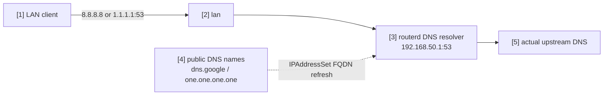

# Public DNS を local resolver に redirect

LAN client が有名な public resolver へ平文 DNS を直接送ろうとしたとき、
TCP/UDP port 53 だけを router の local resolver に redirect する例です。
DoH や DoT の port には触れません。

完全な YAML は `examples/example-local-dns-redirect.yaml` にあります。

## 構成図



## 図の対応表

| 番号 | 意味 | 主な resource |
| --- | --- | --- |
| [1] | public DNS へ直接問い合わせようとする client。 | external client |
| [2] | prerouting redirect rule が match する LAN interface。 | `LocalServiceRedirect/lan-local-services.spec.interface` |
| [3] | redirect された port 53 traffic を受ける local resolver。 | `DNSResolver/lan-resolver` |
| [4] | nftables set に展開される完全一致 FQDN。 | `IPAddressSet/public-dns` |
| [5] | local resolver が実際に使う upstream resolver。 | `DNSForwarder`, `DNSUpstream` |

## 要点

```yaml
# [4] public DNS の exact name を IPAddressSet に解決する。
- apiVersion: net.routerd.net/v1alpha1
  kind: IPAddressSet
  metadata:
    name: public-dns
  spec:
    names:
      - dns.google
      - one.one.one.one
    refreshInterval: 10m

# [2] -> [3] 平文 DNS port 53 だけ local resolver に redirect する。
- apiVersion: firewall.routerd.net/v1alpha1
  kind: LocalServiceRedirect
  metadata:
    name: lan-local-services
  spec:
    interface: lan
    rules:
      - name: public-dns
        protocols: [tcp, udp]
        destinationSetRef: IPAddressSet/public-dns
        destinationPort: 53
        redirectPort: 53
```

`IPAddressSet.spec.names` は完全一致の DNS name です。
`dns.google` は subdomain を含みません。必要な宛先名は明示的に列挙します。

## 確認

```bash
routerd validate --config examples/example-local-dns-redirect.yaml
routerd apply --config examples/example-local-dns-redirect.yaml --once --dry-run
routerctl describe IPAddressSet/public-dns
nft list table ip routerd_nat
```

LAN client からは次のように確認できます。

```bash
dig @8.8.8.8 router.home.example
dig @1.1.1.1 router.home.example
```
