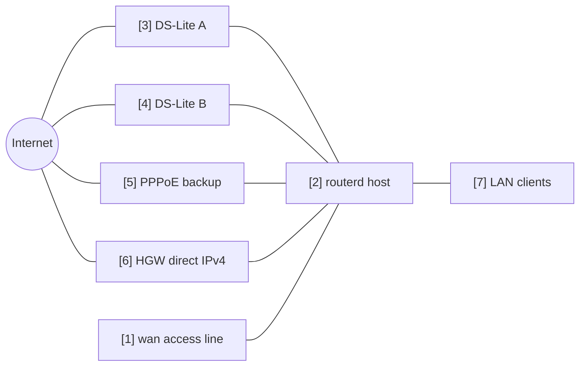

# マルチ WAN IPv4 フェイルオーバー


複数の IPv4 出口から、正常な default route を選ぶ例です。
DS-Lite トンネル、PPPoE、上流ルーター直結の IPv4 を候補にしています。

完全な YAML は `examples/multi-wan-home.yaml` にあります。

## 構成図



## 図の対応表

| 番号 | 意味 | 主なリソース |
| --- | --- | --- |
| [1] | 複数の WAN 候補が共有する物理回線。 | `Interface/wan`, `DHCPv4Client/wan-dhcpv4` |
| [2] | default route を 1 つ選ぶルーター。 | `EgressRoutePolicy/ipv4-default`, `IPv4Route/default` |
| [3] | 第一候補の DS-Lite。 | `DSLiteTunnel/ds-lite-a`, `HealthCheck/internet-via-dslite-a` |
| [4] | 追加の DS-Lite 候補。 | `DSLiteTunnel/ds-lite-b`, `HealthCheck/internet-via-dslite-b` |
| [5] | 優先度を下げた PPPoE のバックアップ。 | `PPPoESession/pppoe-flets`, `HealthCheck/internet-via-pppoe` |
| [6] | 上流ルーター直結の IPv4 フォールバック。 | `DHCPv4Client/wan-dhcpv4`, `HealthCheck/internet-via-hgw-direct` |
| [7] | 選択された出口経路を NAT 経由で使う LAN クライアント。 | `NAT44Rule/lan-to-selected-wan` |

## この例で管理するもの

| 領域 | routerd リソース |
| --- | --- |
| 出口経路 | `DSLiteTunnel/*`, `PPPoESession/pppoe-flets`, `DHCPv4Client/wan-dhcpv4` |
| 回線の正常性 | `HealthCheck/internet-via-*` |
| 選択 | `EgressRoutePolicy/ipv4-default` |
| デフォルトルート | `IPv4Route/default` |
| NAT | `NAT44Rule/lan-to-selected-wan` |

## 設定の要点

```yaml
# [2] 現在正常な候補のうち、weight が最も高いものを選ぶ。
- kind: EgressRoutePolicy
  metadata:
    name: ipv4-default
  spec:
    family: ipv4
    destinationCIDRs:
      - 0.0.0.0/0
    selection: highest-weight-ready
    hysteresis: 30s
    candidates:
      # [3] 第一候補の DS-Lite。
      - name: ds-lite-a
        weight: 120
        healthCheck: internet-via-dslite-a
      # [5] PPPoE バックアップは低めの weight にする。
      - name: pppoe-flets
        weight: 60
        healthCheck: internet-via-pppoe
      # [6] この例では HGW 直結を最後のフォールバックにする。
      - name: hgw-direct
        weight: 40
        healthCheck: internet-via-hgw-direct
```

## 確認

```bash
routerctl validate -f examples/multi-wan-home.yaml --replace
routerctl plan -f examples/multi-wan-home.yaml --replace
routerctl describe EgressRoutePolicy/ipv4-default
routerctl describe IPv4Route/default
ip route show default
```

## 運用上の注意

- ヘルスチェックは保守的に設定します。間隔が短すぎると、弱い回線がフラップします。
- `hysteresis` を入れて、一時的な失敗だけで出口が切り替わらないようにします。
- RFC1918 宛ては、意図がない限り NAT と経路ポリシーから除外します。
