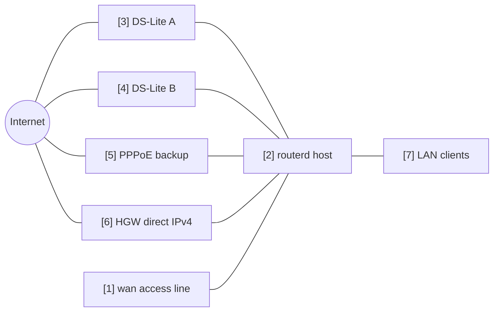

# Multi-WAN IPv4 failover

複数の IPv4 出口から、正常な default route を選ぶ例です。
DS-Lite tunnel、PPPoE、上流 router 直結 IPv4 を候補にしています。

完全な YAML は `examples/multi-wan-home.yaml` にあります。

## 構成図



## 図の対応表

| 番号 | 意味 | 主な resource |
| --- | --- | --- |
| [1] | 複数 WAN candidate が共有する物理 access line。 | `Interface/wan`, `DHCPv4Client/wan-dhcpv4` |
| [2] | default route を 1 つ選ぶ router。 | `EgressRoutePolicy/ipv4-default`, `IPv4Route/default` |
| [3] | primary DS-Lite candidate。 | `DSLiteTunnel/ds-lite-a`, `HealthCheck/internet-via-dslite-a` |
| [4] | 追加 DS-Lite candidate。 | `DSLiteTunnel/ds-lite-b`, `HealthCheck/internet-via-dslite-b` |
| [5] | 優先度を下げた PPPoE backup。 | `PPPoESession/pppoe-flets`, `HealthCheck/internet-via-pppoe` |
| [6] | 上流 router 直結 IPv4 fallback。 | `DHCPv4Client/wan-dhcpv4`, `HealthCheck/internet-via-hgw-direct` |
| [7] | 選択された egress path を NAT 経由で使う LAN client。 | `NAT44Rule/lan-to-selected-wan` |

## 要点

```yaml
# [2] 現在 healthy な candidate のうち、weight が最も高いものを選ぶ。
- kind: EgressRoutePolicy
  metadata:
    name: ipv4-default
  spec:
    family: ipv4
    destinationCIDRs:
      - 0.0.0.0/0
    selection: highest-weight-ready
    hysteresis: 30s
    candidates:
      # [3] primary DS-Lite candidate。
      - name: ds-lite-a
        weight: 120
        healthCheck: internet-via-dslite-a
      # [5] PPPoE backup は低めの weight にする。
      - name: pppoe-flets
        weight: 60
        healthCheck: internet-via-pppoe
      # [6] この例では HGW direct を最後の fallback にする。
      - name: hgw-direct
        weight: 40
        healthCheck: internet-via-hgw-direct
```

## 確認

```bash
routerd validate --config examples/multi-wan-home.yaml
routerd apply --config examples/multi-wan-home.yaml --once --dry-run
routerctl describe EgressRoutePolicy/ipv4-default
routerctl describe IPv4Route/default
ip route show default
```

## 運用上の注意

- health check は保守的にする。短すぎる interval は弱い回線を揺らします。
- `hysteresis` を入れて、一時的な失敗だけで出口が切り替わらないようにする。
- RFC1918 宛ては、意図がない限り NAT と policy routing から除外する。
