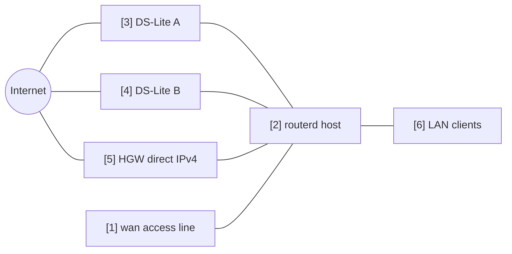

# マルチ WAN IPv4 フェイルオーバー


この例は、2 本の DS-Lite トンネルと上流ルーター直結 IPv4 から、現在使う
IPv4 default route を 1 つ選びます。完全な YAML は
`examples/multi-wan-home.yaml` にあります。**PPPoE はこの YAML には含みません。**

## 構成


```mermaid
flowchart LR
  internet((Internet))
  wan["[1] wan access line"]
  router["[2] routerd host"]
  dsa["[3] DS-Lite A"]
  dsb["[4] DS-Lite B"]
  hgw["[5] HGW direct IPv4"]
  lan["[6] LAN clients"]

  internet --- dsa --- router
  internet --- dsb --- router
  internet --- hgw --- router
  wan --- router --- lan
```

| 番号 | 役割 | 実際のリソース |
| --- | --- | --- |
| [1] | すべての WAN 候補が使う物理回線 | `Interface/wan`、`DHCPv4Client/wan-dhcpv4` |
| [2] | 使う default route を選ぶ | `EgressRoutePolicy/ipv4-default` |
| [3] | 第一候補の DS-Lite | `DSLiteTunnel/ds-lite-a`、`HealthCheck/internet-a` |
| [4] | 第二候補の DS-Lite | `DSLiteTunnel/ds-lite-b`、`HealthCheck/internet-b` |
| [5] | 上流ルーター直結の最後の IPv4 フォールバック | `DHCPv4Client/wan-dhcpv4` |
| [6] | 選ばれた出口を NAT で使う LAN | `NAT44Rule/lan-to-selected-wan` |

## 選び方

`weight`（優先度の数字）が大きく、health check が成功している候補を選びます。
この YAML と同じ形は次です。

```yaml
- kind: EgressRoutePolicy
  metadata:
    name: ipv4-default
  spec:
    family: ipv4
    destinationCIDRs: [0.0.0.0/0]
    selection: highest-weight-ready
    candidates:
      - name: ds-lite-a
        deviceFrom:
          resource: DSLiteTunnel/ds-lite-a
          field: device
        gatewaySource: none
        weight: 100
        healthCheck: internet-a
      - name: ds-lite-b
        deviceFrom:
          resource: DSLiteTunnel/ds-lite-b
          field: device
        gatewaySource: none
        weight: 80
        healthCheck: internet-b
      - name: hgw-direct
        deviceFrom:
          resource: Interface/wan
          field: ifname
        gatewaySource: dhcpv4
        gatewayFrom:
          resource: DHCPv4Client/wan-dhcpv4
          field: gateway
        weight: 40
```

この例は `hysteresis` を設定しません。実際の回線切替が頻繁に揺れることを確認してから、
現在の API 説明に従って追加を検討してください。

## daemon の前に確認する

```sh
LAB_DIR="$(mktemp -d)"
sudo routerd validate --config examples/multi-wan-home.yaml
sudo routerd apply --config examples/multi-wan-home.yaml --once --dry-run --skip-service-manager \
  --state-file "$LAB_DIR/state.db" \
  --ledger-file "$LAB_DIR/ledger.db" \
  --status-file "$LAB_DIR/status.json"
```

dry-run では、`ens18`、LAN の `172.18.0.0/16`、DS-Lite の候補名が自分のラボに
合っているかを確認します。普段の管理ネットワークと重なるなら、live 操作をしません。

## サービス起動後に確認する

```sh
sudo routerctl describe EgressRoutePolicy/ipv4-default
sudo ip route show default
```

この例は `IPv4Route/default` を書きません。`EgressRoutePolicy` のコントローラーが
選んだ default route を導出するため、policy の status と OS の経路表を見ます。

## 運用上の注意

- health check の間隔を極端に短くすると、弱い回線で切替が繰り返されます。
- RFC1918 宛ては、意図がない限り NAT と経路ポリシーから除外します。
- 本番で初めて試さず、コンソールまたは独立した管理 NIC を残します。
