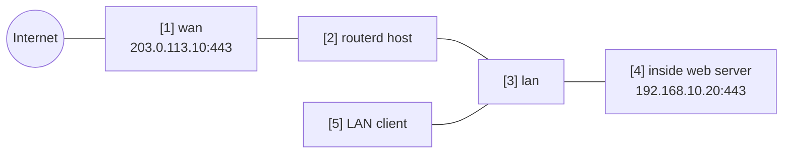

# 内部 Web server への port forward

内部の HTTPS server を WAN 側 IPv4 address で公開し、LAN client からも同じ公開名で
到達できるよう hairpin を有効にする例です。

完全な YAML は `examples/example-port-forward-web.yaml` にあります。

## 構成図



## 図の対応表

| 番号 | 意味 | 主な resource |
| --- | --- | --- |
| [1] | 外部 client が接続する公開側 address と port。 | `PortForward/web-https.spec.listen` |
| [2] | ingress DNAT と hairpin rule を出力する router。 | `PortForward/web-https` |
| [3] | hairpin traffic が入ってくる LAN interface。 | `PortForward/web-https.spec.hairpin.interfaces` |
| [4] | DNAT 先の内部 HTTPS backend。 | `PortForward/web-https.spec.target` |
| [5] | 公開 address や公開 DNS 名を使う LAN client。 | hairpin path |

## 要点

```yaml
# [1] 公開側 listener。hairpin ではここに具体的な address が必要。
- apiVersion: firewall.routerd.net/v1alpha1
  kind: PortForward
  metadata:
    name: web-https
  spec:
    listen:
      interface: wan
      address: 203.0.113.10
      protocol: tcp
      port: 443
    # [4] DNAT された connection を受ける内部 backend。
    target:
      address: 192.168.10.20
      port: 443
    # [3] LAN client から同じ公開 address を使えるようにする。
    hairpin:
      enabled: true
      interfaces:
        - lan
```

hairpin を使うには、LAN 側から見える公開宛先 address が必要です。
そのため `listen.address` または `listen.addressFrom` を指定します。

## 確認

```bash
routerd validate --config examples/example-port-forward-web.yaml
routerd apply --config examples/example-port-forward-web.yaml --once --dry-run
routerctl describe PortForward/web-https
nft list table ip routerd_nat
```

## よく変えるところ

- `203.0.113.10` を実際の WAN 側 IPv4 address に変える。
- 公開名がこの address を返すよう、DNS は別途設定する。
- 公開する port は必要最小限にする。
