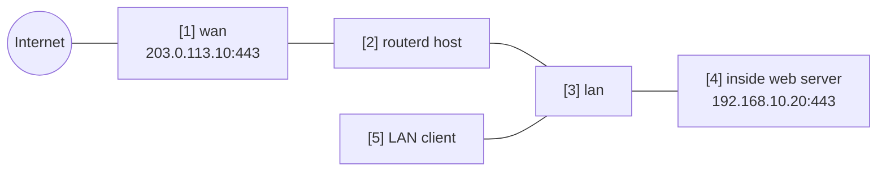

# 内部 Web サーバーへのポートフォワード


内部の HTTPS サーバーを WAN 側の IPv4 アドレスで公開し、LAN クライアントからも同じ公開名で
到達できるよう hairpin を有効にする例です。

完全な YAML は `examples/example-port-forward-web.yaml` にあります。

:::danger サービスを公開すると到達できる人が変わる

この例は内部サービスを WAN から到達可能にします。最初はテスト用アドレスを使い、
backend の更新と認証を確認してから、実サービスを公開する前に独立した
ファイアウォール／セキュリティレビューを行ってください。

:::

## 構成図


```mermaid
flowchart LR
  internet((Internet))
  wan["[1] wan<br/>203.0.113.10:443"]
  router["[2] routerd host"]
  lan["[3] lan"]
  web["[4] inside web server<br/>192.168.10.20:443"]
  client["[5] LAN client"]

  internet --- wan --- router --- lan --- web
  client --- lan
```

## 図の対応表

| 番号 | 意味 | 主なリソース |
| --- | --- | --- |
| [1] | 外部クライアントが接続する公開側のアドレスと port。 | `PortForward/web-https.spec.listen` |
| [2] | ingress DNAT と hairpin ルールを生成するルーター。 | `PortForward/web-https` |
| [3] | hairpin のトラフィックが入ってくる LAN インターフェース。 | `PortForward/web-https.spec.hairpin.interfaces` |
| [4] | DNAT 先の内部 HTTPS バックエンド。 | `PortForward/web-https.spec.target` |
| [5] | 公開アドレスや公開 DNS 名を使う LAN クライアント。 | ヘアピン経路 |

## この例で管理するもの

| 領域 | routerd リソース |
| --- | --- |
| 受信 DNAT | `PortForward/web-https` |
| ヘアピンアクセス | `PortForward.spec.hairpin` |
| ゾーンとポリシー | `FirewallZone/wan`, `FirewallZone/lan`, `FirewallPolicy/home` |

## 設定の要点

```yaml
# [1] 公開側のリスナー。ヘアピンではここに具体的なアドレスが必要。
- apiVersion: firewall.routerd.net/v1alpha1
  kind: PortForward
  metadata:
    name: web-https
  spec:
    listen:
      interface: wan
      address: 203.0.113.10
      protocol: tcp
      port: 443
    # [4] DNAT された接続を受ける内部バックエンド。
    target:
      address: 192.168.10.20
      port: 443
    # [3] LAN クライアントから同じ公開アドレスを使えるようにする。
    hairpin:
      enabled: true
      interfaces:
        - lan
```

hairpin を使うには、LAN 側から見える公開宛先のアドレスが必要です。
そのため `listen.address` または `listen.addressFrom` を指定します。

## daemon の前に確認する

以下は `sudo` を実行できる通常ユーザーを想定します。まだサービスを起動していないため、
`routerctl` ではなく `routerd` を使い、dry-run の状態ファイルは一時ディレクトリへ隔離します。

```sh
LAB_DIR="$(mktemp -d)"
sudo routerd validate --config examples/example-port-forward-web.yaml
sudo routerd apply --config examples/example-port-forward-web.yaml --once --dry-run --skip-service-manager \
  --state-file "$LAB_DIR/state.db" \
  --ledger-file "$LAB_DIR/ledger.db" \
  --status-file "$LAB_DIR/status.json"
sudo sed -n "1,160p" "$LAB_DIR/status.json"
```

## サービス起動後に確認する

レビュー済みの設定を適用して `routerd.service` を起動した**後で**、ルーター上で次を実行します。

```sh
sudo routerctl describe PortForward/web-https
sudo nft list table ip routerd_nat
```

## よく変えるところ

- `203.0.113.10` を実際の WAN 側 IPv4 アドレスに変えます。
- 公開名がこのアドレスを返すよう、DNS は別途設定します。
- 公開する port は必要最小限にします。
