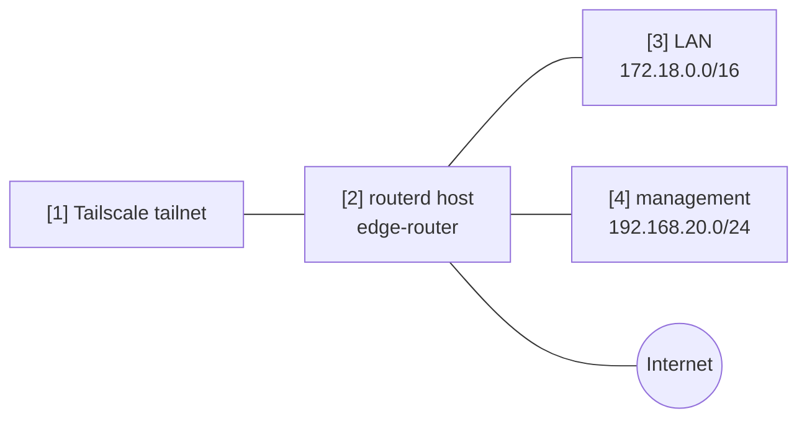

# Tailscale の subnet router / exit node


ルーターを Tailscale の subnet router 兼 exit node として広告する例です。

完全な YAML は `examples/tailscale-exit-subnet.yaml` にあります。

## 構成図



## 図の対応表

| 番号 | 意味 | 主なリソース |
| --- | --- | --- |
| [1] | 経路と exit node の広告を受ける tailnet。 | Tailscale control plane |
| [2] | Tailscale node として登録されるルーター。 | `TailscaleNode/home` |
| [3] | tailnet に広告する LAN プレフィックス。 | `advertiseRoutes` |
| [4] | リモート管理用に広告する管理プレフィックス。 | `advertiseRoutes` |

## この例で管理するもの

| 領域 | routerd リソース |
| --- | --- |
| ランタイムパッケージ | `Package/tailscale-runtime` |
| tailnet ノード | `TailscaleNode/home` |
| 経路の広告 | `advertiseRoutes` |
| exit node | `advertiseExitNode` |

## 設定の要点

```yaml
# [2] ルーターを名前付き Tailscale ノードとして登録する。
- apiVersion: net.routerd.net/v1alpha1
  kind: TailscaleNode
  metadata:
    name: home
  spec:
    hostname: edge-router
    advertiseExitNode: true
    # [3] + [4] tailnet に広告する prefix。
    advertiseRoutes:
      - 172.18.0.0/16
      - 192.168.20.0/24
    acceptDNS: false
    authKeyEnv: TS_AUTHKEY
    authKeyFile: /usr/local/etc/routerd/secrets/tailscale.env
```

## 確認

```bash
routerctl validate -f examples/tailscale-exit-subnet.yaml --replace
routerctl plan -f examples/tailscale-exit-subnet.yaml --replace
routerctl describe TailscaleNode/home
tailscale status
```

tailnet のポリシーに応じて、Tailscale admin console 側で経路と exit node を承認します。
