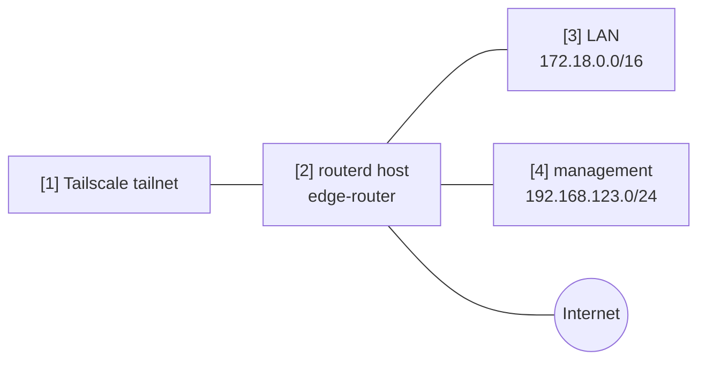

# Tailscale subnet / exit node

router を Tailscale の subnet router 兼 exit node として広告する例です。

完全な YAML は `examples/tailscale-exit-subnet.yaml` にあります。

## 構成図



## 図の対応表

| 番号 | 意味 | 主な resource |
| --- | --- | --- |
| [1] | route と exit node の広告を受ける tailnet。 | Tailscale control plane |
| [2] | Tailscale node として登録される router。 | `TailscaleNode/home` |
| [3] | tailnet に広告する LAN prefix。 | `advertiseRoutes` |
| [4] | remote management 用に広告する管理 prefix。 | `advertiseRoutes` |

## 要点

```yaml
# [2] router を名前付き Tailscale node として登録する。
- apiVersion: net.routerd.net/v1alpha1
  kind: TailscaleNode
  metadata:
    name: home
  spec:
    hostname: edge-router
    advertiseExitNode: true
    # [3] + [4] tailnet に広告する prefix。
    advertiseRoutes:
      - 172.18.0.0/16
      - 192.168.123.0/24
    acceptDNS: false
    authKeyEnv: TS_AUTHKEY
    authKeyFile: /usr/local/etc/routerd/secrets/tailscale.env
```

## 確認

```bash
routerd validate --config examples/tailscale-exit-subnet.yaml
routerd apply --config examples/tailscale-exit-subnet.yaml --once --dry-run
routerctl describe TailscaleNode/home
tailscale status
```

tailnet policy に応じて、Tailscale admin console 側で route と exit node を承認します。
