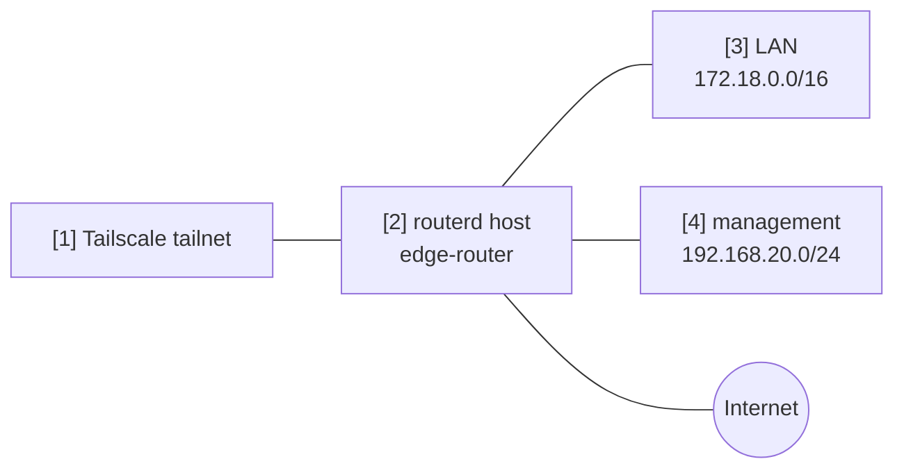

# Tailscale の subnet router / exit node


すでにインストールして enrollment を済ませた Tailscale client を使い、ルーターを
subnet router 兼 exit node として広告する例です。この YAML には `TailscaleNode` はありますが、
Tailscale をインストールする `Package` リソースはありません。先に自分の OS 向けの方法で
Tailscale を導入し、tailnet の enrollment 手順を完了してください。

完全な YAML は `examples/tailscale-exit-subnet.yaml` にあります。

:::danger リモートユーザーが到達できる範囲を確認する

subnet route や exit node を広告すると、tailnet の利用者が LAN へ到達したり、
このルーター経由でインターネットへ出たりできるようになります。最初はテスト用 tailnet を使い、
auth key を保護し、Tailscale admin console では意図した経路だけを承認してください。

:::

## 構成図


```mermaid
flowchart LR
  tailnet["[1] Tailscale tailnet"]
  router["[2] routerd host<br/>edge-router"]
  lan["[3] LAN<br/>172.18.0.0/16"]
  mgmt["[4] management<br/>192.168.20.0/24"]
  internet((Internet))

  tailnet --- router
  router --- lan
  router --- mgmt
  router --- internet
```

## 図の対応表

| 番号 | 意味 | 主なリソース |
| --- | --- | --- |
| [1] | 経路と exit node の広告を受ける tailnet。 | Tailscale control plane |
| [2] | Tailscale node として登録されるルーター。 | `TailscaleNode/home` |
| [3] | tailnet に広告する LAN プレフィックス。 | `advertiseRoutes` |
| [4] | リモート管理用に広告する管理プレフィックス。 | `advertiseRoutes` |

## この例で管理するもの

| 領域 | routerd リソース |
| --- | --- |
| tailnet ノード | `TailscaleNode/home` |
| 経路の広告 | `advertiseRoutes` |
| exit node | `advertiseExitNode` |

## 設定の要点

```yaml
# [2] ルーターを名前付き Tailscale ノードとして登録する。
- apiVersion: net.routerd.net/v1alpha1
  kind: TailscaleNode
  metadata:
    name: home
  spec:
    hostname: edge-router
    advertiseExitNode: true
    # [3] + [4] tailnet に広告する prefix。
    advertiseRoutes:
      - 172.18.0.0/16
      - 192.168.20.0/24
    acceptDNS: false
    authKeyEnv: TS_AUTHKEY
    authKeyFile: /usr/local/etc/routerd/secrets/tailscale.env
```

## daemon の前に確認する

以下は `sudo` を実行できる通常ユーザーを想定します。まだサービスを起動していないため、
`routerctl` ではなく `routerd` を使い、dry-run の状態ファイルは一時ディレクトリへ隔離します。

```sh
LAB_DIR="$(mktemp -d)"
sudo routerd validate --config examples/tailscale-exit-subnet.yaml
sudo routerd apply --config examples/tailscale-exit-subnet.yaml --once --dry-run --skip-service-manager \
  --state-file "$LAB_DIR/state.db" \
  --ledger-file "$LAB_DIR/ledger.db" \
  --status-file "$LAB_DIR/status.json"
sudo sed -n "1,160p" "$LAB_DIR/status.json"
```

## サービス起動後に確認する

レビュー済みの設定を適用して `routerd.service` を起動した**後で**、ルーター上で次を実行します。

```sh
sudo routerctl describe TailscaleNode/home
sudo tailscale status
```

tailnet のポリシーに応じて、Tailscale admin console 側で経路と exit node を承認します。
