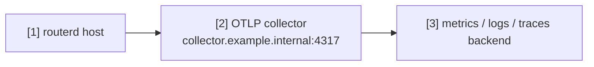

# OTLP collector への telemetry export

routerd の telemetry を OpenTelemetry collector に送る例です。
長時間運転、health check、DPI、apply latency の観測に使えます。

完全な YAML は `examples/telemetry-export.yaml` にあります。

## 構成図



## 図の対応表

| 番号 | 意味 | 主な resource |
| --- | --- | --- |
| [1] | logs、metrics、traces を出す routerd process。 | `Telemetry/otlp` |
| [2] | OTLP collector endpoint。 | `Telemetry.spec.otlp.endpoint` |
| [3] | collector が転送する backend。 | routerd 管理外 |

## 要点

```yaml
# [1] routerd telemetry export を有効にする。
- apiVersion: observability.routerd.net/v1alpha1
  kind: Telemetry
  metadata:
    name: otlp
  spec:
    # [2] OTLP collector endpoint。
    otlp:
      endpoint: http://collector.example.internal:4317
      insecure: true
    serviceNamespace: routerd
    attributes:
      deployment.environment: lab
      site: example
    signals:
      - logs
      - metrics
      - traces
```

## 確認

```bash
routerd validate --config examples/telemetry-export.yaml
routerctl describe Telemetry/otlp
```

collector や backend 側で data が届いていることを確認します。
endpoint は信頼できる管理網または observability network に置いてください。
