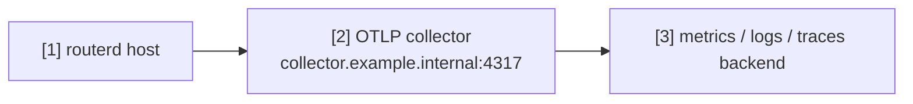

# OTLP コレクターへのテレメトリ送出


routerd のテレメトリを OpenTelemetry コレクターへ送る例です。
長時間運転、health check、DPI、apply のレイテンシーの観測に使えます。

完全な YAML は `examples/telemetry-export.yaml` にあります。

## 構成図



## 図の対応表

| 番号 | 意味 | 主なリソース |
| --- | --- | --- |
| [1] | logs、metrics、traces を出す routerd プロセス。 | `Telemetry/otlp` |
| [2] | OTLP コレクターのエンドポイント。 | `Telemetry.spec.otlp.endpoint` |
| [3] | コレクターが転送する先のバックエンド。 | routerd 管理外 |

## この例で管理するもの

| 領域 | routerd リソース |
| --- | --- |
| テレメトリの送出先 | `Telemetry/otlp` |
| サービスの識別情報 | `serviceNamespace`, `attributes` |
| シグナル | `logs`, `metrics`, `traces` |

## 設定の要点

```yaml
# [1] routerd のテレメトリ送出を有効にする。
- apiVersion: observability.routerd.net/v1alpha1
  kind: Telemetry
  metadata:
    name: otlp
  spec:
    # [2] OTLP コレクターのエンドポイント。
    otlp:
      endpoint: http://collector.example.internal:4317
      insecure: true
    serviceNamespace: routerd
    attributes:
      deployment.environment: lab
      site: example
    signals:
      - logs
      - metrics
      - traces
```

## 確認

```bash
routerctl validate --config examples/telemetry-export.yaml
routerctl describe Telemetry/otlp
```

コレクターやバックエンド側でデータが届いていることを確認します。
エンドポイントは信頼できる管理網または観測用ネットワークに置いてください。
