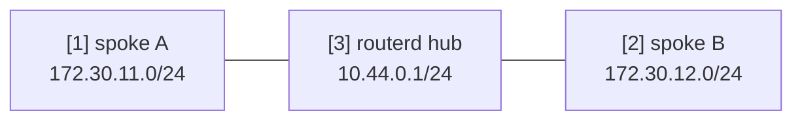

# WireGuard hub-and-spoke template

2 つの spoke を持つ routed WireGuard hub の template です。
実際に使う前に、鍵、endpoint、広告する prefix を置き換えてください。

完全な YAML は `examples/wireguard-hub-spoke.yaml` にあります。

## 構成図



## 図の対応表

| 番号 | 意味 | 主な resource |
| --- | --- | --- |
| [1] | spoke A の tunnel address と routed LAN prefix。 | `WireGuardPeer/spoke-a` |
| [2] | spoke B の tunnel address と routed LAN prefix。 | `WireGuardPeer/spoke-b` |
| [3] | hub 側 WireGuard interface と address。 | `WireGuardInterface/wg-hub`, `IPv4StaticAddress/wg-hub-ipv4` |

## 要点

```yaml
# [3] hub 側 WireGuard interface と listen port。
- kind: WireGuardInterface
  metadata:
    name: wg-hub
  spec:
    privateKeyFile: /usr/local/etc/routerd/secrets/wg-hub.key
    listenPort: 51820
    mtu: 1420

# [1] spoke A の tunnel address と routed LAN prefix。
- kind: WireGuardPeer
  metadata:
    name: spoke-a
  spec:
    interface: wg-hub
    publicKey: REPLACE_WITH_SPOKE_A_PUBLIC_KEY
    allowedIPs:
      - 10.44.0.11/32
      - 172.30.11.0/24
```

## 確認

```bash
routerd validate --config examples/wireguard-hub-spoke.yaml
routerd apply --config examples/wireguard-hub-spoke.yaml --once --dry-run
routerctl describe WireGuardInterface/wg-hub
wg show
```

## よく変えるところ

- private key は permission を絞った file に置く。
- peer ごとに tunnel address `/32` と routed LAN prefix を明示する。
- WAN firewall を routerd で管理している場合は UDP listen port の許可も足す。
