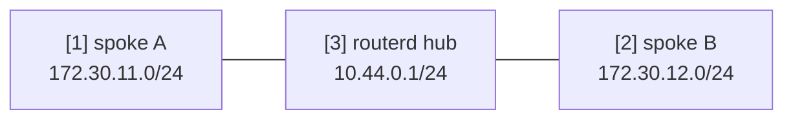

# WireGuard ハブ＆スポークのテンプレート


2 つの spoke を持つ routed WireGuard hub のテンプレートです。
実際に使う前に、鍵、エンドポイント、広告するプレフィックスを置き換えてください。

完全な YAML は `examples/wireguard-hub-spoke.yaml` にあります。

## 構成図



## 図の対応表

| 番号 | 意味 | 主なリソース |
| --- | --- | --- |
| [1] | spoke A のトンネルアドレスとルーティング対象 LAN プレフィックス。 | `WireGuardPeer/spoke-a` |
| [2] | spoke B のトンネルアドレスとルーティング対象 LAN プレフィックス。 | `WireGuardPeer/spoke-b` |
| [3] | ハブ側の WireGuard インターフェースとアドレス。 | `WireGuardInterface/wg-hub`, `IPv4StaticAddress/wg-hub-ipv4` |

## この例で管理するもの

| 領域 | routerd リソース |
| --- | --- |
| WireGuard デバイス | `WireGuardInterface/wg-hub` |
| ハブのアドレス | `IPv4StaticAddress/wg-hub-ipv4` |
| ピアの経路 | `WireGuardPeer/spoke-a`, `WireGuardPeer/spoke-b` |

## 設定の要点

```yaml
# [3] ハブ側の WireGuard インターフェースと listen port。
- kind: WireGuardInterface
  metadata:
    name: wg-hub
  spec:
    privateKeyFile: /usr/local/etc/routerd/secrets/wg-hub.key
    listenPort: 51820
    mtu: 1420

# [1] spoke A のトンネルアドレスとルーティング対象 LAN プレフィックス。
- kind: WireGuardPeer
  metadata:
    name: spoke-a
  spec:
    interface: wg-hub
    publicKey: REPLACE_WITH_SPOKE_A_PUBLIC_KEY
    allowedIPs:
      - 10.44.0.11/32
      - 172.30.11.0/24
```

## 確認

```bash
routerctl validate --config examples/wireguard-hub-spoke.yaml
routerctl apply --config examples/wireguard-hub-spoke.yaml --dry-run
routerctl describe WireGuardInterface/wg-hub
wg show
```

## よく変えるところ

- 秘密鍵はパーミッションを絞ったファイルに置きます。
- ピアごとにトンネルアドレス `/32` とルーティング対象 LAN プレフィックスを明示します。
- WAN のファイアウォールを routerd で管理している場合は、UDP の listen port の許可も足します。
