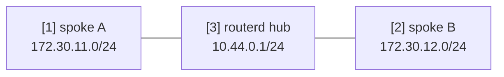

# WireGuard ハブ＆スポークのテンプレート


2 つの spoke を持つ routed WireGuard hub のテンプレートです。
実際に使う前に、鍵、エンドポイント、広告するプレフィックスを置き換えてください。

:::caution WAN から到達できることは別の前提条件

この template は WireGuard interface と peer を設定しますが、上流の Internet port-forward、
cloud security group、UDP 51820 の WAN firewall ルールを作ったり検証したりはしません。
remote peer が接続できると期待する前に、それらを安全に用意し、秘密鍵を YAML repository に
入れないでください。

:::

完全な YAML は `examples/wireguard-hub-spoke.yaml` にあります。

## 構成図


```mermaid
flowchart LR
  a["[1] spoke A<br/>172.30.11.0/24"]
  b["[2] spoke B<br/>172.30.12.0/24"]
  hub["[3] routerd hub<br/>10.44.0.1/24"]

  a --- hub --- b
```

## 図の対応表

| 番号 | 意味 | 主なリソース |
| --- | --- | --- |
| [1] | spoke A のトンネルアドレスとルーティング対象 LAN プレフィックス。 | `WireGuardPeer/spoke-a` |
| [2] | spoke B のトンネルアドレスとルーティング対象 LAN プレフィックス。 | `WireGuardPeer/spoke-b` |
| [3] | ハブ側の WireGuard インターフェースとアドレス。 | `WireGuardInterface/wg-hub`, `IPv4StaticAddress/wg-hub-ipv4` |

## この例で管理するもの

| 領域 | routerd リソース |
| --- | --- |
| WireGuard デバイス | `WireGuardInterface/wg-hub` |
| ハブのアドレス | `IPv4StaticAddress/wg-hub-ipv4` |
| ピアの経路 | `WireGuardPeer/spoke-a`, `WireGuardPeer/spoke-b` |

## 設定の要点

```yaml
# [3] ハブ側の WireGuard インターフェースと listen port。
- kind: WireGuardInterface
  metadata:
    name: wg-hub
  spec:
    privateKeyFile: /usr/local/etc/routerd/secrets/wg-hub.key
    listenPort: 51820
    mtu: 1420

# [1] spoke A のトンネルアドレスとルーティング対象 LAN プレフィックス。
- kind: WireGuardPeer
  metadata:
    name: spoke-a
  spec:
    interface: wg-hub
    publicKey: REPLACE_WITH_SPOKE_A_PUBLIC_KEY
    allowedIPs:
      - 10.44.0.11/32
      - 172.30.11.0/24
```

## daemon の前に確認する

以下は `sudo` を実行できる通常ユーザーを想定します。まだサービスを起動していないため、
`routerctl` ではなく `routerd` を使い、dry-run の状態ファイルは一時ディレクトリへ隔離します。

```sh
LAB_DIR="$(mktemp -d)"
sudo routerd validate --config examples/wireguard-hub-spoke.yaml
sudo routerd apply --config examples/wireguard-hub-spoke.yaml --once --dry-run --skip-service-manager \
  --state-file "$LAB_DIR/state.db" \
  --ledger-file "$LAB_DIR/ledger.db" \
  --status-file "$LAB_DIR/status.json"
sudo sed -n "1,160p" "$LAB_DIR/status.json"
```

## サービス起動後に確認する

レビュー済みの設定を適用して `routerd.service` を起動した**後で**、ルーター上で次を実行します。

```sh
sudo routerctl describe WireGuardInterface/wg-hub
sudo wg show
```

## よく変えるところ

- 秘密鍵はパーミッションを絞ったファイルに置きます。`privateKeyFile` が設定され、
  ファイルが存在しない場合、非 dry-run apply は mode `0600` で鍵ファイルを生成します。
  既存の非空鍵は上書きしません。
- ピアごとにトンネルアドレス `/32` とルーティング対象 LAN プレフィックスを明示します。
- WAN のファイアウォールを routerd で管理している場合は、UDP の listen port の許可も足します。
