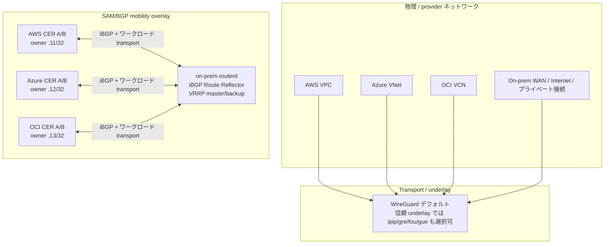
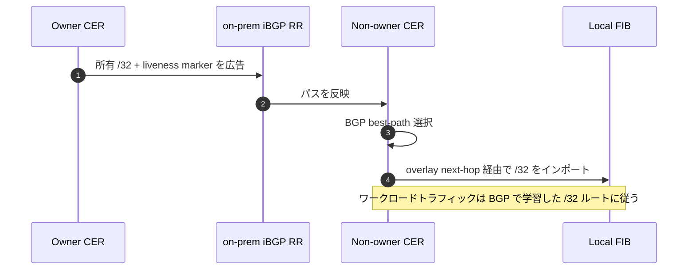
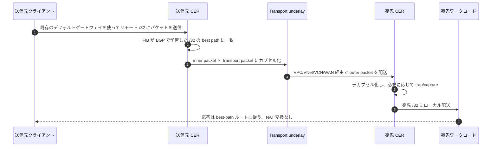
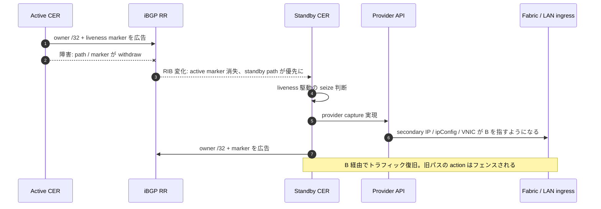
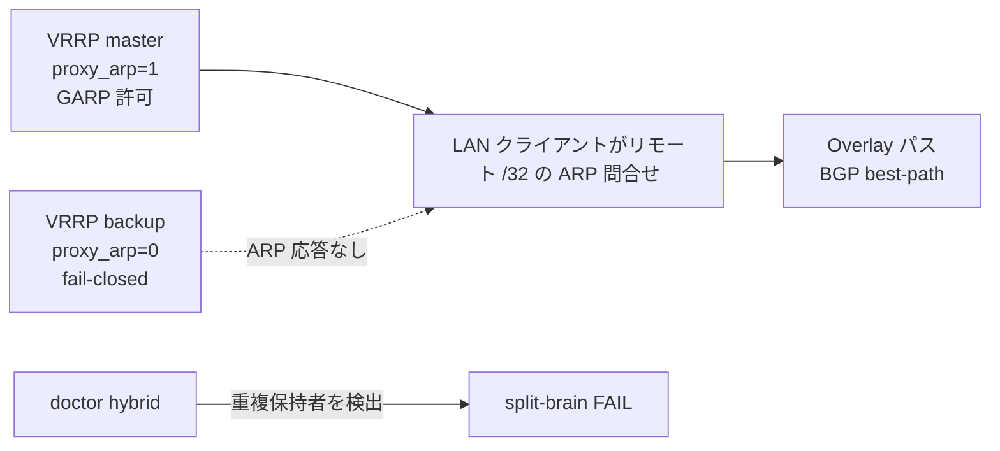

# CloudEdge Selective Address Mobility Phase G — 詳細実装ガイド


本ガイドは Phase G の概要を補足し、CloudEdge SAM の説明やトラブルシューティングで
運用者が必要とする低レベルの詳細を扱います。

- underlay / transport / overlay の用語整理
- WireGuard または `TunnelInterface` のカプセル化と実際の inner/outer パケットビュー
- iBGP ピア、Route Reflector の動作、BGP `/32` 所有権、liveness marker
- RIB 駆動の trap と provider/on-prem の capture 実現
- AWS / Azure / OCI / on-prem の実装差異
- 通常のデータプレーンフロー、フェイルオーバー、エンドポイントの追加・削除の動作

現行の Phase G 設計は **clean Option B** です。BGP が mobility の唯一の真実源です。
以前の mobility 固有の `AddressLease`、`ownershipEpoch`、`captureEpoch`、heartbeat、
route-lowering planner の状態はメインラインから削除されています。これらは歴史的な
ADR や Phase G 以前の議論に残っている場合がありますが、現行の CloudEdge SAM を説明
する主要なパスではありません。

## 1. レイヤーの用語

CloudEdge の文書では「underlay」を SAM/BGP mobility overlay の下位にある transport
の略称として使うことがあります。運用者との会話では 3 つのレイヤーを区別すると
便利です。

| レイヤー | 意味 | CloudEdge SAM での例 |
| --- | --- | --- |
| **物理/provider ネットワーク** | outer packet を実際に運ぶネットワーク。 | AWS VPC、Azure VNet、OCI VCN、on-prem WAN、Internet、DirectConnect、ExpressRoute、FastConnect。 |
| **overlay transport / underlay** | routerd ノードが物理/provider ネットワーク上で BGP とワークロードパケットを運ぶために使うトンネルまたは transport。 | デフォルトは WireGuard。信頼された underlay では `TunnelInterface` モード `ipip`、`gre`、`fou`、`gue`。 |
| **SAM/BGP mobility overlay** | 論理的な `/32` 到達性プレーン。 | BGP best-path の所有権、liveness marker route、RIB trap、バックグラウンド provider capture。 |
| **ワークロードパケット** | transport 内部の実際のクライアント/サービストラフィック。 | `src=10.77.60.11`、`dst=10.77.60.12`、プロトコル TCP/UDP/NFS/RPC 等。 |

CloudEdge 文書で「WireGuard underlay」と呼ぶ場合は、「SAM/BGP mobility overlay の
下位にあるデフォルト transport」と読んでください。物理 provider ネットワークそのもの
ではありません。

## 2. 全体トポロジ

検証済みの Phase G デモは 4 サイト構成を使用します。

- on-prem が iBGP Route Reflector ハブとして機能する
- AWS、Azure、OCI の Cloud Edge Router が transport ネットワーク経由で on-prem RR にピアリングする
- 各サイトにローカルフェイルオーバー用の active/standby ルーターがある
- 論理プール内の選択アドレス、例えば `10.77.60.10/32` から `10.77.60.13/32` が BGP `/32` パスとして広告・学習される



## 3. BGP ownership plane

mobile `/32` の所有者は、そのプレフィクスの現在の BGP best path です。
運用者が lease、claim、アドレスごとの provider action を手書きする必要はありません。
routerd は `MobilityPool` の intent を BGP 広告に投影し、RIB を観測してローカルで
何を実現すべきかを判断します。



要点:

- 所有するサービス/クライアントアドレスは通常の IPv4 unicast `/32` 広告
- marker route はノードの liveness を示し、所有 `/32` とは別
- route policy と community が優先度と identity を表現
- BGP RIB/FIB の状態がデータプレーンで使われる所有者ビュー
- provider capture action は現在の BGP mobility path signature でフェンスされる

## 4. カプセル化: 実際のパケットビュー

あるサイトがリモートの owner `/32` にトラフィックを送信するとき、クライアントパケット
は NAT されません。transport が運ぶ **inner packet** になります。

例: AWS クライアント `.11` が Azure の owner `.12` と通信。

```text
inner ワークロードパケット:
  src = 10.77.60.11
  dst = 10.77.60.12
  proto = TCP/22, NFS, RPC, FTP, bulk TCP 等

transport カプセル化:
  WireGuard / GRE / IPIP / FOU / GUE が inner packet をラップ。

outer transport パケット:
  src = AWS CER の transport/underlay IP
  dst = Azure CER の transport/underlay IP
  proto = WireGuard なら UDP/51820、GRE、IPIP、UDP-encap 等

物理/provider ネットワーク:
  AWS VPC / WAN / Azure VNet が outer packet を配送。
```

受信側の CER では:

1. transport パケットがデカプセル化される。
2. inner packet は依然として `src=10.77.60.11`、`dst=10.77.60.12` のまま。
3. 宛先サイトが capture された `/32` パスを通じてローカルに配送する。
4. 応答トラフィックは同じ overlay/BGP 決定パスを逆方向にたどる。

## 5. 環境ごとの capture 実現

BGP が到達性を決定します。provider または on-prem の capture が、選択された `/32` を
正しいエッジで物理的またはローカルに到達可能にします。

| 環境 | capture 方法 | 制御/API | フェイルオーバーの動き | 注意 |
| --- | --- | --- | --- | --- |
| AWS | ENI secondary private IP | allow-reassignment 動作の `assign-private-ip-addresses` | active の marker/path が消えると standby が secondary IP を奪取。 | ENI 権限と source/dest check の動作を一貫させること。 |
| Azure | NIC secondary IP（ipConfig 経由） | 旧保持者の ipConfig を削除し、新保持者の ipConfig を作成 | 2 ステップの remove/add。リトライは部分障害を処理する必要あり。 | IP を保持する NIC が一時的に存在しない短い窓がある。executor を冪等にすること。 |
| OCI | VNIC secondary private IP | `assign-private-ip --unassign-if-already-assigned` | standby が自身の VNIC に private IP を再割当て。 | VNIC/private-IP の状態、forwarding、ローカルファイアウォールを検証すること。 |
| On-prem | proxy ARP + GARP | VRRP/CARP 様の mastership でゲートされた OS ネットワーキング、または 1 サイト/1 ルーター/1 オーナーの lab 向けに `capture.activeWhen.type: single-router` | HA ペアは VRRP master ゲートを使用。単一ルーターサイトは VRRP なしで常時 active capture を選択可。 | 重複 ARP 応答を防止すること。split-brain doctor は大きな音で失敗しなければならない。 |

provider secondary IP の reconciliation はバックグラウンドの fabric-ingress 実現です。
クラウドネイティブな入口パスにとって重要ですが、overlay 到達性の真実源になっては
いけません。

## 6. 通常の通信シーケンス



パケットキャプチャで証明すべき不変条件:

- クライアントのデフォルトゲートウェイが変化していないこと
- サーバーが元の送信元 `/32` を確認できること
- NAT 変換のシグネチャが現れないこと
- 選択された `/32` 宛先のみが CloudEdge SAM に吸収されること
- bulk/protocol テストが MTU/PMTU によるブラックホールを起こさないこと

## 7. クラウドフェイルオーバーシーケンス



provider ごとの動作:

- AWS: standby の ENI に secondary private IP を再割当て。
- Azure: 旧 ipConfig を削除し、standby の NIC に新 ipConfig を作成。
- OCI: `--unassign-if-already-assigned` で standby の VNIC に private IP を再割当て。
- On-prem: VRRP master 遷移により新 master のみが proxy ARP/GARP を有効化。

## 8. On-prem の LAN capture と split-brain 安全性

BGP はリモート overlay パスを決定できますが、それだけではローカル L2 の ARP 権限を
保護しません。そのため on-prem の capture はローカルでゲートされます。



ルール:

- capture された `/32` アドレスに対して proxy ARP で応答するのは master のみ
- backup は同じ宣言的 intent を持っていても fail-closed を維持
- master 遷移時に LAN キャッシュをリフレッシュするため GARP を送信
- 1 サイト/1 ルーター/1 オーナーの構成では、`capture.activeWhen.type: single-router` が VRRP ゲートなしの明示的な常時 active proxy-ARP capture モード
- 重複 proxy ARP 保持者はハード診断障害

## 9. エンドポイントの追加・削除とルート伝搬

重要なメッセージ伝搬は BGP の advertise/withdraw であり、mobility 固有の
lease/heartbeat 伝搬ではありません。

### 新規または復旧した `/32`

1. ローカルの owner が eligible になり、所有 `/32` と marker を広告。
2. RR がルートをクラウド/on-prem ピアに反映。
3. ピアが best path をローカル FIB にインポート。
4. RIB trap が必要に応じて provider/on-prem の capture reconciliation をトリガ。
5. データプレーンが新しい owner パスへの転送を開始。

### 削除または移動した `/32`

1. 旧 owner が `/32` を withdraw するか marker が消失。
2. BGP best path が変化または消失。
3. path-signature フェンシングにより stale な provider action はスキップ。
4. 新保持者が広告し capture を実現。
5. 全ピアが新しい FIB ルートに収束するか状態を解放。

## 10. PMTU とプロトコル透過性

カプセル化によりオーバーヘッドが追加されます。そのため CloudEdge は PMTU/MSS を
あると便利な診断項目ではなく、データプレーンの不変条件として扱います。

- `EstimateMTU` は WireGuard または `TunnelInterface` のオーバーヘッドに追従。
- `routerd_mss` が TCP MSS をクランプしてブラックホールを回避。
- 信頼パスでは DF ブラックホール緩和が DF セマンティクスの保持より重要な場合に IPv4 force-fragment が利用可能。
- プロトコル透過性の acceptance は ping だけでなく、FTP active/passive、NFS、RPC/rpcbind、大容量 TCP bulk、DF/no-DF の PMTU プローブを含めるべき。

## 11. 運用チェックリスト

CloudEdge SAM の説明やデバッグ時には、このリストを順に確認してください。

1. 現在の BGP best path owner はどの `/32` か？
2. iBGP セッションとワークロードパケットを運ぶ transport は何か？
3. inner と outer パケットを別々に観測できるか？
4. non-owner CER は `/32` の best path を FIB にインポートしたか？
5. provider/on-prem の capture は正しい権限で実行されたか？
6. stale な provider action は現在の BGP path signature でフェンスされているか？
7. on-prem の backup は fail-closed で、split-brain doctor はクリーンか？
8. パケットキャプチャが source 保持と NAT なしを証明しているか？
9. MSS/PMTU プローブと bulk プロトコルは通過するか？

## 12. 人間向けの短い説明

CloudEdge SAM は BGP best-path 駆動の `/32` mobility です。routerd は WireGuard 等の
transport underlay でサイト間を接続し、iBGP で選択した `/32` の owner を学習・広告し、
RIB の変化を trap し、provider secondary IP または on-prem proxy ARP/GARP で ingress
を実現し、NAT なしでワークロードパケットを運ぶため、送信元 IP とクライアントの
デフォルトゲートウェイの動作が変わりません。
