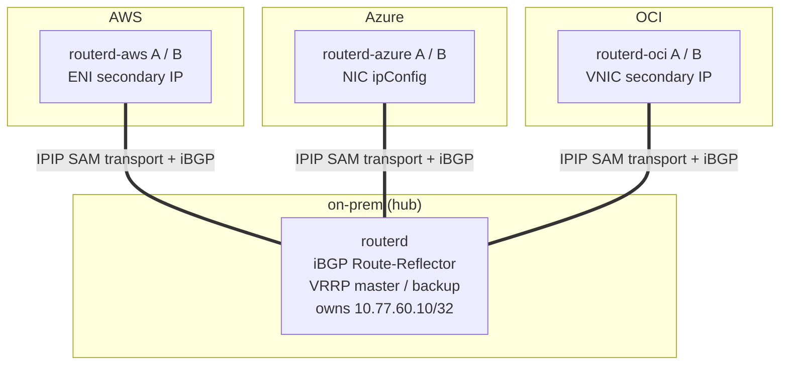
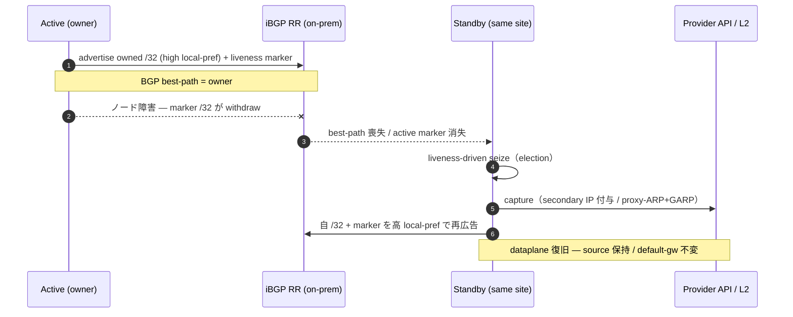
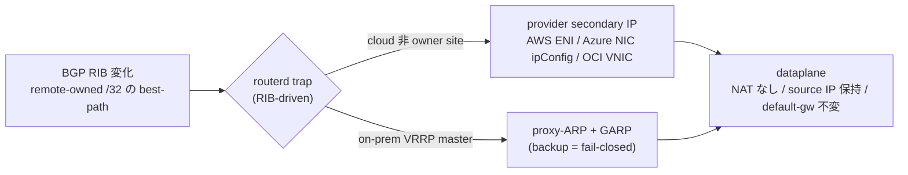
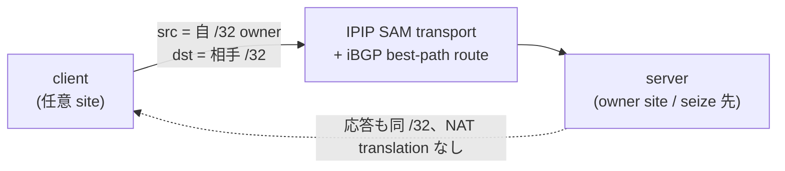
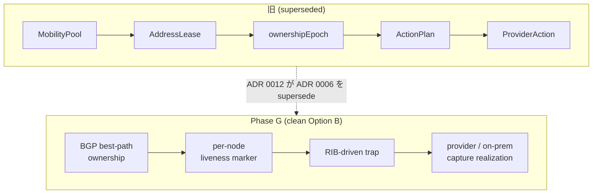

# CloudEdge Selective Address Mobility (Phase G) — 説明図

CloudEdge SAM Phase G は、AWS / Azure / OCI / on-prem をまたいで選択した `/32`
サービス/クライアントアドレスを、**NAT なし・source IP 保持・default gateway 不変**で
到達可能にし、ルーターノード障害時に同一サイトの standby が自律的に所有権を取得して
L3 到達性を復旧する仕組みです。

設計の核は **clean Option B**:

- **ownership = BGP best-path** — `/32` の所有者は BGP の最良経路が決める（中央ロックや
  lease/epoch を持たない単一の真実源）。
- **liveness = per-node marker** — 各ノードが overlay `/32` + identity community の
  marker を広告。active marker の消失が failover トリガ。
- **trap = RIB-driven** — RIB の変化（remote-owned `/32` の best-path）を routerd が trap。
- **seize = liveness-driven** — active marker 消失で同一サイトの standby が seize。

---

## 1. トポロジ — SAM transport + iBGP hub-spoke

各サイトの routerd は `SAMTransportProfile` が生成する IPIP transport 上で iBGP を張り、
on-prem の Route-Reflector(RR) をハブにする hub-spoke 構成。暗号化が必要な環境では
WireGuard を endpoint 専用 underlay として下に敷く。

- logical `/24` = `10.77.60.0/24`。各 site の owner `/32`（例 on-prem `.10` / AWS `.11`
  / Azure `.12` / OCI `.13`）を全 site から到達可能にする。
- default delivery は IPIP。WireGuard を使う場合も `AllowedIPs` は transport endpoint
  prefix だけにし、mobile `/32` は BGP と FIB が扱う。

---

## 2. 所有権と自律フェイルオーバー

active が所有 `/32` と liveness marker を高 local-pref で広告。ノード障害で marker が
withdraw されると、同一サイトの standby が **手動操作ゼロ**で seize する。

実測収束時間（acceptance）: AWS 16.9s / Azure 56.7s / OCI seize / **on-prem VRRP 8s**、
すべて `manualProviderAction=false`（自律）。目標 60s 以下。

---

## 3. capture の実現 — trap から各 provider / on-prem へ

RIB の best-path 変化を trap し、cloud では provider secondary IP、on-prem では
VRRP-master gated な proxy-ARP + GARP で `/32` を捕捉する。

- on-prem は **VRRP-master hard-gate**: master のみ proxy-ARP/GARP を出し、backup は
  fail-closed（`proxy_arp=0`、ARP 応答しない）。`routerctl doctor hybrid` が split-brain
  を deterministically FAIL（loop-free by design）。
- cloud capture の provider mutation は最小権限 identity（AWS ENI-scoped / OCI compartment /
  Azure custom role）で自律実行。

---

## 4. データプレーン不変条件

- **NAT なし** — translation signature が出ない（tcpdump で確認）。
- **source IP 保持** — server から見える source は client の `/32`。
- **default gateway 不変** — client の既定経路は変わらない。
- **MTU/PMTU** — overlay 実効 MTU に追従して MSS clamp(`routerd_mss`)、必要なら
  IPv4 force-fragment(P2-b, ADR 0013, default off)で DF blackhole を回避。
- 透過性 acceptance: FTP(active/passive) / NFS / RPC(rpcbind) / 100MB bulk が
  fragment/blackhole なく完走（source 保持・no-NAT 確認済）。

---

## 5. 旧モデルとの対比

複数の真実源（lease / epoch / heartbeat / action journal）が絡む複雑さを撤去し、
**BGP を唯一の ownership plane** にしたことで、ネットワーク的に説明しやすく堅牢になった。

---

## 関連

- ADR 0012: BGP /32 Address Mobility（clean Option B）
- ADR 0009: Pluggable Overlay Underlay（ipip/gre/fou/gue）
- ADR 0013: IPv4 Force Fragmentation
- reference: Selective Address Mobility
- how-to: cloudedge-mobility-demo / cloudedge-autonomous-lab
- スライド: `docs/slides/cloudedge-sam-phase-g.md`
