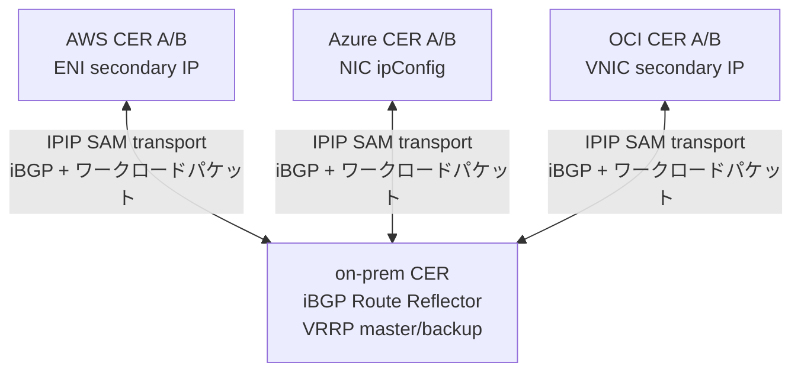
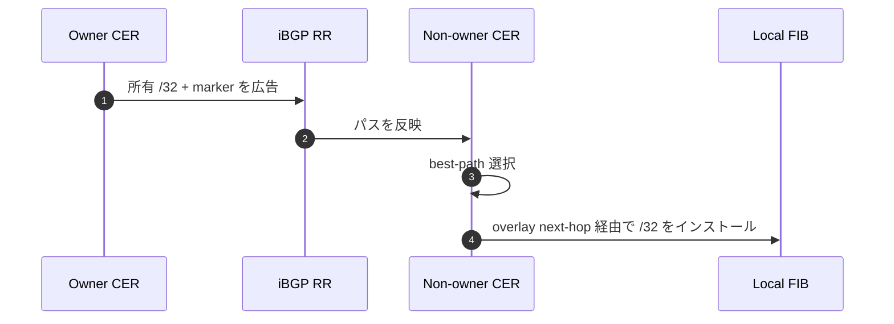
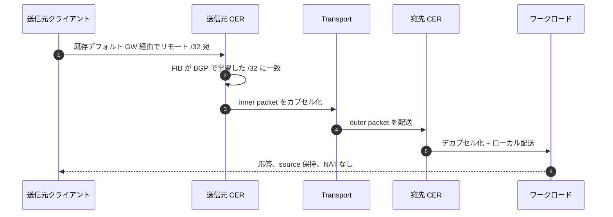
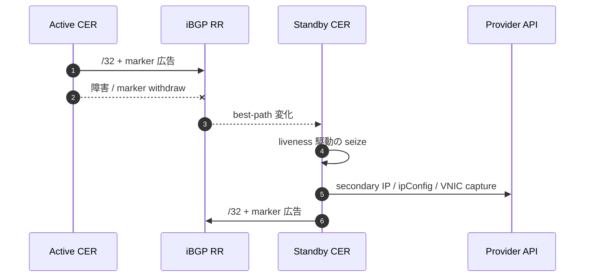
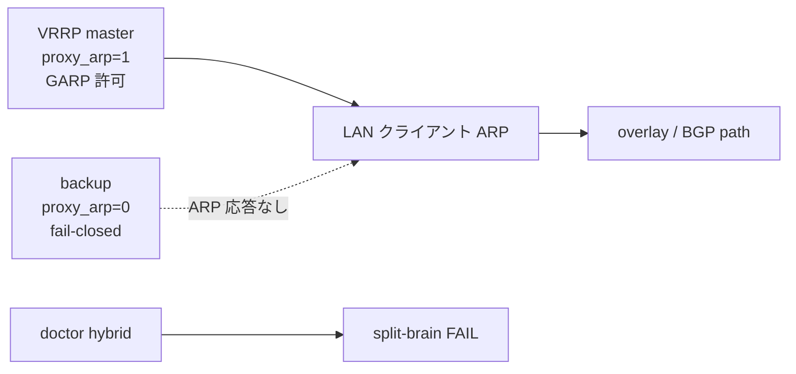

# CloudEdge SAM Phase G 詳細解説
## underlay / transport / overlay / BGP / パケット / secondary IP

AWS / Azure / OCI / on-prem をまたぐ BGP best-path driven `/32` mobility

**NAT なし / source IP 保持 / default gateway 不変**

---

## 1. レイヤーをそろえる

| レイヤー | 役割 | 例 |
|---|---|---|
| physical/provider network | outer packet を実際に運ぶ | AWS VPC / Azure VNet / OCI VCN / WAN / Internet |
| transport / underlay | SAM/BGP overlay の下で運ぶ | IPIP/GRE tunnel、必要なら endpoint-only WireGuard underlay |
| SAM/BGP mobility overlay | `/32` owner と delivery を決める | BGP best-path / marker / RIB trap |
| workload packet | 端末・サービスの実通信 | src/dst は `/32` のまま |

> CloudEdge 文書で "underlay" と呼ぶ場合、SAM overlay から見た下位 transport を指すことがある。

---

## 2. 4 サイトトポロジ



- logical pool: `10.77.60.0/24`
- 選択 owner: `.10` on-prem、`.11` AWS、`.12` Azure、`.13` OCI
- full L2 extension ではなく、選択 `/32` を BGP で到達化する

---

## 3. BGP ownership plane

| 要素 | 方式 |
|---|---|
| ownership | BGP best-path |
| liveness | per-node marker route + identity community |
| delivery | BGP で学習した `/32` FIB route |
| trap | RIB 駆動の best-path 変化 |
| provider capture | BGP path view からのバックグラウンド reconciliation |

`AddressLease / ownershipEpoch / captureEpoch / heartbeat` は mainline から外れ、
BGP RIB が mobility の唯一の真実源になった。

---

## 4. BGP パス伝搬



確認すべきもの:

- GoBGP RIB / Adj-RIB-Out
- route policy / local-pref / community
- marker path の有無
- OS FIB の `/32` route

---

## 5. カプセル化: inner と outer

```text
inner ワークロードパケット:
  src = 10.77.60.11
  dst = 10.77.60.12

transport:
  IPIP / GRE TunnelInterface
  endpoint 暗号化にはオプションの WireGuard underlay

outer パケット:
  src = 送信元 CER の transport IP
  dst = 宛先 CER の transport IP
```

ポイント:

- inner の src/dst は NAT されない
- outer packet だけが physical/provider network で配送される
- tcpdump では inner/outer の観測点を分ける

---

## 6. capture 実現

| 環境 | capture | API / 実装 | failover |
|---|---|---|---|
| AWS | ENI secondary private IP | assign-private-ip-addresses | allow-reassignment |
| Azure | NIC ipConfig secondary IP | 旧 ipConfig 削除 + 新規作成 | 2 ステップリトライ |
| OCI | VNIC secondary private IP | assign-private-ip | unassign-if-already-assigned |
| on-prem | proxy ARP / GARP | OS ネットワーキング + VRRP ゲート | master のみ、backup は fail-closed |

BGP best-path が owner を決める。secondary IP / ARP は ingress 実現。
単一 on-prem ルーター構成では `capture.activeWhen.type: single-router` で VRRP 無しの常時 capture を選べる。

---

## 7. 通常のパケットフロー



---

## 8. クラウドフェイルオーバーシーケンス



- stale なパス action は現在の BGP path signature でフェンスされる
- overlay 到達性は provider fabric のキャッチアップ完了前に回復可能

---

## 9. On-prem VRRP / proxy ARP の安全性



- BGP はローカル L2/ARP 権限を置き換えない
- master のみが proxy ARP / GARP を実現
- backup は fail-closed を維持
- single-router capture は 1 サイト / 1 ルーター / 1 オーナー向けの明示モード
- 重複 proxy-ARP 保持者は診断障害

---

## 10. エンドポイントの追加・削除

### 新規 `/32`
1. owner が `/32` + marker を広告
2. RR がパスを反映
3. non-owner が FIB route をインポート
4. RIB trap が capture reconciliation をトリガ
5. トラフィック転送開始

### 削除または移動した `/32`
1. 旧 owner がパスを withdraw または marker 消失
2. best path が変化
3. stale な provider action がスキップ
4. 新保持者が広告し capture
5. ピアが収束

---

## 11. PMTU とプロトコル透過性

- カプセル化オーバーヘッドにより実効 MTU が変化
- `routerd_mss` が TCP MSS をクランプしてブラックホール回避
- IPv4 force-fragment は信頼パス向け、デフォルト off
- acceptance に含めるべき項目:
  - FTP active/passive
  - NFS
  - RPC / rpcbind
  - 100MB bulk 転送
  - DF / no-DF PMTU プローブ
  - tcpdump による source 保持 / NAT なしの確認

---

## 12. 説明チェックリスト

1. 現在の BGP best-path owner はどの `/32` か？
2. iBGP とワークロードパケットを運ぶ transport は何か？
3. inner と outer のパケットヘッダをどこで観測できるか？
4. ローカル FIB はリモート `/32` をインポートしたか？
5. ingress を実現する provider/on-prem capture メカニズムはどれか？
6. stale な action は path signature でフェンスされているか？
7. パケットキャプチャが NAT なしと source 保持を証明しているか？

CloudEdge SAM = **BGP best-path driven `/32` mobility**。
