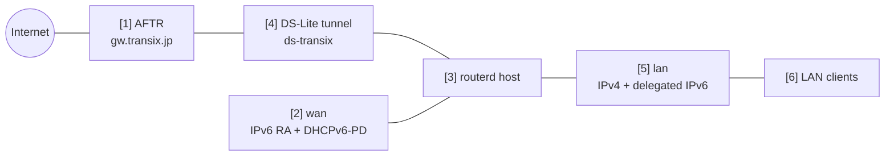

# DS-Lite 家用路由器


这是以 IPv6 作为主要线路的连接示例。路由器通过 Router Advertisement 和 DHCPv6-PD 取得 IPv6，
衍生 LAN 前缀，并将 IPv4 流量通过 DS-Lite 隧道传送。

完整的已验证 YAML 位于 `examples/example-dslite-home.yaml`。

## 架构图



## 图示对应表

| 编号 | 说明 | 主要资源 |
| --- | --- | --- |
| [1] | DS-Lite 隧道连接目标的 ISP 端 AFTR。 | `DSLiteTunnel/transix` |
| [2] | 接收 IPv6 RA 和 DHCPv6-PD 的 WAN 接口。 | `DHCPv6PrefixDelegation/wan-pd` |
| [3] | 建立隧道和 LAN 服务、并推导所需 sysctl 的 routerd 主机。 | Derived host runtime |
| [4] | 用于 IPv4 egress 的 DS-Lite `ip6tnl` 设备。 | `DSLiteTunnel/transix`，从 trust/untrust 区域自动推导的 NAT44 |
| [5] | 持有 IPv4 地址和委派 IPv6 地址的 LAN 接口。 | `IPv4StaticAddress/lan-ipv4`、`IPv6DelegatedAddress/lan-ipv6` |
| [6] | 接收 DHCPv4、RA、RDNSS、DNSSL 的 LAN 客户端。 | `DHCPv4Server/lan-dhcpv4`、`IPv6RouterAdvertisement/lan-ra` |

## 此示例管理的项目

| 领域 | routerd 资源 |
| --- | --- |
| WAN IPv6 | `DHCPv6PrefixDelegation/wan-pd` |
| 前缀委派（PD） | `DHCPv6PrefixDelegation/wan-pd`、`IPv6DelegatedAddress/lan-ipv6` |
| DS-Lite | `DSLiteTunnel/transix` |
| LAN IPv4 和 DHCPv4 | `IPv4StaticAddress/lan-ipv4`、`DHCPv4Server/lan-dhcpv4` |
| LAN IPv6 广播 | `IPv6RouterAdvertisement/lan-ra` |
| DNS | `DNSZone/home`、`DNSResolver/lan-resolver` |
| IPv4 egress | 从 trust/untrust 区域自动推导的 NAT44 |
| MTU/MSS | 从 `DSLiteTunnel/transix` 和防火墙区域自动推导 |

此示例使用近似 Transix 的 AFTR 值作为占位符。请依照实际线路替换
AFTR FQDN、DNS 服务器，以及 DHCPv6 客户端的 profile。

## 配置要点

```yaml
# [2] 从 WAN 取得 IPv6 前缀委派（PD）。
- apiVersion: net.routerd.net/v1alpha1
  kind: DHCPv6PrefixDelegation
  metadata:
    name: wan-pd
  spec:
    interface: wan
    client: dhcp6c
    profile: ntt-hgw-lan-pd

# [5] 从委派前缀衍生 LAN IPv6 地址。
- apiVersion: net.routerd.net/v1alpha1
  kind: IPv6DelegatedAddress
  metadata:
    name: lan-ipv6
  spec:
    prefixDelegation: wan-pd
    interface: lan
    subnetID: "0"
    addressSuffix: "::1"

# [1] + [4] 建立指向 ISP AFTR 的 DS-Lite 隧道。
- apiVersion: net.routerd.net/v1alpha1
  kind: DSLiteTunnel
  metadata:
    name: transix
  spec:
    interface: wan
    tunnelName: ds-transix
    aftrFQDN: gw.transix.jp
    aftrDNSServers:
      - 2404:1a8:7f01:a::3
      - 2404:1a8:7f01:b::3
    localAddressSource: delegatedAddress
    localDelegatedAddress: lan-ipv6
    localAddressSuffix: "::100"
    defaultRoute: true
    mtu: 1454
```

此 DS-Lite 隧道以委派的 IPv6 地址作为本地端点。
若线路端预期以 WAN RA 地址作为端点，请将 `localAddressSource` 改为
`interface`。

## LAN 端服务

此示例通过 RA 广播委派的前缀，并向客户端分发路由器作为 DNS。

```yaml
# [6] 通过 RA 广播委派的 LAN 前缀和本地 DNS 信息。
- apiVersion: net.routerd.net/v1alpha1
  kind: IPv6RouterAdvertisement
  metadata:
    name: lan-ra
  spec:
    interface: lan
    prefixFrom:
      resource: IPv6DelegatedAddress/lan-ipv6
      field: address
    rdnssFrom:
      - resource: IPv6DelegatedAddress/lan-ipv6
        field: address
    dnsslFrom:
      - resource: DNSZone/home
        field: zone
    oFlag: true
    mtu: 1454
```

`DNSResolver` 中配置了针对 AFTR 名称的条件式转发器。在 AFTR 记录只在线路端解析器才有意义的配置中，此指定至关重要。

## 应用步骤

```bash
cp examples/example-dslite-home.yaml router.yaml
routerd validate --config router.yaml
routerd plan --config router.yaml
routerd apply --config router.yaml --once --dry-run
```

执行 plan 时请确认以下项目。

- WAN / LAN 的接口名称正确。
- 不会误删管理访问路径。
- AFTR FQDN 和解析器地址为预期的值。
- NAT 出口为 DS-Lite 隧道而非物理 WAN。

确认无误后执行应用。

```bash
routerd apply --config router.yaml --once
```

## 确认

```bash
routerctl status
routerctl describe DHCPv6PrefixDelegation/wan-pd
routerctl describe IPv6DelegatedAddress/lan-ipv6
routerctl describe DSLiteTunnel/transix
routerctl describe FirewallZone/wan
ip -6 tunnel show
ip route show default
```

在 LAN 客户端端确认以下项目。

```bash
ip -6 addr
ip route
curl https://1.1.1.1/
dig router.home.example
```

## 常见的修改点

- 依照平台变更 `client` 和 `profile`。
- 非 Transix 的场合，请替换 `gw.transix.jp` 和 AFTR 解析器地址。
- 若需从 WAN RA 地址建立 DS-Lite 隧道，请使用 `localAddressSource: interface`。
- DS-Lite 通常需要 MSS clamp。routerd 会从隧道 MTU 和 LAN/WAN 的防火墙区域自动推导。
