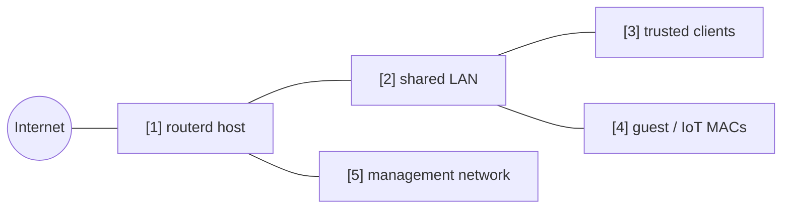

# 访客 / IoT 端点隔离


将连接至同一 LAN 的特定 MAC 地址视为访客 / IoT 端点，
允许其访问互联网，但阻止其到达受信任的 LAN 及管理网络的示例。

完整 YAML 位于 `examples/guest-mode.yaml`。

## 构成图



## 图示对应表

| 编号 | 含义 | 主要资源 |
| --- | --- | --- |
| [1] | 应用端点策略的路由器。 | `FirewallPolicy/default` |
| [2] | 受信任端点与访客端点共存的共用 LAN。 | `FirewallZone/lan` |
| [3] | 不符合访客策略的普通端点。 | default zone behavior |
| [4] | 视为访客 / IoT 的 MAC 地址。 | `ClientPolicy/guest-devices` |
| [5] | 访客端点不得到达的管理目的地。 | `ClientPolicy.spec.isolation.lanMgmt` |

## 要点

```yaml
# [4] 将列出的 MAC address 视为隔离的 guest / IoT client。
- apiVersion: firewall.routerd.net/v1alpha1
  kind: ClientPolicy
  metadata:
    name: guest-devices
  spec:
    mode: include
    macs:
      - 18:ec:e7:33:12:6c
    # [4] -> [1] 允许 internet，拒绝 LAN 与管理网络。
    isolation:
      lanInternet: allow
      lanLAN: deny
      lanMgmt: deny
      mDNSBroadcast: deny
```

## 确认

```bash
routerctl validate --config examples/guest-mode.yaml
routerctl apply --config examples/guest-mode.yaml --dry-run
routerctl describe ClientPolicy/guest-devices
nft list table inet routerd_filter
```

确认访客端点可以连出互联网，但无法到达受信任的 LAN 与管理网络。

## 常见调整项目

- 仅隔离列举的 MAC 地址时，使用 `mode: include`。
- 原则上视为访客，仅列举的端点视为受信任时，使用 `mode: exclude`。
- 为在 Web 管理界面中更易于识别，可搭配 DHCP 保留地址一起设置。
