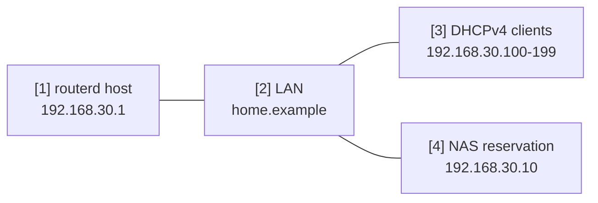

# LAN DHCP 与本地 DNS


将单一 LAN 接口作为小型家用 LAN 或验证用 LAN 服务区段的示例。
routerd 管理 LAN 地址、DHCPv4、本地 DNS 区域，以及 DHCP 租约派生的名称。

完整 YAML 位于 `examples/example-lan-dns-dhcp.yaml`。

## 构成图



## 图示对应表

| 编号 | 含义 | 主要资源 |
| --- | --- | --- |
| [1] | 同时负责 LAN DNS 监听的路由器地址。 | `IPv4StaticAddress/lan-base`, `DNSResolver/lan-resolver` |
| [2] | 作为 DHCP search domain 发送的本地 DNS 区域。 | `DNSZone/home` |
| [3] | 接收地址与 DNS 配置的动态客户端。 | `DHCPv4Server/lan-dhcpv4` |
| [4] | 具有固定租约与名称的基础设施主机。 | `DHCPv4Reservation/nas`, `DNSZone/home` |

## 本示例管理的项目

| 领域 | routerd 资源 |
| --- | --- |
| LAN 地址 | `Interface/lan`, `IPv4StaticAddress/lan-base` |
| 本地名称 | `DNSZone/home` |
| 解析器 | `DNSResolver/lan-resolver` |
| DHCPv4 | `DHCPv4Server/lan-dhcpv4`, `DHCPv4Reservation/nas` |

## 要点

```yaml
# [2] router.home.example 或 nas.home.example 的本地区域。
- kind: DNSZone
  metadata:
    name: home
  spec:
    zone: home.example
    dhcpDerived:
      sources:
        - DHCPv4Server/lan-dhcpv4
      ddns: true

# [3] 通过 DHCP 将 router address 作为 gateway / DNS 下发。
- kind: DHCPv4Server
  metadata:
    name: lan-dhcpv4
  spec:
    gatewayFrom:
      resource: IPv4StaticAddress/lan-base
      field: address
    dnsServerFrom:
      - resource: IPv4StaticAddress/lan-base
        field: address
    domainFrom:
      resource: DNSZone/home
      field: zone
```

## 确认

```bash
routerctl validate --config examples/example-lan-dns-dhcp.yaml
routerctl apply --config examples/example-lan-dns-dhcp.yaml --dry-run
routerctl describe DNSZone/home
routerctl describe DHCPv4Server/lan-dhcpv4
dig @192.168.30.1 router.home.example
```

## 常见调整项目

- 将 `home.example` 改为您自己的 search domain。
- NAS、打印机、基础设施设备请加入 `DHCPv4Reservation`。
- 若需将部分域名转发至私有上游，请新增 `DNSForwarder` 与 `DNSUpstream`。
