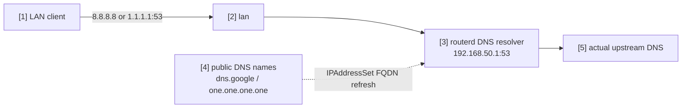

# 将公共 DNS 重定向至本地解析器


当 LAN 客户端试图直接将明文 DNS 查询送往知名公共解析器时，
仅将 TCP/UDP port 53 重定向至路由器本地解析器的示例。
DoH 及 DoT 的端口不受影响。

完整 YAML 位于 `examples/example-local-dns-redirect.yaml`。

## 构成图



## 图示对应表

| 编号 | 含义 | 主要资源 |
| --- | --- | --- |
| [1] | 试图直接查询公共 DNS 的客户端。 | external client |
| [2] | prerouting 重定向规则匹配的 LAN 接口。 | `LocalServiceRedirect/lan-local-services.spec.interface` |
| [3] | 接收重定向后 port 53 流量的本地解析器。 | `DNSResolver/lan-resolver` |
| [4] | 展开至 nftables set 的完整匹配 FQDN。 | `IPAddressSet/public-dns` |
| [5] | 本地解析器实际使用的上游解析器。 | `DNSForwarder`, `DNSUpstream` |

## 要点

```yaml
# [4] 将 public DNS 的 exact name 解析到 IPAddressSet。
- apiVersion: net.routerd.net/v1alpha1
  kind: IPAddressSet
  metadata:
    name: public-dns
  spec:
    names:
      - dns.google
      - one.one.one.one
    refreshInterval: 10m

# [2] -> [3] 只将明文 DNS port 53 重定向到 local resolver。
- apiVersion: firewall.routerd.net/v1alpha1
  kind: LocalServiceRedirect
  metadata:
    name: lan-local-services
  spec:
    interface: lan
    rules:
      - name: public-dns
        protocols: [tcp, udp]
        destinationSetRef: IPAddressSet/public-dns
        destinationPort: 53
        redirectPort: 53
```

`IPAddressSet.spec.names` 为完全匹配的 DNS 名称。
`dns.google` 不包含子域名。请明确列举所有需要的目的地名称。

## 确认

```bash
routerctl validate -f examples/example-local-dns-redirect.yaml --replace
routerctl plan -f examples/example-local-dns-redirect.yaml --replace
routerctl describe IPAddressSet/public-dns
nft list table ip routerd_nat
```

从 LAN 客户端可通过以下方式确认：

```bash
dig @8.8.8.8 router.home.example
dig @1.1.1.1 router.home.example
```
