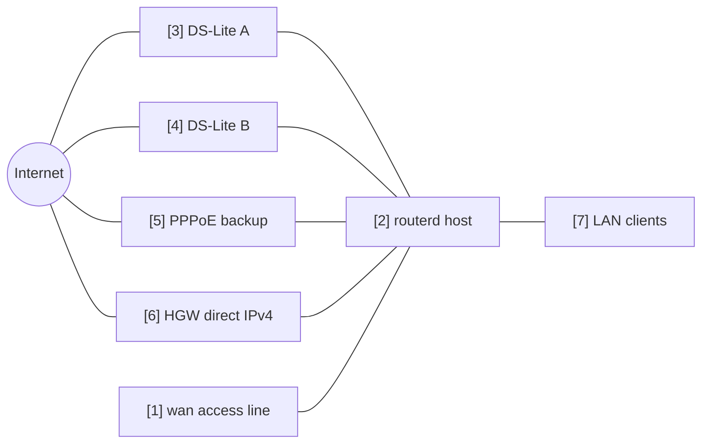

# Multi-WAN IPv4 Failover


从多个 IPv4 出口中选出正常默认路由的示例。
以 DS-Lite 通道、PPPoE 及上游路由器直连的 IPv4 作为候选出口。

完整 YAML 位于 `examples/multi-wan-home.yaml`。

## 构成图



## 图示对应表

| 编号 | 含义 | 主要资源 |
| --- | --- | --- |
| [1] | 多个 WAN 候选共用的物理 access line。 | `Interface/wan`, `DHCPv4Client/wan-dhcpv4` |
| [2] | 从中选出单一默认路由的路由器。 | `EgressRoutePolicy/ipv4-default`, `IPv4Route/default` |
| [3] | 第一优先的 DS-Lite。 | `DSLiteTunnel/ds-lite-a`, `HealthCheck/internet-via-dslite-a` |
| [4] | 额外的 DS-Lite 候选。 | `DSLiteTunnel/ds-lite-b`, `HealthCheck/internet-via-dslite-b` |
| [5] | 优先度较低的 PPPoE 备援。 | `PPPoESession/pppoe-flets`, `HealthCheck/internet-via-pppoe` |
| [6] | 上游路由器直连的 IPv4 最终备援。 | `DHCPv4Client/wan-dhcpv4`, `HealthCheck/internet-via-hgw-direct` |
| [7] | 通过 NAT 使用所选 egress 路由的 LAN 客户端。 | `NAT44Rule/lan-to-selected-wan` |

## 要点

```yaml
# [2] 在当前 healthy 的 candidate 中，选择 weight 最高的。
- kind: EgressRoutePolicy
  metadata:
    name: ipv4-default
  spec:
    family: ipv4
    destinationCIDRs:
      - 0.0.0.0/0
    selection: highest-weight-ready
    hysteresis: 30s
    candidates:
      # [3] 主要的 DS-Lite candidate。
      - name: ds-lite-a
        weight: 120
        healthCheck: internet-via-dslite-a
      # [5] PPPoE backup 设为较低的 weight。
      - name: pppoe-flets
        weight: 60
        healthCheck: internet-via-pppoe
      # [6] 此示例中将 HGW direct 作为最后的 fallback。
      - name: hgw-direct
        weight: 40
        healthCheck: internet-via-hgw-direct
```

## 确认

```bash
routerd validate --config examples/multi-wan-home.yaml
routerd apply --config examples/multi-wan-home.yaml --once --dry-run
routerctl describe EgressRoutePolicy/ipv4-default
routerctl describe IPv4Route/default
ip route show default
```

## 运用注意事项

- 健康检查请保守设置。interval 过短会导致质量较弱的线路出现震荡。
- 设置 `hysteresis`，避免仅因暂时性失败就切换出口。
- RFC1918 目的地，除非有特别意图，否则应从 NAT 与路由策略中排除。
